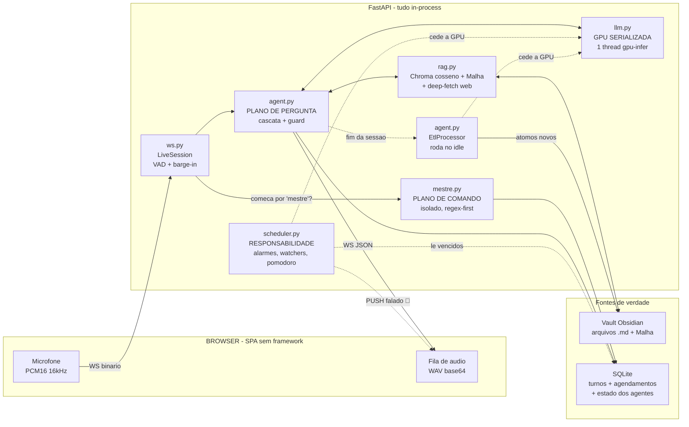
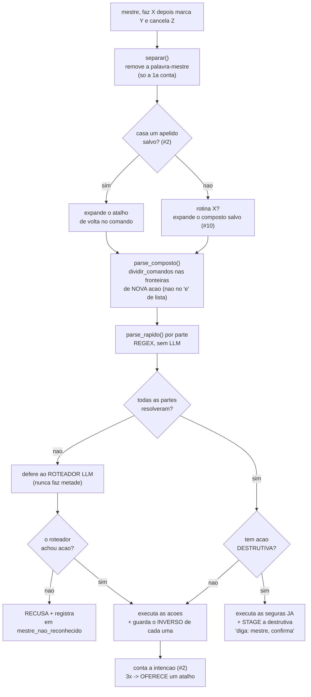
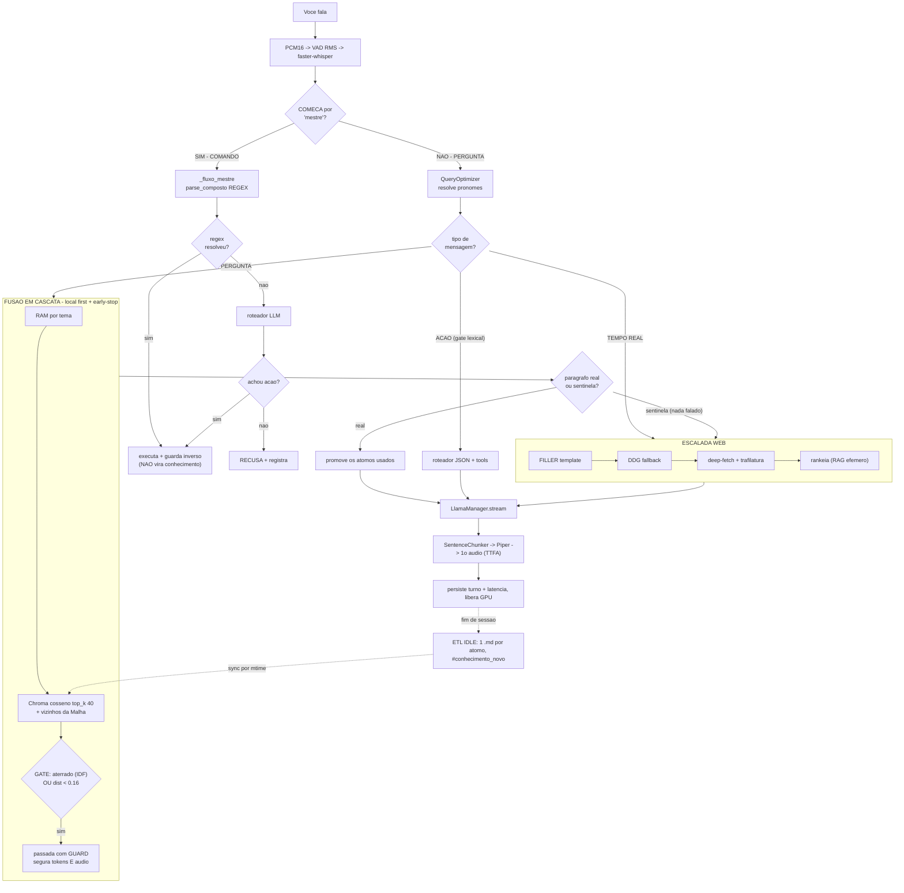
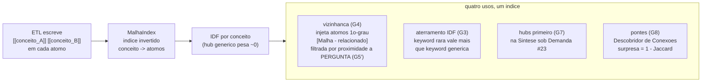
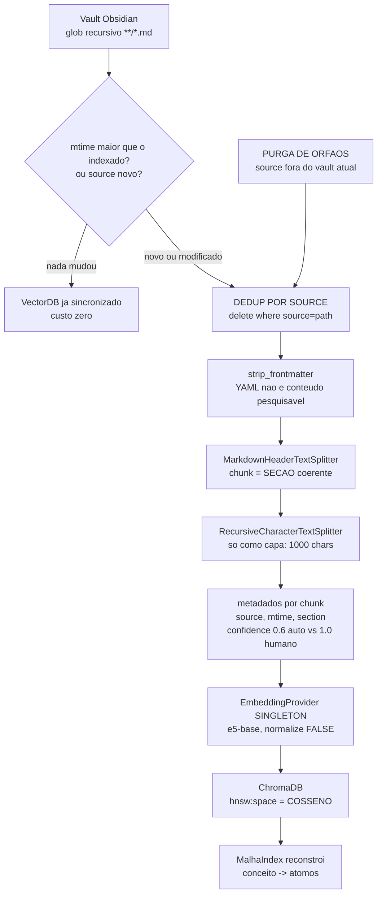
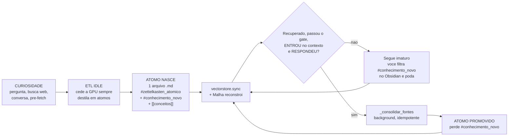
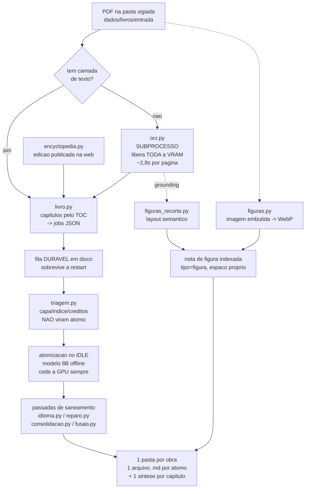

<div align="center">

# 🧠 Mente Digital

### Assistente Omni **100% local** — voz e texto, sem nuvem, sem API key, sem telemetria de terceiros.

*Um segundo cérebro que fala: conversa por voz, responde a partir das **suas** notas do Obsidian, recorre à web só quando precisa — **age** por comando falado (lembretes, listas, rotinas), **cuida** de coisas sozinho (alarmes, briefings, pomodoro) e, enquanto você não está olhando, destila o que aprendeu em novas notas atômicas.*

🇺🇸 *Prefer English? There's a [condensed overview](README.en.md).*


**Alvo:** RTX 3080 (10 GB) · Ryzen 9 7950X3D · Windows

> 📐 Este é o **deep-dive técnico** do Mente Digital. Para a visão geral (2 min), volte ao **[README](README.md)**.

</div>

---

<div align="center">

**⏱ A camada de 30 segundos** — oito números, todos medidos neste repositório:

| | |
|---:|:---|
| **1.226 testes** | a suíte inteira roda **sem GPU e sem rede**, em ~11 s — é literalmente o job de CI |
| **33% → 8%** | taxa de "não sei" com o contexto na mão, na troca `Qwen2.5-7B` → `Qwen3-8B` — decidida por **A/B próprio** (`eval/ab_modelos.py`) |
| **~2×** | ranqueamento do RAG na troca de embedding (known-item MRR@10 0.20 → 0.375, `eval/ab_embeddings.py`) |
| **0.55 → 0.16** | gate de relevância **recalibrado por dados** contra a base real (`eval/calibrar_gate.py`) |
| **27 s → 10-12 s** | turno com escalada web no modo live, depois da rodada de latência (deep-fetch em race, filler paralelo) |
| **31,7 s → 12,4 s** | boot do servidor, em três passadas medidas (XTTS preguiçoso → pré-montagem em RAM → paralelismo) |
| **1.736 figuras** | acervo visual buscável extraído dos livros por **layout semântico** do OCR (contra 777 da heurística de pixel) |
| **8,9 / 10 GB** | o stack inteiro (Qwen3-8B + e5-base + KV `q8_0`) residente na VRAM da RTX 3080, com ~1,3 GB de folga |

</div>

---

## Índice

| | | |
|---|---|---|
| [O que é](#-o-que-é) | [📓 Patch Notes](#-patch-notes) | [Anatomia em 30s](#-anatomia-em-30-segundos) |
| [Os dois planos](#-os-dois-planos-pergunta-e-comando) | [O plano de comando](#-o-plano-de-comando-a-palavra-mestre) | [Agentes proativos](#-agentes-proativos-a-responsabilidade-contínua) |
| [Stack](#-stack-e-como-cada-peça-é-usada) | [Papel de cada módulo](#-papel-de-cada-módulo) | [Passo a passo](#-passo-a-passo-o-que-acontece-quando-você-fala) |
| [A Malha](#-a-malha-um-grafo-sobre-as-suas-notas) | [O banco vetorial](#-o-banco-vetorial-como-ele-é-formado) | [Ciclo do conhecimento](#-o-ciclo-de-vida-do-conhecimento) |
| [Ingestão de obras](#-ingestão-de-obras-livros-pdfs-e-figuras) | [Por que cada formato](#-por-que-cada-formato) | [Skills demonstradas](#-skills-de-engenharia-demonstradas) |
| [Evolução](#-evolução-do-projeto) | [War stories](#-war-stories-os-bugs-que-moldaram-a-arquitetura) | [Casos de uso](#-casos-de-uso) |
| [Outros contextos](#-além-do-assistente-pessoal) | [Setup](#-setup--instalação) | [Configuração](#-configuração) |
| [API e protocolo](#-api-e-protocolo) | [Não-features](#-não-features-intencionais-e-pontos-em-aberto) | [Histórico completo](docs/EVOLUCAO_DO_PROJETO.md) |

---

## 🎯 O que é

**Mente Digital** é um assistente de voz e texto que roda inteiramente na sua máquina. Você fala; ele ouve, pensa e responde falando — em GPU local, com o primeiro áudio saindo enquanto o modelo ainda está decodificando o resto da frase. Nada sai do computador, exceto uma busca web quando (e somente quando) o conhecimento local não basta.

Mas ele não só **responde**. Ele **age** (crie um lembrete, adicione à lista, salve uma nota, grave uma rotina — tudo por voz), **cuida** de coisas por conta própria (alarmes que disparam, "me avise quando o dólar passar de X", um briefing diário, um ciclo pomodoro) e **lembra** (desfazer, corrigir, confirmar — a última ação sempre tem um inverso). São três verbos, e a arquitetura mantém uma **parede rígida** entre eles.

A diferença para um "chatbot com RAG" está em teses que atravessam cada linha do código:

**1. A base de conhecimento é sua, e é um vault Obsidian.** Não um banco vetorial opaco — arquivos `.md` que você lê, edita e versiona. O ChromaDB é um índice **derivado e descartável**; a fonte de verdade é o filesystem. Trocar o modelo de embedding é uma reindexação, não uma perda de dados. E ela cresce por duas portas: a **sua curiosidade** (o ETL destila o que você perguntou) e a **ingestão de obras** — um PDF solto numa pasta vira centenas de átomos com proveniência de página e um acervo de figuras buscáveis, tudo no idle (ver [Ingestão de obras](#-ingestão-de-obras-livros-pdfs-e-figuras)).

**2. O que importa não é a latência real, é a latência percebida.** A métrica que o sistema persegue não é TTFT (tempo até o primeiro *token*) e sim **TTFA — tempo até o primeiro *áudio***. Num assistente de voz, token que ninguém ouviu não existe. Streaming + chunking por frase + filler falado + guard prefixal existem todos para minimizar esse número — e ele é medido, gravado no SQLite e exposto em `/api/metrics`.

**3. Anti-alucinação é problema de controle de fluxo, não de prompt.** O assistente prefere dizer "não sei" a inventar. Mas "não sei" é um **sinal interno de controle** — o usuário nunca o ouve: o sistema segura o áudio, detecta o sentinela ainda em streaming, descarta a resposta e escala para a web sem que uma sílaba tenha vazado.

**4. Comando não é conversa — e a fronteira é física, não uma dica no prompt.** Perguntar é uma coisa; mandar fazer é outra. Uma frase que **começa** pela palavra-mestre (`"mestre, …"`) entra num fluxo **isolado e determinístico**: resolvido por regex sem pagar LLM sempre que possível, e — crucialmente — **nunca vira conhecimento**. "Mestre, me lembra de ligar pro médico" não polui o Zettelkasten com uma nota sobre médicos. A persistência de um comando é a tabela/lista/alarme dele, não o vault.

**5. O sistema faz trabalho quando ninguém está olhando — dos dois lados.** No fim da sessão, um ETL idle destila as pesquisas e a própria conversa em notas Zettelkasten atômicas — que nascem marcadas `#conhecimento_novo` e só "amadurecem" (perdem a tag) quando você de fato as reusa. E, em paralelo, um scheduler persistente carrega a **responsabilidade contínua** — dispara os alarmes que venceram, checa os watchers, entrega o briefing — falando por conta própria, com PUSH de áudio, e cedendo a GPU para a conversa ao vivo sempre que ela acontece.

> Este é o pacote modularizado (**V2**) de um MVP monolítico anterior (`mvp_mente.py`), estendido por três "ondas" de agentes. A herança importa: quase toda heurística deste repositório carrega no comentário o bug real que ela conserta. Elas não são estilo — são cicatrizes. E as três ondas inteiras foram feitas com **zero dependência nova**: cada agente é módulo puro testável + comando-mestre + (quando preciso) uma tabela SQLite.

---

## 🧭 O que este projeto demonstra de Engenharia de Dados

> Por fora é um assistente de voz. Por dentro é o problema central de todo time de dados:
> **transformar dado bruto e disperso em um dataset confiável, pronto para uma camada de IA consumir.**

| Competência de Eng. de Dados | Onde vive neste repositório |
|---|---|
| **Pipeline de ETL incremental** (ingestão → transformação → carga) | `etl.py` — destila conversas e páginas web em unidades atômicas e as carrega em duas engines |
| **Modelagem em camadas** (bruto → limpo → pronto, no espírito *bronze/silver/gold*) | dado cru (`chat_dump_bruto.md`, HTML) → limpo/conformado (extração, dedup, atomização com proveniência) → pronto (indexado e ranqueado) |
| **Ingestão incremental / CDC** | reindex por `mtime` do filesystem como *change-feed* — só reprocessa o que mudou (`rag.py`) |
| **Arquitetura relacional + não-relacional** | SQLite (fatos + estado, migrações idempotentes) e ChromaDB (vetorial, cosseno) convivendo |
| **Qualidade de dados / DataOps** | **1.226 testes sem GPU nem rede** em CI, dedup por Jaccard, proveniência/linhagem em frontmatter |
| **Decisão orientada por métrica** | harnesses de A/B em `eval/` — ranqueamento **2×** (MRR@10 0,20→0,375), erro do modelo **33%→8%** |
| **Otimização de performance/custo** | orçamento de 10 GB de VRAM; profiling por estágio com **percentis p50/p95** (`/api/metrics`) |
| **Orquestração** | `scheduler.py` — loop persistente de trabalho agendado (recorrência, reentrega do que falhou) |

---

## 📓 Patch Notes

Histórico de lançamentos em ordem inversa (mais novo primeiro). Cada item é uma feature real, com o comando de voz (`mestre, …`) ou o botão `.env` quando existe. As seções técnicas mais abaixo aprofundam o *como* e o *porquê*; aqui é o *o quê*.

> 📖 A **história completa** — as cinco eras narradas, lidas commit a commit e PR a PR, com a curva de crescimento e o método que emerge dela — está em [`docs/EVOLUCAO_DO_PROJETO.md`](docs/EVOLUCAO_DO_PROJETO.md).

<details open>
<summary><b>🖼 Figuras, a enciclopédia e o custo em boot/VRAM (mais recente)</b></summary>

O assistente ganhou **olhos**: as figuras dos livros viraram conhecimento buscável, e a imagem aparece no chat ao lado da frase que fala dela. Pagar por isso obrigou a repensar quando o TTS sobe e quanto o boot custa.

| Mudança | Resultado esperado |
|---|---|
| **Detecção de figura por layout semântico** (`figuras_recorte.py`) — o DeepSeek-OCR com o token `<\|grounding\|>` devolve caixas rotuladas com a legenda já pareada, no lugar da heurística de pixel | **1.736 figuras contra 777.** A heurística exigia escolher entre perder diagrama de traço fino e promover tarja de design; sem entender a *página*, nenhum limiar separa as duas coisas |
| **Espaço de busca próprio para figura** (`_buscar_figuras`, metadado `tipo`) com **gate adaptativo** — corte relativo à melhor figura *da própria pergunta* (1,10×) | A figura **ilustra, nunca ancora** (só é buscada quando o texto já achou candidato) mas **promove** maturidade. Disputando as mesmas vagas ela perdia (0,1239 fora de um top-40 cujo pior era 0,1373) ou vencia demais (16 das 40 vagas numa pergunta de poda) |
| **O servidor anexa a imagem**, não o LLM (`2b8f2b0`) | Determinístico, custo zero de token, imune ao nível de verbosidade. Pedir ao modelo que copiasse o wikilink falhava sob o teto de tokens — a resposta consumia o teto e não sobrava espaço para um embed de ~105 chars |
| **Figura inline** — entra depois da frase que a menciona, casada por palavra da legenda (`8f51d4f`) | Deixa de empilhar tudo no fim da resposta. Limiar **proporcional** ao tamanho da legenda |
| **Cannabis Encyclopedia no vault** (`encyclopedia.py`, `obras.py`) — ingestão da edição web + **precedência declarada entre obras** | 30 capítulos, 1.817 figuras, 5.907 átomos, 1.087 notas da edição antiga aposentadas. A precedência exige relação **declarada nos dois sentidos** — a 1ª versão, que inferia da semelhança, aposentou 76 notas indevidamente em produção |
| **Fusão em vez de escolha** (`fusao.py`) | Três testes cegos deram **17 a 10 para a base antiga**: o que faltava na nova era o **dado duro** ("5 a 14 dias", "±0,5 ponto") — ao fatiar mais fino, o modelo separou o número do contexto. A nova virou espinha dorsal e a antiga entrou dentro dela: **2.994 átomos enriquecidos** |
| **Saneamento de idioma** (`idioma.py`, `vocabulario.py`, `reparo.py`) | Átomo em inglês é **invisível** para o gate (que exige interseção exata de tokens). 185 traduzidos, 1.443 legendas de figura passadas para PT — **aterramento léxico de 100 para 1.490** em 14 perguntas |
| **8B nas passadas offline** (`llm.preparar_offline`) | O modelo do servidor foi escolhido por **latência**; a atomização não tem ninguém esperando e a VRAM está livre. O 4B truncava 5 átomos em 8 páginas; o 8B, **0 em 24 medições** |
| **Turno digitado não fala** (`32474d9`, ContextVar `turno_falado`) | Em 19 turnos reais por texto, a síntese consumia **~95% do relógio** — áudio que ninguém ia ouvir. O sinal (`origem_voz`) já existia e nunca fora ligado à síntese |
| **XTTS preguiçoso + pré-montado em RAM** (`8b6ea7e`, `2d7a93b`) | Sobe só quando o microfone abre. Do perfil por fase: dos **20,28 s** de load, **19,3 s são CPU/RAM e só 1,0 s precisa da GPU** — então monta-se em background e deixa só o `.to(cuda)` para a hora da voz |
| **Boot 31,7 s → 12,4 s** (`fa81745`) | Whisper ∥ embeddings e a MALHA fora do caminho crítico. E `rede.porta_em_uso` (~0,2 ms) no topo do lifespan: o uvicorn só reserva a porta **depois** do lifespan, então um start duplicado carregava tudo (~45 s, ~4,7 GB) antes de descobrir que a porta estava ocupada |
| **Ponte de vocabulário EN→PT** (`vocabulario.py`) | *"O que é topping"* trazia cobertura de pizza — o vault cobre o assunto com fartura, sob nomes sem **nenhum token** em comum com a palavra digitada. O e5 é multilíngue, então a metade *semântica* do gate atravessa idiomas; quem morre no jargão é a metade *léxica* |
| **Gravação do turno inteiro** (`transcricao.py`, JSONL no `safe_send`) | Registra o que foi **enviado**, não o que o servidor acha que enviou. Revelou de imediato que **7 de 19** respostas batiam no teto de 90 tokens — numa delas o corte fez o pipeline escalar para a web e responder pior do que o vault sabia. Teto do nível curto: **90 → 128** |

</details>

<details>
<summary><b>📚 Ingestão de obras — Fases 1 a 5 — e o painel de especialistas</b></summary>

Duas frentes que se somaram: um **painel de especialistas** auditou o projeto e virou backlog, e o pedido *"seja expert neste livro"* virou um pipeline de ingestão completo — sempre **no idle**, nunca competindo com a conversa.

**O painel (semanas 1 a 3):**

| Mudança | Por quê |
|---|---|
| **Backup diário** de vault + SQLite (`backup.py`, retenção 14 dias, API `sqlite3.backup` consistente em WAL) | O vault era a **única cópia** do conhecimento destilado — o dump bruto morre na atomização, logo disco morto = base morta |
| **Anti-injeção na persistência do ETL** | A colheita enfileirava texto cru de página web; um payload viraria átomo **permanente** do vault. O choke point ficou antes do LLM da síntese |
| **Sigilo de verdade** (`MENTE_SIGILO_BLOQUEIA_WEB`, `ctx.sigilosas` por `conversa_id`) | Em modo confidencial a escalada web passa a ser **bloqueada** — só agora a promessa "fica só nesta sessão" é verdadeira. Validado por um **teste-invariante** que roda um turno sigiloso contra o DB real e afirma que nenhuma tabela de conteúdo cresce |
| **CI de qualidade** — ruff, cobertura com **piso ratchet**, bandit, pip-audit | O CI deixa de ser só "os testes passam" |
| **Erro falado + UI 100% local** | Erro de pipeline deixa de ser dead-air; `fonts.googleapis.com` saiu (contradizia o "sem telemetria de terceiros" e quebrava offline) |

**As cinco fases da ingestão:**

- **Fase 1 — livro digital** (`livro.py`): PDF → capítulos pelo TOC → jobs numa **fila durável em disco** (sobrevive a restart) → átomos com proveniência de página **+ uma nota-síntese por capítulo** (a atomização fragmenta o argumento; a síntese preserva a tese).
- **Fase 2 — consolidação** (`consolidacao.py`): funde átomos quase-idênticos num canônico. Agrupamento **ancorado no representante** (sem corrente A~B~C em que C já derivou de assunto); os originais são **arquivados, nunca deletados**.
- **Fase 3 — OCR do livro escaneado** (`ocr.py`): roda como **subprocesso, não import** (o modelo exige outra versão de Python/torch), com `ctx.liberar_vram()` descarregando LLM + XTTS + Whisper + embeddings e `restaurar_vram()` obrigatório no `finally` — sem ele **a voz voltaria muda em silêncio**. Retomada por página; **~2,8 s/página**, 628 páginas em ~20 min com fila contínua por semáforo.
- **Fase 4 — colheita acadêmica** (`academico.py`): PDFs acadêmicos + **pasta vigiada** onde o arquivo *sempre* sai da entrada (digital → `processados/`, escaneado → `aguardando_ocr/`).
- **Fase 5 — figuras** (`figuras.py`): extraídas em WebP (q80 = **2,2× menor** que o JPEG já embutido no PDF), vinculadas na síntese do capítulo e servidas por rota com `resolve()` + allowlist — **só wikilink é aceito no cliente**, porque markdown de imagem com URL externa numa nota envenenada faria o browser buscar servidor de fora.
- **Triagem editorial** (`triagem.py`): capa, índice remissivo e créditos não viram átomo — decidido por **sinal medido** (densidade de entradas, razão de prosa), não por lista de páginas. Na dúvida, mantém.

> **Guarda anti-desperdício:** na fila real, **de 3 livros, 2 já tinham camada de texto** — seriam ~4 h de GPU para um resultado pior que o embutido. E num PDF escaneado a "imagem embutida" é a própria página: Amabis gerou 627 "figuras" para 628 páginas. **286 MB de retratos de página** foram removidos do vault.

</details>

<details>
<summary><b>🎙 Modo live — XTTS estável, latência e as travas de GPU</b></summary>

A conversa por voz de ponta a ponta saiu do papel. **Turno com web: ~27 s → 10-12 s. Web fetch: ~11 s → ~3 s.**

| Mudança | Resultado |
|---|---|
| **Race-first-K no deep-fetch** — dispara um pool, aceita os primeiros úteis, cancela o resto | O ganho principal da rodada. E os **perdedores viraram feature**: em vez de abortados no meio (o que "tem cara de bot"), terminam em background durante a fala e viram átomos `#conhecimento_novo` de graça |
| **Carência do filler** (`MENTE_FILLER_CARENCIA_S`, 1,5 s) | Bug *causado* pela otimização anterior: com a web voltando em ~3 s, a ponte falada ("vou buscar…") **atropelava o próprio dado**. Se a busca termina na janela, o filler é pulado inteiro |
| **`dividir_para_xtts`** — corta a frase abaixo do `gpt_max_audio_tokens` | Frase longa estourava o teto do GPT-2 interno do XTTS e disparava **device-side assert que corrompia o contexto CUDA e derrubava o llama.cpp junto**. O TTS matava o LLM |
| **Serialização da inferência XTTS** (token de geração `_gen` + `_infer_lock`) | **Duas sínteses concorrentes** faziam o mesmo estrago, envenenando a GPU inteira. Agravante: o `clear()` do Event no início da síntese *ressuscitava* a thread órfã de um turno cortado |
| **Meia-duplex** (`7fb3a9f`) — enquanto a IA fala, o mic não abre turno | A IA **respondia aos próprios fantasmas**: o microfone captava o eco da própria fala e o Whisper alucinava "e aí", "obrigado", "buponte", que abriam turnos novos. O único efeito permitido durante a fala é o comando de parada, por regex leve |
| **Debounce do ETL idle** (`idle_grace_seconds`) + idle só sem sessão conectada | O ETL pesado (atomizar, indexar, reconstruir a malha, unload) rodava **no meio da conversa** e envenenava a pergunta seguinte |
| **Instrumentação** — `tok/s` medido no **produtor** (imune ao TTS inline), `lock_wait`/`prefill`/`reload_frio`/`vram_peak`/`tts_synth` por frase, modo TRACE em JSONL | É o que permitiu atribuir a latência corretamente. A hipótese óbvia estava errada: **não era contenção GPU LLM↔XTTS** (o decode é rápido e fica ocioso durante a fala), era volume de síntese + web lenta + spill de VRAM no WDDM |

</details>

<details>
<summary><b>🧱 Modularização, Consultoria TTFT e o teste real 2507</b></summary>

Três coisas ao mesmo tempo: o projeto virou **publicável** (Apache-2.0, CI, Docker, README bilíngue), o deus-módulo foi **quebrado**, e o dono começou a **usar o assistente de verdade** — o que despejou uma fila numerada de defeitos.

**A refatoração (`agent.py`: 2.472 → 506 linhas + 6 módulos).** Um commit por extração, código movido *verbatim* (funções puras, regexes e comentários-cicatriz preservados), com os 624 testes verdes em **cada** passo. `atomos.py`, `otimizador.py`, `LatencyTracker`→`telemetry.py`, `etl.py`, e os mixins `comandos_mestre.py`/`respostas.py` — que em runtime são o mesmo objeto `Agent` de sempre. Lição registrada: os monkeypatches de namespace passam a mirar a casa **nova** do símbolo, porque o rebind só afeta o namespace onde o código *lê* o símbolo.

**A Consultoria TTFT — 12 otimizações aceitas de uma vez** (relatório com banca e ranking em [`docs/CONSULTORIA_TTFT.md`](docs/CONSULTORIA_TTFT.md)):

- **Waterfall por estágio** (`vad_ms`/`extrator_ms`/`busca_ms`, p50/p95 em `/api/metrics`) — a instrumentação que arbitra qualquer otimização futura, e a que sustentou as rodadas seguintes.
- **Dedup na escala do e5**: `MENTE_DEDUP_DIST_MAX` **0.08 → 0.01**. O 0.08 era escala MiniLM; no e5 marcaria 75% da base como duplicata e o `_ja_no_banco` descartava átomo legítimo **em silêncio**.
- **Endpointing adaptativo** (fala curta encerra em 0,7 s), **filler ∥ busca web**, **1º chunk agressivo** (60 chars), **fase (b) do extrator** (recuperação vetorial em paralelo com o LLM), **fallback Whisper cuda→CPU**.
- **Higiene do DB de teste** — a suíte estava escrevendo no SQLite **real**; três lacunas-fixture foram expurgadas do banco de produção.
- **Bench com guardrails** (`eval/bench_ttfa.py`: sentinela nunca falado, rota esperada, waterfall preenchido) e o **preâmbulo comum de KV entregue desligado**, com kill criterion explícito: só cravar com A/B real ≥50 ms/turno.

**O teste real (defeitos #32–#38):** o reindex do vault saindo do caminho crítico (`total=46055ms` no waterfall — *"o usuário repetia a pergunta 3× achando que travou"*); **~40 átomos vazados** do modo confidencial no disconnect; o veto declarativo (*"salva" é substring de "Salvador"*); a alucinação "Obrigado" do Whisper virando nota; backchannel ("ok", "aham") ativando o registro declarativo; barge-in com guard anti-eco no servidor (RMS 4× o VAD normal, porque sem AEC o próprio TTS captado pelo mic se auto-cortaria); e um átomo em vietnamita derrubando a busca inteira via `UnicodeEncodeError` no `cp1252` do Windows — donde a regra: **logging é instrumentação, nunca pode ter poder de quebrar o pipeline**.

</details>

<details>
<summary><b>🔊 Voz — engine XTTS-v2 (GPU, opt-in), números falados e correções</b></summary>

A camada de voz ganhou um **segundo motor** e uma leitura de números correta. Tudo atrás de flag, com o **Piper seguindo como default** — nada muda até você ligar.

| Mudança | Resultado esperado |
|---|---|
| **Verbalização PT-BR de números** (`verbalizar.py`, dep `num2words`) — roda **antes** do Piper/XTTS | O foneizador não adivinha mais: `3,5`→"três vírgula cinco", `14h30`→"catorze e trinta", `R$ 5,50`→"cinco reais e cinquenta centavos", além de `80°C`, `1º`, `50%`, `1.200`. |
| **Novo engine XTTS-v2** (Coqui, GPU) — opt-in por `MENTE_TTS_ENGINE=xtts` (`tts_xtts.py`) | Voz muito mais natural e **clonável** (58 locutores embutidos + clone de `.wav`), **multilíngue** (PT/EN/…). Contrato duck-typed idêntico ao Piper, fábrica `build_tts()`, import do coqui/torch **tardio** (CI e o caminho Piper seguem leves). Roda no próprio `to_thread`, **não** no executor do LLM (rodar por lá deadlockaria o streaming). |
| **fp16 via autocast** (`MENTE_TTS_XTTS_FP16`) | `model.half()` quebra o XTTS (layer_norm do GPT); autocast dá mixed precision estável. Os **pesos ficam em fp32** (~2-4 GB de VRAM — não corta pela metade). |
| **Pin `transformers<5`** — o coqui-tts 0.27 quebra com transformers≥5 (`isin_mps_friendly` removido) | Validado empiricamente: e5-base **bit-idêntico** (cosseno 1.0 vs o vetor gravado no Chroma), faster-whisper e a suíte seguem OK — o projeto não usa `transformers` direto, só via `sentence-transformers`. |
| **Pré-init do cuDNN no boot** (`_preinit_cudnn`) | XTTS (torch, cuDNN 9) + faster-whisper (ctranslate2, cuDNN 8) crashavam juntos (`cudnnGetLibConfig`, erro 127); pré-carregar o cuDNN do torch fixa a ordem. **Medido ao vivo: Qwen + Whisper-cuda + XTTS-cuda + e5 = 9,0 / 10 GB, online.** |
| **Fix da fila de fala** (`index.html`) | Áudio de turnos de **texto** deixa de acumular e tocar antes da resposta de voz seguinte. |
| **Fix do warning de fingerprint** (`rag.py`) | Deixa de reenviar `hnsw:space` no carimbo da coleção legada (o Chroma rejeita) — o warning `[DB] Não consegui carimbar…` some. |

> Custo do XTTS na 3080 compartilhada: **~3 s a mais no 1º áudio** (TTFA−TTFT) vs Piper em respostas longas — troca de latência por naturalidade. Ideal quando a 4090 assumir o LLM e liberar a 3080.

</details>

<details>
<summary><b>🔧 Modelos &amp; Voz — recuperação 2×, wake-word "mestre" e a análise de tempo</b></summary>

Cada troca foi decidida por **A/B medido**, não por intuição — os harnesses ficaram no repositório (`eval/`). O que mudou e o que esperar de cada mudança:

| Mudança | Resultado esperado |
|---|---|
| **Embedding: MiniLM → `intfloat/multilingual-e5-base`**. Exige prefixos `query:`/`passage:` (`MENTE_EMBEDDING_QUERY_PREFIX`/`_PASSAGE_PREFIX`), **reindex** do vault (`scripts/reindexar.py`) e gate recalibrado (`MENTE_RAG_SCORE_CONFIDENT` 0.55→**0.16**, derivado por `eval/calibrar_gate.py`) | **~2× no ranqueamento** (known-item MRR@10 0.20→0.375, Recall@1 0.145→0.288). Mais pergunta respondida **do vault** e menos escalada desnecessária à web. Medido: pergunta do vault casa em `dist 0.06–0.17` |
| **STT: `small` → `large-v3-turbo`** (`MENTE_WHISPER_MODEL`) | Transcrição bem mais fiel em PT-BR. **Custo:** na CPU roda a ~0,8× tempo real (~4 s para 5 s de fala) — mova para a GPU se a latência incomodar |
| **KV-cache: `f16` → `q8_0`** (`MENTE_KV_CACHE_TYPE`, exige `flash_attn`) | ~Metade da VRAM de KV, abrindo espaço para o embedding maior. **Stack completo medido: 8,9 / 10 GB** (Qwen3-8B + e5 na GPU; ~1,3 GB de folga) |
| **Modelo-base: `Qwen2.5-7B-Instruct` → `Qwen3-8B`**, decidido por A/B (`eval/ab_modelos.py --no-think`). Exigiu dois botões novos — `MENTE_LLM_NO_THINK` (desliga o raciocínio) e `MENTE_LLM_STRIP_THINK` (remove o bloco `<think>` do stream) | O Qwen3 **lê muito melhor os átomos recuperados**: sentinela com contexto na mão cai de **33% para 8%**, e a atomização melhora (tags 25%→50-62%). Custo: **~9% menos `tok/s`** (93,8 vs 102,5), TTFT equivalente. Sem o strip, o TTS **falaria a tag `<think>`** |
| **Higiene:** ~21 GB de GGUFs não usados removidos de `modelos/` | Ficam só os 4 modelos que o código realmente carrega (LLM, voz Piper, Whisper, embedding) |
| **Wake-word "mestre" (#F3)** — modo tipo Alexa; opt-in por `MENTE_MESTRE_WAKE` (+ `MENTE_MESTRE_SLEEP_SECONDS`) | Com o live aberto ele começa **dormente**: a voz de outra pessoa por perto **não dispara nada**. Dizer *"mestre…"* acorda e processa; 15 s de silêncio faz dormir de novo. Desligado (default), o live se comporta como antes |
| **Barge-in só do dono (#F5)** — limiar + debounce no cliente (`BARGE_RMS`/`BARGE_FRAMES` no `index.html`) | Interromper o narrador passa a exigir voz **alta e sustentada**: ruído e voz de fundo curta **não cortam mais** a resposta. (Tier 1 — reconhecer *a sua* voz por speaker-ID é o Tier 2, adiado) |
| **Timing por estágio (#F4)** — `LatencyTracker` + `/api/metrics` + colunas novas em `metricas_latencia` | Cada resposta passa a registrar **decode `tok/s`** e o tempo de **STT** (além de TTFT/TTFA/total/nº de tokens): dá para ver **onde** o tempo vai. Medido ao vivo: `tok/s≈85`, TTFT≈1,1 s numa resposta do vault |

> Roteiro de verificação (o que já foi validado automaticamente e o que exige microfone) em [`TESTE_MANUAL.md`](docs/TESTE_MANUAL.md).

</details>

<details>
<summary><b>🌊 Onda 3 — a base que pensa sobre si, se protege e se adapta</b></summary>

**🕸 A Malha (GraphRAG sobre o seu vault)** — um grafo de conceitos construído dos `[[links]]` que o ETL escreve em cada átomo, sem nenhuma lib de grafo:
- **Aterramento por IDF** — o gate de relevância passou a pesar keyword **rara** mais que genérica; consertou perguntas gerais puxando notas pessoais.
- **Dedup near-duplicate** — tira quase-duplicatas do contexto por Jaccard antes do prefill (`MENTE_RAG_DEDUP_NEAR_JACCARD`). Velocidade pura.
- **Hubs primeiro na síntese** — "o que eu sei sobre X" ordena os átomos pela centralidade na Malha (`MENTE_SINTESE_HUBS_PRIMEIRO`).
- **Vizinhança filtrada pela pergunta** — a expansão da Malha só injeta o vizinho se ele for próximo da *pergunta* (`MENTE_MALHA_SIM_MIN`).
- **Descobridor de Conexões** — *"mestre, alguma conexão nova?"* fala **pontes**: notas que ligam dois temas estabelecidos que quase nunca co-ocorrem (ranking por **surpresa** = vizinhanças disjuntas).

**🗓 Cluster de produtividade** — 8 agentes novos + ajuda falável:
- **Repetição espaçada (SRS)** — *"mestre, revisa isso"* / *"mestre, revisão"* (Leitner, `MENTE_SRS_*`).
- **Leitor de agenda `.ics`** — *"o que tenho hoje?"* (100% local, integra ao briefing).
- **Gatilhos condicionais** — *"quando eu adicionar X na lista, me lembra de Y"*.
- **Revisão Diária** — *"resumo do dia"* agrega auditoria + inbox + agenda de amanhã.
- **Diário de Hábitos** — *"fiz X"* / *"meus hábitos"* com sequência (streak).
- **Tutor Socrático** — *"mestre, modo tutor"*: responde com perguntas guiadas.
- **Rotinas Compostas** — *"rotina manhã: adiciona café e cria lembrete às 7h"* → *"mestre, rotina manhã"*.
- **Pomodoro** — ciclo foco/pausa por voz, com push falado.
- **/ajuda** — *"mestre, ajuda"*: lista os comandos falando.

**🛡 Robustez & privacidade** — a base se protege sozinha:
- **Guarda de Egressão (#6)** — mascara PII (e-mail, CPF/CNPJ, cartão via Luhn, telefone) na query **antes** de ir ao DuckDuckGo (`MENTE_EGRESSAO_GUARDA`).
- **Auto-recuperação de Índice (#33)** — ChromaDB corrompido é movido para o lado e reconstruído do vault, sem tocar o `mtime` dos `.md`.
- **Fila Offline / disjuntor (#31)** — N falhas de rede seguidas **abrem** a busca web por um cooldown (anti-shadowban do DDG); a query vai para uma fila e é drenada quando reabre.
- **Anti-injeção web (#26)** — dropa trechos de página com "ignore as instruções anteriores…" antes de virarem contexto do LLM.
- **Detector de Contradição (#24)** — no idle, acha átomos do mesmo tema que se contradizem; *"mestre, alguma contradição?"* reporta.
- **Governador de VRAM (#28+#29)** — avisa de vazamento e calibra o orçamento de tokens do trabalho de fundo pela VRAM livre.

**🎚 Adaptação & navegação**:
- **Modo Econômico (#30)** — *"mestre, modo econômico"*: responde do vault sempre que der, evitando a web (opt-in, menos preciso).
- **Diapasão (#36)** — aprende no idle **como** você prefere ser respondido (curto/detalhado, exemplos) e adapta o estilo, sem imitar seu tom. *"mestre, como você me vê?"*.
- **Fio da Conversa (#35)** — *"mestre, onde paramos?"* resgata o assunto de uma conversa anterior.
- **Navegação por Voz (#14)** — *"mestre, nova conversa"* / *"mostra o histórico"* / *"abre a conversa sobre X"*: opera a interface falando.

</details>

<details>
<summary><b>🌊 Onda 2 — reversibilidade e comandos que se encadeiam</b></summary>

- **Desfazer (#8)** — *"mestre, desfaça"* reverte a última ação (add↔remove de lista, lembrete↔cancelamento).
- **Corta-e-Corrige (#9)** — *"mestre, corrige para X"* desfaz a última adição e refaz com o valor certo.
- **Cofre de Confirmação (#25/#15)** — ações destrutivas e não-desfazíveis esperam *"mestre, confirma"* (sem confirmação redundante para o que o undo já cobre).
- **Encadeamento falado (#12)** — *"mestre, adiciona leite e ovos e me lembra às 8h"* = várias ações numa frase (o "e" de lista não vira corte).
- **Atalho de intenção frequente (#2)** — repetiu 3× a mesma intenção? O assistente oferece um apelido; *"mestre, atalho X"* grava.
- **Early-stop da cascata (#3)** — se a RAM já respondeu, o banco vetorial nem é consultado (menos decode na GPU).
- **Explique-como-para-criança (#45)** — *"me explica como se eu fosse leigo"*: resposta com analogia, sem jargão.

</details>

<details>
<summary><b>🌊 Onda 1 — a palavra-mestre nasce, e os agentes tipo-Alexa</b></summary>

- **Palavra-mestre** — o plano de comando isolado e determinístico (`mestre.py`): frase que começa por *"mestre, …"* é comando, não pergunta, e **nunca** vira conhecimento.
- **Agentes tipo-Alexa** — lembretes/alarmes, timers, *"me avise quando X"* (watchers) e flash briefing diário, tudo persistente (sobrevive a restart) com push falado.
- **Captura Rápida (#20)** — *"mestre, anota que…"* joga na inbox GTD; a atomização fica pro idle.
- **Cache de Voz (#1)** — memoiza as falas recorrentes (fillers, confirmações) — não re-sintetiza.
- **Uma Frase Basta (#7)** — pergunta factual curta ganha resposta de 1 frase; "explica/por quê" ganha resposta cheia.
- **Síntese sob Demanda (#23)** — *"o que eu sei sobre X"* em map-reduce que não estoura o contexto.
- **Trilha de Auditoria (#27)** — *"o que você fez hoje?"* lê as ações mutantes do dia.
- **Health-check (#32)** — *"como você está?"* faz o autoteste falável dos serviços.
- **Modo Confidencial (#5)** — *"mestre, modo confidencial"*: o turno vive só na RAM (sem SQLite, sem ETL, sem virar átomo).

</details>

---

## 🔬 Anatomia em 30 segundos



**Como ler este diagrama:** as setas cheias são o caminho crítico (o que acontece enquanto você espera); as pontilhadas são trabalho de background que nunca compete com você pela GPU. O `ws.py` faz a bifurcação de mais alto nível do sistema: **começou por "mestre"? é comando** (plano determinístico, `mestre.py`) — **senão, é pergunta** (plano de conhecimento, `agent.py`). Essa separação é a arquitetura inteira em uma imagem.

---

## 🔀 Os dois planos: pergunta e comando

O sistema tem **dois pipelines completamente separados**, e a escolha entre eles é a primeira decisão de cada turno. Entender essa dualidade é entender o projeto.

| | **Plano de PERGUNTA** | **Plano de COMANDO** (palavra-mestre) |
|---|---|---|
| **Gatilho** | Qualquer mensagem | Mensagem que **começa** por `"mestre, …"` |
| **Onde vive** | `agent.py` (`pipeline_resposta`) | `mestre.py` + `agent._fluxo_mestre` |
| **Como resolve** | LLM sempre (RAG, cascata, web) | **Regex primeiro** (`parse_composto`); LLM só se a regex não casar |
| **Vira conhecimento?** | **Sim** — alimenta o dump que o ETL atomiza | **Nunca** — a persistência é tabela/lista/alarme |
| **Se não resolve?** | Cai na web | **Recusa** e **registra** o comando não-reconhecido para revisão |
| **Exemplos** | "o que é RAG?", "quanto está o bitcoin?" | "mestre, me lembra às 8h", "mestre, desfaça", "mestre, rotina manhã" |

Por que separar tão fisicamente? Porque as duas naturezas têm requisitos opostos. Uma **pergunta** quer recall generoso e tolerância a ambiguidade — o LLM é bem-vindo. Um **comando** quer o oposto: determinismo, custo zero de latência quando possível, e **zero contaminação** da base. Misturar os dois — deixar "me lembra de comprar leite" virar um átomo Zettelkasten — foi um bug real que a palavra-mestre existe para tornar impossível por construção.

---

## 🗝 O plano de comando: a palavra-mestre

`mestre.py` (1.010 linhas, um dos maiores módulos) é o **fluxo isolado que aciona os agentes**. Ele é quase todo **puro e testável** — funções que recebem `(texto, agora)` e devolvem uma `Decisao`, com o instante de referência **injetado** para o teste ser determinístico.



O que cada peça resolve — cada uma é um agente da Onda 2, feito no estilo módulo-isolado:

<details>
<summary><b>Encadeamento falado (#12) — "faz X e faz Y" é várias ações</b></summary>

`parse_composto` fatia o comando nas fronteiras onde um conector (`" e "`, `"depois"`, `";"`) é seguido do **início de uma nova ação** (`_ACAO_START_RE`). O "e" **interno** de uma lista ("leite, farinha **e** ovos") **não** vira corte — a heurística distingue "e mais um item" de "e mais uma ação". Se **qualquer** parte não resolve, o TODO defere ao LLM: **nunca faz metade** de um composto.

</details>

<details>
<summary><b>Desfazer (#8) e Corta-e-Corrige (#9) — reversibilidade de primeira classe</b></summary>

Toda mutação (rápida OU via LLM, com OU sem palavra-mestre) guarda seu **inverso** na RAM via `_lembrar_reversao`. "Mestre, desfaça / volta atrás / cancela isso" executa esse inverso: add↔remove de lista, `criar_lembrete`→`cancelar_lembrete` pelo `#id` que a própria ferramenta reportou. Dois detalhes que só aparecem em quem já debugou undo: **(a)** o cálculo inspeciona o *resultado* da ação para não "reverter" o que falhou; **(b)** o undo é **consumo único** (limpa o campo — não se desfaz o desfazer). "Mestre, corrige para X / na verdade era Y, não Z" = **desfaz a última adição + refaz com o valor certo** (o trecho após "não" é o rejeitado, descartado), deixando o novo alvo de undo limpo para correções encadeadas.

</details>

<details>
<summary><b>Cofre de confirmação (#25 + #15) — o destrutivo espera</b></summary>

Ações **destrutivas e não-desfazíveis** (marcadas `Tool.confirmavel=True` — hoje só `cancelar_lembrete`, que o undo não recria) não rodam de imediato: são **staged** em `mem.confirmacao_pendente` e pedem *"diga 'mestre, confirma'"*. Mas a confirmação **redundante é evitada de propósito**: o que o undo já cobre (add/remove) **não** é gateado — seria burocracia. Só o `confirmavel` de verdade segura. Botão `MENTE_CONFIRMACAO_HABILITADA`.

</details>

<details>
<summary><b>Atalho de intenção frequente (#2) e Rotinas (#10) — o sistema aprende com você</b></summary>

O `_fluxo_mestre` **conta** cada intenção-mestre resolvida por forma normalizada (`mestre_frequencia`). Quando uma cruza `MENTE_ATALHO_SUGESTAO_MIN` (default 3), **oferece um atalho uma vez**. "Mestre, atalho `<nome>`" grava o último comando resolvido sob o apelido; no topo do fluxo, um comando que casa o apelido é **expandido** de volta. As **rotinas** (#10, Onda 3) são o parente nomeado: "rotina manhã: adiciona café na lista e cria lembrete às 7h" salva um **composto** inteiro sob um nome, e "mestre, rotina manhã" o expande e executa via `parse_composto`. Só **ações** contam como intenção — meta-comandos (desfazer/confirmar/atalho) não.

</details>

<details>
<summary><b>Gatilhos condicionais (#11) — "quando eu adicionar X na lista, faça Y"</b></summary>

Eventos **internos** do app viram condição: a tabela `gatilhos` guarda "quando eu adicionar leite na lista → cria lembrete de ir ao mercado". A emissão acontece em `_executar_acoes_rapidas` logo após `adicionar_item`; a ação disparada roda **direto** (sem re-emitir → sem loop infinito). É a base de automação do assistente, hoje ancorada no evento `lista_add`.

</details>

O isolamento é rígido em ambos os sentidos: comando que o app não cobre é **recusado** e **gravado** (`mestre_nao_reconhecido`) como melhoria a revisar — em vez de virar uma pergunta acidental. E comando **nunca** alimenta o dump que o idle atomiza.

---

## 🔔 Agentes proativos: a responsabilidade contínua

O ETL idle é **oportunista** (colhe quando dá). O `scheduler.py` (635 linhas) é o oposto: a **responsabilidade contínua** de um assistente tipo-Alexa — o que tem *hora marcada*. É um loop de background (retido em `ctx.track_task`) que lê a tabela **`agendamentos`** — **persistente, sobrevive a restart** — e dispara os vencidos.

```mermaid
flowchart LR
    subgraph TAB["tabela agendamentos (SQLite, persistente)"]
        LEM["lembrete<br/>alarme/timer<br/>unico ou recorrente"]
        WAT["watcher<br/>me avise quando X<br/>recorrente"]
        BRI["briefing<br/>flash diario"]
        POM["pomodoro<br/>alterna foco/pausa"]
    end
    LOOP["SchedulerService<br/>loop de background"] --> TAB
    TAB --> VENC{"venceu?"}
    VENC -->|watcher/briefing| IDLE["espera interactive_idle<br/>+ preemptible=True<br/>(a conversa passa na frente)"]
    IDLE --> LLM2["LLM decide:<br/>a condicao ocorreu?<br/>/ monta o briefing"]
    VENC -->|lembrete/pomodoro| PUSH
    LLM2 --> PUSH["PUSH FALADO 🔔<br/>ctx.sessoes -> safe_send<br/>{tipo: proativo} + audio"]
    PUSH --> VIVO{"tem sessao<br/>ouvindo?"}
    VIVO -->|nao| PEND["pendente_entrega<br/>reentregue na proxima conexao"]
```



Quatro tipos, um mecanismo:

- **`lembrete`** — alarme ou timer, único ou recorrente. O parser de tempo PT-BR (`agenda.py`, puro/testável, instante injetado) cobre relativo ("daqui a 10 min"), absoluto ("amanhã às 8h", "meio-dia") e recorrente ("todo dia às 7h", "a cada 30 min"). O que não casa devolve `(None, None)` — a ferramenta **pede para reformular** em vez de agendar no horário errado.
- **`watcher`** — "me avise quando X". A cada checagem, busca na web e **pergunta ao LLM** se a condição ocorreu (`SYS_WATCHER`). Recorrente por natureza.
- **`briefing`** — flash briefing diário (`SYS_BRIEFING`), que hoje já integra a **agenda** (`calendario.py`: parser mínimo de `.ics`, 100% local, "o que tenho hoje").
- **`pomodoro`** (#19, Onda 3) — alterna foco/pausa via `payload` do agendamento, reagendando-se.

Duas garantias que definem a qualidade:

**Sem ouvinte, nada se perde.** Se o alarme dispara e nenhuma aba está conectada, o disparo vira `pendente_entrega` e é **reentregue na próxima conexão** (o WS chama `entregar_pendentes` no accept). O usuário fechou o notebook às 7h; ao abrir às 9h, ouve o que perdeu.

**Respeita a GPU serializada.** Watcher e briefing só chamam o LLM **após `interactive_idle.wait()`** e com `preemptible=True` — exatamente como o ETL. Se você está conversando, o briefing das 8h **cede a GPU** e espera sua vez. O assistente nunca disputa consigo mesmo.

---

## 🧩 Stack e como cada peça é usada

Nenhuma escolha aqui é "a lib popular". Cada uma resolve uma restrição concreta do alvo: **10 GB de VRAM e um orçamento de TTFA**. E as três ondas de agentes **não adicionaram nenhuma dependência** — foram construídas inteiramente sobre o que já estava aqui (SQLite, `re`, o SchedulerService, o EmbeddingProvider).

### Núcleo de IA

| Tecnologia | Papel | Como é usada **neste** projeto |
|---|---|---|
| **llama-cpp-python** | LLM local | Compilado com CUDA. Encapsulado em `LlamaManager` com **GPU serializada por um `ThreadPoolExecutor(max_workers=1)`** — dois decodes nunca coexistem, por construção. `flash_attn=True` invertendo o default da lib; `n_batch`/`n_ubatch`/`kv_cache_type` expostos como botões calibráveis. Streaming token-a-token com `stop_event` para barge-in de ~1 token de granularidade, e `preemptible` para o trabalho de fundo ceder a GPU. |
| **Qwen3-8B** `Q4_K_M` | Modelo | GGUF de ~4.7 GB. A quantização não é sobre qualidade — é **orçamento de coabitação**: pesos + KV-cache de 8k (`q8_0`) + embeddings na GPU têm que caber juntos em 10 GB. **Medido com tudo carregado: 8,9 / 10 GB** — ~1,3 GB de folga, o que fecha a porta para o Whisper na GPU. Escolhido por **A/B com contexto fixo** (`eval/ab_modelos.py`): venceu o `Qwen2.5-7B-Instruct` lendo muito melhor os átomos recuperados. Exige `MENTE_LLM_NO_THINK` + `MENTE_LLM_STRIP_THINK` — ele abre toda resposta com `<think>…</think>`. |
| **faster-whisper** (CTranslate2) | STT | Mesmos pesos do Whisper, execução muito mais rápida. Roda na **CPU por padrão** — deliberadamente: sai da GPU para o embedding poder entrar. Este projeto adota `MENTE_WHISPER_MODEL=large-v3-turbo` (multilíngue, qualidade ~`large-v3` sobre o `small`); suba para a GPU quando houver VRAM. |
| **Piper TTS** (ONNX) | Voz PT-BR (**default**) | `onnxruntime` puro: sem PyTorch, sem CUDA, **zero VRAM**. Chamado **uma vez por frase** — é o que faz o primeiro áudio sair enquanto o LLM ainda decodifica. Um **cache LRU** de frases sintetizadas (#1) memoiza as falas recorrentes (fillers, confirmações). Números viram palavras faláveis antes da síntese (`verbalizar.py`). |
| **XTTS-v2** (Coqui, **opt-in**) | Voz neural GPU | `MENTE_TTS_ENGINE=xtts` (`tts_xtts.py`): voz muito mais natural e **clonável**, multilíngue (PT/EN). fp16 via autocast (~2-4 GB), roda **fora** do executor serializado do LLM (rodar por lá deadlockaria o streaming por frase). Import do coqui/torch **tardio** → CI e o caminho Piper seguem leves; exige `transformers<5` (o coqui 0.27 quebra com o 5.x). Custo: ~3 s a mais no 1º áudio na 3080 compartilhada. |
| **sentence-transformers** | Embeddings | `intfloat/multilingual-e5-base` (com prefixos `query:`/`passage:`), **singleton** criado uma vez e injetado em **dois** consumidores: o `VectorStore` (busca no vault) e o `WebSearcher` (ranking do deep-fetch). Um modelo, uma alocação de VRAM, dois usos. |

### RAG e dados

| Tecnologia | Papel | Como é usada **neste** projeto |
|---|---|---|
| **ChromaDB** | Índice vetorial | In-process, persistido em disco. **Métrica de cosseno explícita** (`hnsw:space=cosine`), não o L2 padrão — ver [war stories](#3-o-gate-que-rejeitava-tudo--l2-vs-cosseno). Metadata por chunk (`source`/`section`/`confidence`/`origin`) sustenta o reindex por arquivo, a purga de órfãos e a proveniência no prompt. |
| **A Malha** (código próprio) | Grafo do vault | `MalhaIndex`: um índice invertido **conceito→átomos** sobre os `[[conceitos]]` que o LLM escreve na ingestão. Dá vizinhança ponderada por **IDF** (corta hubs genéricos), aterramento léxico que pesa keyword **rara**, hubs-primeiro na síntese e o Descobridor de Conexões. GraphRAG **sem** biblioteca de grafo — ver [A Malha](#-a-malha-um-grafo-sobre-as-suas-notas). |
| **LangChain** (só os splitters) | Chunking | Usado **cirurgicamente**: `MarkdownHeaderTextSplitter` para quebrar por cabeçalho e `RecursiveCharacterTextSplitter` só como capa de tamanho. Nenhuma chain, nenhum agent, nenhuma abstração de orquestração — o pipeline é código próprio. |
| **Obsidian / Markdown** | **Fonte de verdade** | O vault é o dado; o vetor é derivado. `mtime` do filesystem é um change-feed grátis para o reindex incremental. |
| **SQLite** | Fatos episódicos **e** estado dos agentes | Turnos com `conversa_id`, latências, log de ETL, **e** as tabelas dos agentes: `agendamentos`, `auditoria`, `srs_cards`, `habitos`, `gatilhos`, `rotinas`, `mestre_atalhos`/`_frequencia`/`_nao_reconhecido`. Uma conexão por operação (`timeout=10`) porque conexões `sqlite3` não atravessam threads. Migração idempotente via `PRAGMA table_info` + `ALTER TABLE`. |
| **ddgs** (DuckDuckGo) | Busca web | Com **fallback de backend** (`auto → html → lite`): backend que cai por rate-limit não derruba a busca. Cache LRU + speculative pre-fetch. |
| **httpx** + **trafilatura** | Deep-fetch | Abrem o **corpo** das top-N páginas em paralelo e extraem o texto principal (sem menu/rodapé/ads). Existem porque snippet não responde pergunta numérica — ver [war stories](#4-a-web-respondia-e-o-modelo-dizia-que-não-sabia). |

### Web e infra

| Tecnologia | Papel | Como é usada **neste** projeto |
|---|---|---|
| **FastAPI** | Servidor | `lifespan` constrói o `AppContext`, injeta tudo e sobe o `SchedulerService` como task de background. O `main.py` tem ~350 linhas e **zero lógica de domínio** — só wiring e rotas. |
| **WebSocket** | Transporte ao vivo | Full-duplex é **pré-condição do barge-in** (o microfone sobe enquanto o áudio desce) **e do PUSH proativo** (o scheduler empurra o alarme por este mesmo canal). |
| **Pydantic Settings** | Configuração | **268 parâmetros** com prefixo `MENTE_`, todos com default derivado de `BASE_DIR`. Calibrar o sistema — inclusive todos os botões dos agentes — **nunca** exige editar código. |
| **HTML/CSS/JS puro** | Frontend | SPA de arquivo único (555 linhas), sem framework e sem build. A fila de áudio tem 3 linhas — porque o wire é WAV base64. Uma bolha própria com 🔔 abre para as mensagens `{tipo: proativo}`. |
| **pytest** | Testes | **1.226 testes que rodam sem GPU e sem rede** (de 80), com fakes de LLM/TTS/store e clock injetado — é exatamente o que o CI roda a cada PR. Testabilidade aqui é restrição de design, não add-on. |

---

## 🗂 Papel de cada módulo

**~19.700 linhas de Python** em 51 módulos (de ~3.300 em 12), mais ~16.100 de testes e ~555 de frontend. Nenhum módulo de domínio conhece o WebSocket: o pipeline recebe um callback `send(dict) -> bool` e é só isso que ele sabe do mundo exterior.

```
.                        # a RAIZ fica com o entrypoint + o resto em pastas
├── main.py              # 350  entrypoint: `python main.py` (ou `uvicorn main:app`) — wiring do lifespan, scheduler, rotas + WS
├── mente_digital/       # o PACOTE do app (lógica de domínio; importado por caminho absoluto)
│   │ ── núcleo ────────────────────────────────────────────────────────────────
│   ├── config.py       # 1216 Settings (Pydantic), 268 knobs + dicionário fonético do TTS
│   ├── prompts.py      # 754  todos os prompts de sistema/tarefa + as tags Zettelkasten
│   ├── state.py        # 430  AppContext (DI) + SessionMemory (histórico + estado dos agentes)
│   ├── llm.py          # 577  LlamaManager: GPU serializada, streaming, cancelamento, preempção
│   ├── telemetry.py    # 1380 logs coloridos thread-safe + Database (SQLite, todas as tabelas)
│   ├── ws.py           # 502  LiveSession: VAD, barge-in, wake-word, meia-duplex, PUSH, fim de sessão
│   ├── rede.py         # 51   checa a porta ANTES de carregar modelo (start duplicado morre em 0,2 s)
│   │ ── voz ───────────────────────────────────────────────────────────────────
│   ├── audio.py        # 470  SttService (Whisper) + TtsService (Piper + cache) + SentenceChunker
│   ├── tts_xtts.py     # 441  XttsService: engine alternativo (XTTS-v2/coqui, GPU, opt-in, lazy)
│   ├── verbalizar.py   # 144  verbalização de números PT-BR p/ fala (num2words, puro/testável)
│   │ ── conhecimento ──────────────────────────────────────────────────────────
│   ├── rag.py          # 2056 EmbeddingProvider (e5) + VectorStore + MalhaIndex + WebSearcher + figuras
│   ├── agent.py        # 738  o NÚCLEO: pipeline de resposta, roteamento de tools, re-exports
│   ├── respostas.py    # 734  mixin "responde": contexto/web/stream, síntese, prefetch, promoção
│   ├── otimizador.py   # 285  QueryOptimizer + heurísticas puras da pergunta
│   ├── atomos.py       # 318  atomização Zettelkasten pura (o Python impõe a estrutura)
│   ├── etl.py          # 1209 EtlProcessor do idle: fila web, conversa, proativa, ingestão, snapshot
│   ├── vocabulario.py  # 94   ponte de jargão EN→PT para o aterramento léxico — puro
│   ├── textutils.py    # 145  normalização, keywords, aterramento léxico, Jaccard (100% puro)
│   │ ── ação (o plano de comando) ─────────────────────────────────────────────
│   ├── comandos_mestre.py # 854 mixin "age": _fluxo_mestre + executores das três ondas
│   ├── mestre.py       # 1010 PALAVRA-MESTRE: plano de comando isolado e determinístico
│   ├── tools.py        # 720  function calling aditivo: gate, roteador JSON, agentes de agenda/lista
│   ├── agenda.py       # 271  parser de tempo PT-BR puro (relativo/absoluto/recorrente)
│   ├── scheduler.py    # 635  SchedulerService: alarmes, watchers, briefing, pomodoro (persistente)
│   ├── calendario.py   # 88   parser mínimo de .ics (100% local) — "o que tenho hoje"
│   ├── verbosidade.py  # 162  governador de verbosidade: 1-frase, detalhe, ELI5, tutor
│   │ ── ingestão de obras (ver seção própria) ─────────────────────────────────
│   ├── livro.py        # 165  Fase 1: PDF digital → capítulos → jobs com proveniência — puro
│   ├── ocr.py          # 298  Fase 3: livro escaneado (subprocesso + VRAM liberada e restaurada)
│   ├── academico.py    # 91   Fase 4: colheita de PDFs acadêmicos + pasta vigiada — puro
│   ├── figuras.py      # 352  Fase 5: extrai/comprime figura em WebP e vincula ao capítulo
│   ├── figuras_recorte.py # 868 detecção por layout semântico do OCR (`<|grounding|>`)
│   ├── encyclopedia.py # 409  livro publicado na WEB → o mesmo job da Fase 1 — puro
│   ├── obras.py        # 76   precedência DECLARADA entre edições de uma obra — puro
│   ├── fusao.py        # 155  funde a edição antiga DENTRO da nova, enriquecendo-a — puro
│   ├── triagem.py      # 119  o que NÃO vira átomo (capa, índice, créditos), por sinal medido — puro
│   ├── consolidacao.py # 53   Fase 2: funde átomos quase-idênticos num canônico — puro
│   ├── idioma.py       # 214  detecta e reescreve em PT-BR o átomo que saiu em inglês — puro
│   ├── reparo.py       # 416  reescreve o corpo de átomos truncados a partir do job-fonte — puro
│   │ ── módulos-agente puros e guardas ────────────────────────────────────────
│   ├── srs.py          # 25   repetição espaçada (Leitner) — puro
│   ├── habitos.py      # 22   sequência de hábitos (streak) — puro
│   ├── grafo.py        # 86   pontes/conexões do vault (surpresa por Jaccard) — puro
│   ├── egressao.py     # 99   guarda anti-PII na query que vai à web (#6) — puro
│   ├── vram.py         # 111  governador de VRAM + orçamento de tokens de fundo (#28/#29) — puro
│   ├── antiinjecao.py  # 54   dropa "ignore as instruções…" do conteúdo web (#26) — puro
│   ├── fio.py          # 47   Fio da Conversa: retomar um assunto anterior (#35) — puro
│   ├── disjuntor.py    # 47   disjuntor anti-shadowban da busca web (#31) — puro
│   ├── diapasao.py     # 41   perfil de COMO o dono prefere ser respondido (#36) — puro
│   ├── contradicao.py  # 35   banda de "mesmo tema" do detector de contradição (#24) — puro
│   ├── acesso.py       # 44   token (tempo constante) ou loopback-only + guarda de Origin — puro
│   ├── backup.py       # 91   backup diário do trio insubstituível: vault + SQLite + .env
│   └── transcricao.py  # 118  grava o turno inteiro em JSONL, no ponto único de saída
├── dados/               # TODO dado de runtime (gitignored) — nada disto vai pro git
│   ├── modelos/         # LLM .gguf + voz Piper + whisper/ (binários fora do git)
│   ├── Cerebro_Digital/ # vault Obsidian (as notas do dono)
│   ├── banco_vetorial_cerebro/ # índice Chroma (derivado do vault)
│   ├── ingestao/pendentes/     # fila DURÁVEL de jobs de capítulo (sobrevive a restart)
│   ├── livros/entrada/         # pasta vigiada: solte um PDF aqui
│   ├── telemetria_etl.db       # SQLite: histórico, latência, agendamentos
│   └── chat_dump_bruto.md      # fila do ETL de conversa
├── templates/           # index.html — a SPA inteira (555 linhas)
├── tests/               # 1.226 testes em 125 arquivos, sem GPU, sem rede
├── eval/                # 16 harnesses de A/B e bench (TTFA, embeddings, modelos, qualidade de átomo)
├── scripts/             # 25 utilitários (reindex, ingerir livro, OCR, reparo, certs, bench de STT)
└── docs/                # EVOLUCAO_DO_PROJETO.md, CALIBRACAO.md, CONSULTORIA_TTFT.md, TESTE_MANUAL.md
```

<details>
<summary><b>O que cada arquivo faz (clique para expandir)</b></summary>

### `main.py` — o wiring, e nada mais
Único arquivo executável. No `lifespan`: cria as pastas, sobe o SQLite, monta o `AppContext`, instancia todos os serviços **e inicia o `SchedulerService`** como task retida. **A GPU carrega em background** (`track_task`) para o servidor aceitar conexões enquanto o modelo sobe; Whisper/Piper/embeddings vão para `asyncio.to_thread`. Zero lógica de domínio, por decisão explícita.

### `config.py` — o painel de controle
Uma classe `Settings` (Pydantic) com **268 campos**. **Todos os caminhos derivam de `BASE_DIR`** — o repositório roda de qualquer diretório após um clone. Cada campo é sobrescrevível por `MENTE_*`. Guarda o `DICIONARIO_FONETICO` (inglês→PT-BR) que impede o Piper de soletrar "software" com fonética portuguesa, e os botões de todos os agentes (intervalos de SRS, mínimos de atalho/conexão, gate da malha, etc.). `ensure_dirs()` roda no startup, **nunca no import**.

### `state.py` — estado compartilhado, sem lógica
`AppContext` é o container de DI que vive em `app.state.ctx`. Contém `track_task` (referência forte contra o GC — ver [war stories](#2-as-tasks-que-o-garbage-collector-comia)), o `interactive_idle` (prioridade de GPU), `sessoes` (as conexões vivas, alvo do PUSH proativo) e a `SessionMemory`. Esta última cresceu com os agentes: além de histórico e fila de ETL, guarda o **estado de sessão** dos meta-comandos — `confidencial`, `confirmacao_pendente`, `ultima_reversivel`, `ultima_acao`, `ultimo_comando_mestre`, `revisao` (SRS), `tutor` — tudo `deque`/campo com vida só na RAM.

### `llm.py` — a única porta para a GPU
`LlamaManager` encapsula o `llama-cpp-python`. A garantia central: **um `ThreadPoolExecutor(max_workers=1)` chamado `gpu-infer`** — serialização **estrutural**, não cooperativa. O cancelamento usa um `threading.Event` por requisição, e o `asyncio.Lock` só é liberado **depois** do join da thread — sem overlap de VRAM. O parâmetro `preemptible` marca o trabalho de fundo (ETL, watcher, briefing) que deve ceder à conversa ao vivo. Import lazy do `llama_cpp` **dentro** das funções — pré-condição da suíte rodar sem GPU.

### `audio.py` — tudo que é som, tudo na CPU
`SttService` (faster-whisper, hoje o **`large-v3-turbo`**), `TtsService` (Piper, agora com **cache LRU** de frases sintetizadas) e o `SentenceChunker`. Roda inteiramente na CPU, sempre atrás de `asyncio.to_thread`. O `SentenceChunker` é um conversor de impedância: o LLM produz token-a-token, o Piper precisa de uma frase prosodicamente fechada. Três mecanismos: piso (`min_len`) contra migalhas, fim-de-frase **real** (`Dr.`, `3.5`, `etc.` não cortam) e flush por tamanho **no último espaço da janela**.

### `rag.py` — as fontes de conhecimento (hoje o maior arquivo do repo)
`EmbeddingProvider` (singleton — hoje o **e5-base**, com os prefixos `query:`/`passage:` aplicados num **ponto só** (`_com_prefixos`), de onde Chroma, Malha e RAG efêmero herdam), `VectorStore` (Chroma, cosseno, reindex por `mtime`, purga de órfãos, dedup por `source` **e near-dup por Jaccard**), o **`MalhaIndex`** (o grafo do vault por conceito compartilhado — ver seção própria) e `WebSearcher` (DDG com fallback, cache, pre-fetch, e o **deep-fetch + RAG efêmero**: baixa o corpo das páginas, extrai com trafilatura, rankeia por cosseno e **não indexa nada**). Detalhes: `strip_frontmatter`, `split_markdown`, `resolve_device`.

### `agent.py` — o núcleo do cérebro (738 linhas; era um deus-módulo de 2.472)
`Agent.pipeline_resposta` (cascata RAM→banco→web com guard anti-sentinela e **early-stop** #3) e o roteamento aditivo (`_rotear`/`_pipeline_tools`). A classe compõe dois mixins — `ComandosMestre` e `Respostas` — que em runtime são o mesmo objeto de sempre, e **re-exporta os nomes históricos** (main/ws/scripts/eval/testes seguem importando de `agent`). A modularização foi extração incremental, um módulo por commit, com a suíte inteira verde em cada passo.

### `comandos_mestre.py` / `respostas.py` — as duas metades do Agent
`comandos_mestre.py` (854): o **plano de comando** — `_fluxo_mestre` orquestra `parse_composto`, undo/redo, confirmação, atalhos, rotinas, SRS, hábitos, revisão diária, tutor. `respostas.py` (734): os **geradores falados** — `_responder_contexto` (segura o áudio até provar que não é o sentinela, e **casa a figura inline** com a frase que a menciona), `_responder_web` (filler + escalada), `_responder_stream` (token→frase→TTS), `_sintese_sob_demanda` (map-reduce) e `_consolidar_fontes` (a promoção do `#conhecimento_novo`).

### `otimizador.py` / `atomos.py` / `etl.py` — interpretação, estrutura e idle
`otimizador.py` (285): `QueryOptimizer` + as heurísticas puras da pergunta (referência ao turno anterior, tema de síntese, frase citada, lacuna pesquisável, **`precisa_antecedente`** — o histórico só é prefixado em follow-up de verdade). `atomos.py` (318): a atomização **pura** — o LLM entrega a ideia, o Python impõe a estrutura (tags, `##`, frontmatter, wikilinks). `etl.py` (1209): o `EtlProcessor` do idle — fila web, atomização da conversa, pesquisa proativa, **a ingestão de obras** e snapshot da base, sempre cedendo a GPU.

### Os módulos de ingestão de obras — ver [seção própria](#-ingestão-de-obras-livros-pdfs-e-figuras)
`livro.py`, `ocr.py`, `academico.py`, `figuras.py`, `figuras_recorte.py`, `encyclopedia.py`, `obras.py`, `fusao.py`, `triagem.py`, `consolidacao.py`, `idioma.py`, `reparo.py`. Quase todos **puros**: recebem bytes/texto e devolvem estruturas; quem toca GPU e disco é o `EtlProcessor`, no idle. É o subsistema mais novo e o maior em número de módulos.

### `tools.py` — function calling **aditivo**
"Aditivo" é a decisão arquitetural: pergunta de conhecimento **não paga nada** pela existência das ferramentas. O gate lexical `talvez_acao` filtra: só mensagem de **ação** chega ao roteador LLM (por **JSON**, não o tool-calling nativo). `calcular_seguro` compila AST com whitelist (nunca `eval`) e capa o expoente. As ferramentas: as básicas (calcular, hora, notas, buscar_web), os **agentes de agenda/lista** (lembrete, listar/cancelar, avisar_quando, briefing, itens de lista), a **captura rápida** (inbox GTD), o **health-check** (`status_sistema`) e a **auditoria** (`auditoria_hoje`). As de agenda/lista têm `registra_conhecimento=False`: seu turno **não** vira Zettelkasten.

### `mestre.py` — o plano de comando (ver [seção própria](#-o-plano-de-comando-a-palavra-mestre))
1.010 linhas quase todas puras: `separar`, `parse_rapido`, `parse_composto`/`dividir_comandos`, `comando_desfazer`/`reverter`, `tem_correcao`/`parse_correcao`/`refazer_com`, `comando_confirmar`/`_abortar`, `parse_atalho`, `parse_gatilho`, `comando_conexoes`. O instante de referência é sempre injetado.

### `agenda.py` — o tempo em português, puro
`parse_quando(texto, agora) -> (primeiro_disparo, recorrencia)` sem dependência nova. Relativo, absoluto e recorrente; o que não casa devolve `(None, None)`. `proximo_disparo` calcula a próxima ocorrência. Como `mestre.py`, o `agora` é injetado — 100% testável.

### `scheduler.py` — a responsabilidade contínua (ver [seção própria](#-agentes-proativos-a-responsabilidade-contínua))
`SchedulerService`: o loop que despacha `agendamentos` por `tipo` e faz o PUSH falado, respeitando o idle e reentregando o que disparou sem ouvinte.

### `verbosidade.py` — o governador de resposta
`classificar(pergunta)` puro decide tamanho/latência: factual curta → 1 frase com teto de tokens menor (#7); "explica/por quê" → resposta cheia; **`crianca`** → simplificação com analogia (#45, ortogonal — vence curto/detalhado). `aplicar_tutor` injeta a instrução socrática (#44). Tudo per-pergunta e stateless, reusando a fiação `max_tokens`/`instrucao_extra` que chega ao LLM local **e** web.

### `srs.py` / `habitos.py` / `grafo.py` / `calendario.py` / `egressao.py` / `vram.py` / `antiinjecao.py` / `fio.py` / `disjuntor.py` / `diapasao.py` / `contradicao.py` — os módulos-agente puros
Minúsculos e testáveis por design: `srs.py` (Leitner, intervalos de repetição espaçada), `habitos.py` (cálculo de streak), `grafo.py` (pontes por **surpresa** = 1 − Jaccard das vizinhanças, domínios disjuntos primeiro), `calendario.py` (parser mínimo de `VEVENT` do `.ics`), `egressao.py` (máscara de PII antes de a query ir ao DDG, #6), `vram.py` (detector de vazamento + orçamento de tokens de fundo pela VRAM livre, #28/#29), `antiinjecao.py` (dropa imperativos de override vindos de página web, #26), `fio.py` (retomar um assunto de conversa anterior, #35), `disjuntor.py` (circuit breaker anti-shadowban do DDG, #31), `diapasao.py` (destila o perfil de **como** o dono prefere ser respondido, #36) e `contradicao.py` (a banda de distância onde mora a contradição, #24). Nenhum toca GPU, rede ou disco — recebem dados e devolvem dados. **São 11 módulos puros: é aqui que a testabilidade sem GPU nasce.**

### `textutils.py` — as heurísticas puras do anti-alucinação
Só `re` + `unicodedata`, zero imports do projeto. `normaliza`, `palavras_chave`, `contem_alguma` (aterramento léxico), `limpar_query`, `remover_tag`, **`jaccard`** (usado no dedup near-dup e nas pontes). A lista `STOP` é **curada adversarialmente** (inclui `'modelo'`, `'dados'`) — a stoplist é função do corpus, não da língua.

### `ws.py` — a máquina de estados ao vivo
`LiveSession`: VAD por RMS, barge-in em dois níveis, controle de conversas, **`entregar_pendentes`** no accept (reentrega do scheduler) e `_finalizar_sessao` disparando o ETL no `end_session` **e** no disconnect. Ganhou o **wake-word "mestre"** (`_deve_processar` / `_check_sono`): com `MENTE_MESTRE_WAKE`, a sessão começa **dormente** — fala que não começa pela palavra-mestre é ignorada — e volta a dormir após `MENTE_MESTRE_SLEEP_SECONDS` de silêncio. Também **cronometra o STT** e passa o tempo ao pipeline (timing por estágio).

### `telemetry.py` — observabilidade e persistência
Logs coloridos thread-safe e o wrapper de SQLite — agora com **todas as tabelas dos agentes** e suas migrações idempotentes. Histórico agrupado **por conversa**, `save_latency` por resposta — agora com **timing por estágio** (`stt_ms`, `decode_tok_s`, `n_tokens`, entrando por migração idempotente) — e a regra do projeto codificada: **nunca `except: pass`**.

### `prompts.py` — a camada de linguagem
Todos os prompts num só lugar, incluindo os novos `SYS_WATCHER`, `SYS_BRIEFING`, os de síntese map-reduce e a instrução socrática. `SYS_RESPOSTA` e `SYS_RESPOSTA_WEB` compartilham o **sentinela literal idêntico** (o guard depende da string exata) com ceticismos diferentes. `TAG_ATOMO`/`TAG_NOVO`.

</details>

---

## 🎬 Passo a passo: o que acontece quando você fala

O caminho completo, do ar até o ar. A **primeira bifurcação** decide tudo: começou por "mestre"? é comando. Senão, é pergunta.



<details>
<summary><b>Os momentos que valem detalhe (clique para expandir)</b></summary>

**1. A bifurcação mestre.** `mestre.separar` detecta e remove a palavra-mestre (**só a 1ª conta**). Sem ela, o pipeline de conhecimento de hoje não muda. Com ela, o turno é comando — e comando **não** alimenta o dump.

**2. Regex antes de LLM no comando.** `parse_composto` resolve os comandos regulares por regex, **sem pagar uma chamada de LLM**. Só o que não casa (lembrete com mensagem livre, watcher) cai no roteador. Se nem o roteador acha ação, o comando é **recusado e registrado**.

**3. VAD no servidor.** `rms = sqrt(mean(pcm**2))` direto sobre `int16` — sem decoder no caminho crítico. Todos os frames entram no buffer enquanto grava, para não cortar pausas curtas.

**4. QueryOptimizer.** Resolve pronomes cruzados com os 2 últimos turnos. `"sim"`/`"continue"` reaproveitam a query anterior sem chamar o LLM.

**5. Pergunta enriquecida só para o gerador.** `_pergunta_com_contexto` prefixa 2 turnos **apenas no prompt de resposta** — dump, memória e busca seguem com o texto original. Conserta o bug do gerador cego a "explique melhor".

**6. A cascata é fusão com early-stop.** RAM → banco → web. Com `MENTE_EARLY_STOP_CASCATA` (default on), a cascata **para na 1ª fonte que responde com confiança** — se a RAM já respondeu, o banco **nem é consultado** (menos passes de decode na GPU serializada). Desligado, volta à fusão completa (cada fonte um parágrafo).

**7. O gate combina dois sinais ortogonais — agora com peso.** Aterramento **léxico** (o chunk menciona a entidade) **OU** confiança **semântica** (`rag_score_confident`). O léxico não é mais um OR booleano cru: o **IDF da Malha** pesa keyword rara mais que keyword genérica (`MENTE_ATERRAMENTO_IDF_MIN`). Léxico e denso cobrem as falhas um do outro — híbrido sparse+dense a custo quase zero.

**8. O corte real é orçamento de caracteres**, não contagem de chunks. `rag_context_char_budget` morde primeiro; antes dele, o **dedup near-dup por Jaccard** (#G6) tira quase-duplicatas do contexto — velocidade pura.

**9. O guard anti-sentinela** é um matcher de prefixo incremental sobre o stream. Enquanto o buffer normalizado for **prefixo** de `"nao tenho informacoes suficientes"`, tokens **e áudio** ficam retidos. Confirma → descarta, `None`, **nada foi falado**, escala. É a única forma de "cancelar depois de já ter começado a gerar" sem matar o streaming.

**10. O filler é UX de tempo.** Só na escalada web (o único caminho com espera real), por **template** (mascarar latência não pode *custar* latência), e **diz o que está fazendo**.

**11. Barge-in de ponta a ponta.** Cancelamento → `CancelledError` re-propagado → `stop_event.set()` → o loop quebra no próximo token → **join** → só então o lock é liberado → sem overlap de VRAM.

**12. Fim de sessão.** Dispara no `end_session` **e** no disconnect. A task do ETL vive no `ctx`, **não na sessão**. O `EtlProcessor` espera `interactive_idle` **antes de cada tarefa pesada** — e cede a GPU no meio se outra aba perguntar.

</details>

---

## 🕸 A Malha: um grafo sobre as suas notas

A base é Zettelkasten atômica, e na ingestão o LLM escreve `[[conceitos]]` em cada átomo. O `MalhaIndex` transforma isso num **grafo do vault** — um índice invertido **conceito→átomos** — e o usa para melhorar recall **e** velocidade, aplicando técnicas de GraphRAG **sem nenhuma biblioteca de grafo**. É a "trilha Graphify" da Onda 3.



O que cada peça faz e por quê:

- **Vizinhança (G4 / core do #34 Cartógrafo).** O `VectorStore.search` já injeta os vizinhos de 1º grau dos átomos recuperados, rotulados `[Malha - relacionado]`, disputando o char budget. Eles **não votam no gate** e **não promovem maturidade** — são contexto extra, não resposta. Isso é **melhor que expandir por cosseno**: zero custo de embedding no caminho quente. O **G5′** conserta o flanco que desligava a expansão: o vizinho só entra se for próximo **da pergunta** (`rankear_por_similaridade`, `MENTE_MALHA_SIM_MIN`), não só do átomo.

- **Aterramento por IDF (G3).** O antigo aterramento léxico era um OR booleano — qualquer keyword em comum bastava. O `MENTE_ATERRAMENTO_IDF_MIN` exige que a keyword casada seja **rara** na base (IDF alto). Foi o próprio autor que marcou esse OR cru como a raiz do bug "RAG→Tarkov" (pergunta geral puxando uma nota-piada pessoal).

- **Hubs primeiro (G7).** Na Síntese sob Demanda ("o que eu sei sobre X"), o map-reduce ordena os átomos do tema pela **centralidade** na Malha — os hubs do assunto entram primeiro no orçamento de contexto (`MENTE_SINTESE_HUBS_PRIMEIRO`).

- **Descobridor de Conexões (G8).** "Mestre, alguma conexão nova?" → `_descobrir_conexoes` fala **pontes**: notas que ligam dois conceitos estabelecidos que quase nunca co-ocorrem. O ranking é por **surpresa** — `1 − Jaccard` das vizinhanças dos dois conceitos, **domínios disjuntos primeiro** (`grafo.py`). O ranking ingênuo por tamanho de tema surfava trivialidades ("python↔vram"); o de surpresa surfa o que interessa ("modelo whisper↔modelo yolo", "custo↔sensor de torque").

**Medição na base real (12.778 átomos):** a atomização serve bem ao grafo (0,6% de átomos sem conceito, mediana de 3 conceitos/átomo, 2.415 conceitos com df≥3). O grafo é **rápido** (pontes 58ms, centralidade <1ms) — **não** é gargalo de resposta. E os thresholds de IDF são **invariantes ao N** (`idf ≥ T ⟺ df/N ≤ e⁻ᵀ`, uma fração constante), documentado em `docs/CALIBRACAO.md`.

---

## 🗄 O banco vetorial: como ele é formado

A regra que governa tudo: **o vault é a fonte de verdade; o Chroma é um índice derivado e descartável.** Apagar `dados/banco_vetorial_cerebro/` não perde nada — o próximo boot reconstrói. É essa hierarquia que dá liberdade de trocar métrica, modelo de embedding ou estratégia de chunking sem que isso seja *perda de dados*.



### As etapas, e o porquê de cada uma

| # | Etapa | Por que assim |
|---|---|---|
| 1 | **Varredura** — `glob **/*.md` | O filesystem é o índice primário de identidade. `source path` = id do átomo. |
| 2 | **Diff por `mtime`** | Change-feed **de graça**, sem CDC/watcher. A heurística antiga (`len(ids) < len(arquivos)`) comparava chunks com arquivos — quebrava após o 1º split. |
| 3 | **Purga de órfãos** | Quando o *caminho* do vault muda, o delete-by-source não casa e **toda** nota duplica. Aconteceu: 14.9k chunks para 7.5k reais. |
| 4 | **Dedup por `source`** | Delete-then-insert por arquivo. Sem isso, editar uma nota **duplicaria** os chunks. |
| 5 | **`strip_frontmatter`** | Metadado YAML não é pesquisável — e envenenaria o embedding. |
| 6 | **Split por cabeçalho** | Chunk = seção coerente. `strip_headers=False`: o título fica **dentro** do texto (contexto para o LLM *e* o TTS); o caminho vai para `metadata['section']`. |
| 7 | **Embedding + Chroma cosseno** | A decisão mais consequente do módulo — ver [war stories](#3-o-gate-que-rejeitava-tudo--l2-vs-cosseno). |
| 8 | **Reconstrução da Malha** | Os `[[conceitos]]` viram o índice invertido que sustenta a vizinhança, o aterramento IDF e as pontes. |

### Proveniência: o LLM sabe de onde veio cada pedaço

```python
is_auto = settings.subpasta_conhecimento_novo in path
base_meta = {
    "source": path,                          # id do átomo
    "mtime": mtime,                          # chave do reindex incremental
    "confidence": 0.6 if is_auto else 1.0,   # auto-colhido vale menos que escrito à mão
    "origin": "Web" if is_auto else "Local",
}
```

E isso **aparece literalmente no prompt** (`[Local - Confiança: 0.6] ...`): o modelo recebe o *grau de confiança da fonte*, não apenas o texto.

### Por que top_k=40 e não 4

Porque **a granularidade do corpus dita a configuração**. A base é atômica — 1 nota = 1 ideia. Colher 4 chunks rende contexto pobre demais. Daí `rag_top_k=40` / `rag_max_chunks=30` e a resposta por **fusão** — o LLM integra dezenas de átomos num parágrafo coerente. A Malha soma vizinhos a isso, e o dedup near-dup tira as quase-duplicatas antes de gastar o orçamento.

> ⚠️ **`hnsw:space` é fixado na criação da coleção.** Trocar a métrica exige **apagar `dados/banco_vetorial_cerebro/`** e reindexar.

---

## 🔄 O ciclo de vida do conhecimento

Este é o mecanismo mais sofisticado do projeto: **um feedback loop de curadoria com sinal implícito.** A base cresce da sua curiosidade e amadurece pelo seu uso — sem você curar nada à mão. E note: **só o plano de PERGUNTA alimenta esse ciclo** — comandos-mestre ficam de fora por construção.



### Nascimento: três fontes

| Fonte | Onde | Detalhe |
|---|---|---|
| **Pesquisas web da sessão** | `process_queue` | Cada escalada para a web é enfileirada e destilada no idle. |
| **A "curiosidade" do pre-fetch** | `_prefetch` | O speculative pre-fetch baixa um contexto **amplo** para antecipar a próxima pergunta — e o que *não precisava ser falado agora* também vira átomo. O sistema colhe o que você **quase** perguntou. |
| **O histórico da conversa** | `summarize_dump` | A conversa inteira é atomizada. `"NADA"` (small talk) → nenhuma nota. |

### Promoção: três condições, todas necessárias

```python
if local.relevante:                                  # 1. passou o gate
    antes = len(paragrafos)
    await passada(self._montar_contexto(local, []), "banco")
    if len(paragrafos) > antes and local.fontes:     # 2. produziu parágrafo REAL (não sentinela)
        self.ctx.track_task(self._consolidar_fontes(local.fontes))   # 3. só as fontes que ENTRARAM
```

**1. O sinal é honesto.** `LocalResult.fontes` reporta só os chunks que **entraram no contexto** — não os que o `similarity_search` recuperou. E recuperar não basta: o átomo tem que ter de fato **respondido** (passada não-sentinela).

**2. Um arquivo por átomo** existe porque, com vários `##` num arquivo, promover um átomo **promoveria os vizinhos por acidente**. A resolução do armazenamento foi escolhida em função da resolução do feedback.

**3. A escrita é idempotente e barata.** `_consolidar_fontes` só reescreve **se a tag existir** — porque `mtime` é o gatilho do índice, e cada promoção redundante dispararia uma reindexação inútil.

---

## 📚 Ingestão de obras: livros, PDFs e figuras

O ciclo acima cresce da **sua curiosidade**. Este subsistema resolve o problema oposto: *"seja expert neste livro"* — despejar uma obra inteira na base, de uma vez, **sem nunca competir com a conversa**. Um PDF solto em `dados/livros/entrada/` vira centenas de átomos com proveniência de página e um acervo de figuras buscáveis, tudo processado no idle.



### As decisões que definem o subsistema

**A fila é durável, em disco.** Um livro são dezenas de jobs de capítulo; o servidor pode reiniciar no meio. Os jobs são JSON em `dados/ingestao/pendentes/` e guardam o **texto integral** — reprocessar não pede o PDF de volta.

**O OCR é subprocesso, não import.** O modelo de OCR exige uma combinação de Python/torch/CUDA incompatível com a env do app (que tem `transformers<5` travado pelo coqui). Rodar como processo separado resolve o conflito de dependência *e* dá isolamento de falha. Antes dele, `ctx.liberar_vram()` descarrega LLM, XTTS, Whisper e embeddings; `restaurar_vram()` no `finally` é **obrigatório** — STT e TTS não auto-carregam, então sem ele **a voz voltaria muda em silêncio**.

**Um servidor por lote, não um processo por página.** A primeira versão pagava ~3 GB de carga de modelo *por página*. Trocar o CLI por um `llama-server` levantado uma vez e um POST por página levou a transcrição a **~2,8 s/página**; a fila contínua por semáforo (em vez de blocos) fechou 628 páginas em **~20 min**, com o `interactive_idle` checado a cada **página** — a GPU volta para a conversa em ~2 s.

**A figura tem espaço de busca próprio.** Notas de figura recebem o metadado `tipo="figura"` e são buscadas com filtro do Chroma — que filtra **antes** da busca aproximada, dando recall exato no subconjunto. A regra: a figura **ilustra, nunca ancora** (só é consultada quando o texto já achou candidato), mas **promove** maturidade quando entra na resposta. O corte é **relativo à melhor figura da própria pergunta**, porque num acervo de 1.735 imagens um limiar absoluto nunca sabe desistir.

**Nada é deletado; tudo é arquivado.** A consolidação de quase-duplicatas move os originais para o lado. A precedência entre edições exige relação **declarada nos dois sentidos** (`obras.py`) — inferir da semelhança aposentou 76 notas indevidamente em produção, porque um átomo sobre estômatos ficava a 0,07 de um de cannabis.

**Fundir vale mais que escolher.** Quando a edição nova perdeu um teste cego para a antiga (17 a 10), o diagnóstico não foi "a nova é pior": era que o fatiamento mais fino separou o **dado duro** do seu contexto. `fusao.py` usa a nova como espinha dorsal e injeta o que só a antiga tinha — 2.994 átomos enriquecidos, zero reescritos do zero.

### O que este subsistema ensinou sobre medir

Três guardas nasceram de desperdício observado, e as três são baratas:

| Guarda | O que evitou |
|---|---|
| **Checar camada de texto antes do OCR** | Na fila real, **de 3 livros, 2 já tinham texto** — seriam ~4 h de GPU para um resultado *pior* que o embutido |
| **~1 imagem por página descarta o lote** | Num PDF escaneado a "imagem embutida" é a própria página: 627 "figuras" para 628 páginas. **286 MB de retratos de página** saíram do vault |
| **Exigir prova no original antes de corrigir tradução** | Trocar "borboleta" por "bud" às cegas corrompia notas onde a palavra está certa ("coevolução borboleta-monarca"). Exigir o termo inglês no trecho-fonte derrubou o alcance de 22 para 8 notas — **as 14 de diferença eram estrago** |

> **A ponte de idioma é a lição transferível.** Fonte em inglês produz átomo em inglês, e o gate de relevância exige interseção **exata** de tokens — um átomo em inglês não casa nenhum token de uma pergunta em português, perdendo metade do critério. O e5 é multilíngue, então a metade *semântica* atravessa idiomas; quem morre no jargão é a metade *léxica*. Daí três respostas em camadas: o prompt passou a exigir PT-BR **com o termo técnico original entre parênteses** (aterra nos dois idiomas, zero LLM extra), `idioma.py` reescreve o que já entrou torto, e `vocabulario.py` traduz o jargão da *pergunta* para os termos que o vault de fato usa.

---

## 🎛 Por que cada formato

**Três formatos, três naturezas de dado, nenhum forçado no papel do outro.** SQLite guarda fatos episódicos e estado de agentes; Markdown guarda conhecimento semântico curado; Chroma é índice derivado descartável.

<details>
<summary><b>GGUF Q4_K_M — uma decisão de orçamento de sistema, não de qualidade</b></summary>

**GGUF** é o formato do llama.cpp: tensores + metadata num **arquivo único**, mmap-ável, com **offload por camadas** (`n_gpu_layers`). É o que *permite* a divisão GPU/CPU. **Q4_K_M** é k-quant "medium": mais bits nos tensores sensíveis, 4 no resto. ~4.7 GB para um 7B com perplexidade próxima do fp16.

**A justificativa real é coabitação.** A RTX 3080 tem 10 GB para: pesos + KV-cache de `n_ctx=8192` + embeddings na GPU + eventualmente Whisper. A mesma restrição explica, em cascata: `whisper_device="cpu"`, `flash_attn=True` (invertendo o default) e o `kv_cache_type="q8_0"` — que deixou de ser escape hatch e virou o padrão adotado justamente para abrir espaço quando o embedding subiu para o `e5-base`.

</details>

<details>
<summary><b>ONNX (Piper) — porque a GPU é o recurso escasso</b></summary>

Piper é **VITS exportado para ONNX**, no `onnxruntime`: **sem PyTorch, sem CUDA, sem VRAM**. **A razão arquitetural é a política de GPU:** tudo que consegue rodar na CPU deve rodar na CPU, senão come TTFA. O TTS na GPU competiria com o decode que está *produzindo o texto que ele precisa falar*. Chamado **uma vez por frase**, com o **cache LRU** memoizando as falas recorrentes (#1). O `.onnx.json` ao lado carrega `phoneme_id_map` e `sample_rate` — daí `setframerate(voice.config.sample_rate)`, não hardcoded.

</details>

<details>
<summary><b>Markdown / Obsidian — a fonte de verdade durável</b></summary>

1. **O banco vetorial é derivado; o vault é a fonte.** Se o dado morasse no Chroma, trocar de embedding seria **perda de dados**.
2. **`mtime` é um change-feed grátis.**
3. **Markdown tem estrutura semântica** — cabeçalhos permitem chunkar por seção, e os `[[links]]` são o grafo da Malha.
4. **As tags são texto no arquivo** — a promoção é um `re.sub`, e o Obsidian já filtra por tag: a UI de curadoria vem de graça.
5. **Human-in-the-loop real.** Você abre o Obsidian e **vê** o átomo. É por isso que `remover_tag` consome o whitespace órfão.
6. **Formato aberto e durável.** O conhecimento sobrevive ao projeto.

</details>

<details>
<summary><b>SQLite — episódico E estado de agentes, e por que não Postgres</b></summary>

- **Zero servidor, um arquivo, embutido** — coerente com "sem infra".
- **O perfil de acesso cabe folgado** — nunca chega perto do limite de escritor único, mesmo com os agentes gravando `agendamentos`, `auditoria`, `habitos`, etc.
- **Suporta migração idempotente** (`PRAGMA table_info` + `ALTER TABLE`) — cada onda de agentes adicionou tabelas **sem migração destrutiva** — e **SQL real** (o `COALESCE` que agrupa turnos legados por dia, as agregações de TTFT/TTFA).
- **A persistência dos agendamentos é o que faz o scheduler sobreviver a restart** — um alarme criado hoje dispara amanhã mesmo que o servidor tenha reiniciado.

</details>

<details>
<summary><b>ChromaDB, JSON para tools, WebSocket, PCM↑/WAV↓</b></summary>

- **ChromaDB:** in-process com persistência; métrica **configurável por collection** (permitiu a correção do gate) e **metadata arbitrária** com filtro/delete por `where` (reindex por source, purga de órfãos, proveniência). `similarity_search_with_score` devolve a **distância crua** — sem ela o gate seria inconstruível.
- **JSON para roteamento de tools:** o parser nativo do llama.cpp é instável; prompt+JSON foi **validado 7/7 no Qwen local**. Trocar o `.gguf` não quebra o roteador. `_objetos_json` trata a saída como texto não-confiável (varredura balanceada e ciente de strings) e degrada para "responder".
- **WebSocket:** full-duplex é a razão insubstituível — **sem duplex não existe barge-in** (o mic sobe enquanto o áudio desce) **nem PUSH proativo** (o scheduler empurra o alarme pelo mesmo canal). O disconnect é um **sinal entregue** — dispara o ETL quando você fecha a aba.
- **PCM↑, WAV↓:** subida crua porque **é o que o VAD e o Whisper querem**, sem decoder no caminho crítico do barge-in (~32 KB/s, grátis em localhost). Descida em WAV base64 porque monta o header em **~44 bytes e zero encoding**, toca em qualquer browser sem codec, e viaja no **mesmo canal JSON dos tokens** — um único protocolo.

</details>

---

## 🛠 Skills de engenharia demonstradas

Cada item aponta para código específico e para o bug real que o motivou.

### Concorrência sobre recurso escasso e não-preemptível

**A lição central: um `asyncio.Lock` não serializa trabalho que já vazou para uma thread.** O bug do monólito é o caso canônico de *lock protegendo o token errado* — protegia a entrada no gerador async, não a posse da VRAM. A correção troca serialização *cooperativa* por **estrutural** (`ThreadPoolExecutor(max_workers=1)`). Três detalhes de quem já debugou isso: a ordem do `finally` (`stop_event.set()` → **join** → *só então* solta o lock); granularidade de ~1 token; e manter o `asyncio.Lock` "redundante" porque são **dois invariantes distintos** (uma stream lógica por vez; um decode físico por vez).

**Prioridade de dois níveis sem scheduler.** `interactive_idle` é um `asyncio.Event` com semântica invertida — **SET = livre**. Os três consumidores de baixa prioridade — ETL, **watcher e briefing do scheduler** — esperam antes de *cada* tarefa pesada; o de alta (`pipeline_resposta`) faz `clear()` ao entrar e `set()` no `finally`. Prioridade + yield cooperativo sem fila de prioridade. Que o mesmo mecanismo governe três produtores de trabalho de fundo diferentes é a prova de que a abstração é genérica.

### Determinismo e isolamento como requisito (o plano de comando)

- **A fronteira comando/pergunta é física.** Uma parede em `ws.py`/`_fluxo_mestre`, não uma dica no prompt. Comando não vira conhecimento **por construção** — `registra_conhecimento=False` e o dump nunca é tocado. Foi um bug real ("me lembra de X" virando átomo) tornado impossível.
- **Regex antes de LLM é uma decisão de latência E de confiabilidade.** `parse_composto`/`parse_rapido` resolvem o caso comum sem pagar a GPU e sem a variância de um modelo. O LLM é o *fallback*, não o caminho.
- **Reversibilidade de primeira classe.** Toda mutação guarda seu inverso; o undo inspeciona o *resultado* para não reverter o que falhou, e é consumo único. Correções encadeadas ficam limpas porque o novo alvo de undo é só o redo.
- **Recusar é uma feature.** Comando não-reconhecido é **registrado** (`mestre_nao_reconhecido`), não empurrado para uma resposta genérica. O isolamento rígido gera o seu próprio backlog de melhorias.

### Latência percebida ≠ latência real

**Cada decisão é cotada em TTFA:**

| Decisão | Efeito no TTFA |
|---|---|
| Gate lexical antes do roteador LLM | Pergunta comum **não paga** a chamada extra |
| Comando resolvido por regex | "Mestre, …" comum **não paga** LLM nenhum |
| Early-stop da cascata (#3) | RAM respondeu → banco nem é consultado |
| Dedup near-dup antes do prompt (#G6) | Menos chars no contexto = decode mais rápido |
| Filler é template, não LLM | Mascarar latência não pode *custar* latência |
| Cache de voz (#1) | Fala recorrente não re-sintetiza |
| Warm-up de 1 token no boot | A 1ª resposta real não paga cold-start |
| Promoção, pre-fetch e `sync()` em `track_task` | Saem do caminho crítico |

### Anti-alucinação como controle de fluxo

O sentinela é um **sinal de controle *in-band*** num canal de linguagem natural — logo, exige um demultiplexador. O guard compara sobre **texto normalizado**; o `"\n\n"` só é emitido na 1ª emissão real **dentro do guard**. **Ceticismo calibrado por proveniência:** `SYS_RESPOSTA` (local) é conservador; o mesmo prompt na web dava **falso negativo** (rejeitava o preço cravado no snippet) → `SYS_RESPOSTA_WEB`. E o gate ganhou o **IDF da Malha**: aterrar só por keyword **rara** conserta o "RAG→Tarkov" sem mexer no prompt.

### Design de sistema

- **Ports & adapters de verdade — e o port tem semântica.** `send(dict) -> bool`: o retorno importa (`False` = backpressure). O mesmo port serve à resposta **e** ao PUSH proativo do scheduler.
- **Degradação graciosa é uma matriz.** LLM falha → servidor sobe e avisa; STT/TTS falham → texto funciona; vault vazio → web; deep-fetch falha → snippets; backend do DDG cai → próximo; **sem ouvinte para o alarme → `pendente_entrega`, reentregue depois.** Cada camada tem um degrau abaixo.
- **Migração de dados sem destruição:** o schema se adapta ao dado do usuário — e cada uma das ~10 tabelas de agentes entrou por migração idempotente, nunca por reset.
- **Injeção de clock e de "agora".** `LatencyTracker(clock=...)`, `parse_quando(texto, agora)`, `parse_rapido(comando, agora)` — teste determinístico de tempo sem monkeypatch global. É por isso que `agenda.py`, `mestre.py`, `srs.py`, `habitos.py` são 100% puros.

### Segurança de entrada gerada por LLM

`calcular_seguro` compila **AST com whitelist de nós** — nunca `eval`. O detalhe caro é o **teto de expoente**: como a calculadora roda **síncrona no event loop**, `9**9**9` não é "lento", é **indisponibilidade global do servidor**.

### Testabilidade sem GPU

**1.226 testes, sem GPU e sem rede** (de 80). Só é possível por causa da arquitetura: o port `send`; import lazy do `llama_cpp`; `textutils`/`agenda`/`mestre`/`srs`/`habitos`/`grafo`/`calendario` **puros** com dados e "agora" injetados; clock injetado; o RAG efêmero degradando sem embeddings. A **cobertura foi escolhida por risco**: gate, buffer anti-sentinela, chunker, latência, parse de tools, fallback web, ciclo do conhecimento, **e cada agente das três ondas** (desfazer, encadeamento, confirmação, atalho, scheduler, SRS, hábitos, tutor, conexões…) — e testes de **propriedade** (Hypothesis) que varrem as máquinas de estado de streaming (`_FiltroThink`, `SentenceChunker`) com partições aleatórias de tokens.

> **Meta-skill:** cada heurística carrega no comentário **o bug que ela conserta**. É convenção obrigatória no `CLAUDE.md`. Nenhuma dessas defesas pode ser removida por engano num refactor — a razão está no arquivo.

---

## 📈 Evolução do projeto

Cada marco resolveu um problema **observado**, não hipotético. Do monólito a um assistente que responde, age, cuida e lê livros.

> 📖 A narrativa completa das cinco eras — com a curva de crescimento dia a dia, os resultados negativos publicados e o método que emerge — está em [`docs/EVOLUCAO_DO_PROJETO.md`](docs/EVOLUCAO_DO_PROJETO.md). Aqui ficam os marcos.

```mermaid
timeline
    title Do monolito ao assistente que age
    section Fundação (V2)
        5919df3 : Modularizacao V2 : fronteiras explicitas, DI
        d62eddf : Fix do cosseno : RAG local estava 100% inoperante
        aa1e003 : Tuning llama.cpp : flash attn ON, speculative OFF com numero
        7f3b144 : RAG Zettelkasten : top_k 6 para 40, fusao em cascata
        1ee0b26 : Deep-fetch + ciclo do conhecimento : 80 testes
    section Onda 1 (Tier S)
        bc7292f : Palavra-mestre : plano de comando isolado
        e53044f : Agentes tipo-Alexa : lembretes, watchers, briefing, listas
        c9ee546 : 7 agentes : captura, cache de voz, verbosidade, sintese, auditoria, health-check, confidencial
    section Onda 2 (baixo custo)
        bc548c7 : Desfazer + Corta-e-Corrige : reversibilidade de 1a classe
        6e7c96f : Early-stop da cascata : menos decode na GPU
        e6ebb57 : Cofre de confirmacao : o destrutivo espera
        cf97815 : Encadeamento + Atalhos : composto e aprendizado de intencao
    section Onda 3 (Malha + produtividade)
        25429d8 : Trilha Graphify : IDF, dedup, hubs, pontes
        a87b372 : Cluster produtividade : SRS, .ics, gatilhos, revisao, habitos, tutor, rotinas, pomodoro : 472 testes
    section Modelos e Voz
        0d345c4 : Stack medido por A-B : e5-base 2x recall, Whisper turbo, KV q8_0
        0d345c4 : Modelo-base trocado : Qwen2.5 para Qwen3-8B, sentinela 33 para 8 pct
        0d345c4 : Voz e observabilidade : wake-word mestre, barge-in do dono, tok-s por resposta : 560 testes
    section Modularizacao e TTFT
        1183c8a : agent.py 2.472 linhas vira 6 modulos : verbatim, suite verde em cada passo
        2e4741c : Consultoria TTFT : waterfall p50-p95 por estagio + 12 otimizacoes
        b055ca3 : Publicavel : Apache-2.0, CI, Docker, README bilingue : 624 testes
        112edb7 : Teste real 2507 : reindex fora do caminho critico, vazamento do sigilo, veto declarativo
    section Modo live
        d4a09ce : Turno web 27s para 10-12s : race-first-K no deep-fetch, filler paralelo
        83894ce : XTTS serializado : sintese concorrente corrompia o contexto CUDA
        7fb3a9f : Meia-duplex : a IA respondia ao eco da propria voz
    section Ingestao de obras
        2910cea : Painel de especialistas : backup diario, anti-injecao no ETL, sigilo de verdade
        c76a74d : Fases 1 a 5 : livro digital, consolidacao, OCR, academico, figuras : 885 testes
        7cc431f : Triagem editorial : capa e indice nao viram atomo, por sinal medido
    section Figuras e boot
        80b2e52 : 1.736 figuras por layout semantico : contra 777 da heuristica de pixel
        0c1cf1f : Cannabis Encyclopedia : 5.907 atomos, precedencia declarada entre obras
        6bcacb4 : Recuperacao consertada : orcamento da figura, expansao por pagina, lacunas
        fa81745 : Boot 31,7s para 12,4s : XTTS lazy, pre-montagem em RAM, paralelismo : 1.226 testes
```



<details>
<summary><b>O que cada marco resolveu (clique para expandir)</b></summary>

### Fundação — `5919df3` → `1ee0b26`
Modularização do MVP monolítico (17 arquivos, DI, nenhum módulo de domínio conhece o WS); fix do cosseno (L2→cosine destravou o RAG local, que estava 100% inoperante); tuning do llama.cpp (**+6-10% tok/s, −22% TTFT no RAG**, speculative desligado *com número*); RAG Zettelkasten (top_k 6→40, fusão em cascata, purga de órfãos: **14.9k→7.5k chunks**); deep-fetch + RAG efêmero + o ciclo `#conhecimento_novo` (**80 testes**). Detalhes técnicos completos em [war stories](#-war-stories-os-bugs-que-moldaram-a-arquitetura).

### Onda 1 (Tier S) — `bc7292f` → `c9ee546`
**A palavra-mestre nasce aqui** (`bc7292f`): o plano de comando isolado e determinístico, e a família de agentes tipo-Alexa (lembretes/alarmes, watchers, briefing, listas) sobre o `SchedulerService` persistente. Depois, **7 agentes** num PR: Captura Rápida (inbox GTD), Cache de Voz, Uma Frase Basta (verbosidade), Síntese sob Demanda (map-reduce), Trilha de Auditoria, Health-check falável, Modo Confidencial (turno só na RAM). Padrão que se repete pelas três ondas: **comando-mestre + módulo puro + tabela SQLite quando preciso**.

### Onda 2 (baixo custo, alto ganho) — `bc548c7` → `cf97815`
Reversibilidade de primeira classe: **Desfazer** (`bc548c7`) e **Corta-e-Corrige** reusando a mesma infra de inverso. **Early-stop** da cascata (menos passes de decode). **Explique-como-para-criança** (ELI5, ortogonal à verbosidade). **Cofre de confirmação** (destrutivo espera "confirma", sem confirmação redundante). **Encadeamento falado** ("faz X e faz Y" = várias ações, nunca metade). **Atalho de intenção frequente** (conta, oferece 1x, cria apelido).

### Onda 3 (Malha + produtividade) — `25429d8` → `51c1274`
**A Trilha Graphify:** IDF no aterramento, dedup near-dup, hubs-primeiro na síntese, filtro de proximidade da vizinhança, e o Descobridor de Conexões por surpresa (`grafo.py`). **O cluster de produtividade completo:** SRS (Leitner), leitor de `.ics` local, Gatilhos condicionais, Revisão Diária, Diário de Hábitos (streak), Tutor Socrático, Rotinas Compostas, Pomodoro — e o comando **/ajuda** falável. **472 testes.** Medido na base real (12.778 átomos): a atomização serve bem ao grafo, e os thresholds de IDF são invariantes ao N.

### Modularização e Consultoria TTFT — `1183c8a` → `2e4741c`
**O projeto virou publicável e governável ao mesmo tempo.** Apache-2.0, CI rodando a suíte a cada PR (com `requirements-ci.txt` leve — os imports pesados são tardios e a suíte usa fakes), Docker e README bilíngue. E o deus-módulo caiu: `agent.py` de **2.472 → 506 linhas** mais 6 módulos coesos, um commit por extração, código movido *verbatim*, suíte verde em cada passo. A Consultoria TTFT trouxe as **12 otimizações aceitas** e, acima de tudo, o **waterfall p50/p95 por estágio** — a instrumentação que arbitra todas as rodadas seguintes. Duas correções de calibração perigosas saíram daí: o dedup `0.08 → 0.01` (escala MiniLM sobrevivendo no e5, descartando átomo legítimo em silêncio) e a **higiene do DB de teste** — a suíte estava escrevendo no SQLite real.

### Modo live — `d4a09ce` → `7fb3a9f`
**A conversa por voz de ponta a ponta.** Turno com web de **~27 s para 10-12 s**, com race-first-K no deep-fetch e filler em paralelo. Mas o valor está no que a medição *negou*: não era contenção GPU LLM↔XTTS (o decode fica ocioso durante a fala) — era volume de síntese, web lenta e spill de VRAM no WDDM. Três travas de GPU nasceram aqui, todas do mesmo device-side assert que **envenenava a placa inteira**: frase longa estourando o teto do GPT-2 interno do XTTS, duas sínteses concorrentes, e o `clear()` que ressuscitava thread órfã. E a correção mais divertida: **meia-duplex**, porque a IA estava respondendo ao eco da própria voz transcrito pelo Whisper.

### Painel de especialistas e ingestão de obras — `2910cea` → `7cc431f`
**A base ganhou rede de segurança e uma porta de entrada em lote.** Do painel: backup diário (o vault era a única cópia do conhecimento destilado), anti-injeção na persistência do ETL, sigilo que **bloqueia a escalada web** — validado por um teste-invariante contra o DB real — e CI com ruff, cobertura com piso, bandit e pip-audit. Depois, as **cinco fases** da ingestão de obras (ver [seção própria](#-ingestão-de-obras-livros-pdfs-e-figuras)), com a restrição do dono virando lei: coleta e atomização **só no idle**.

### Figuras, enciclopédia e boot — `80b2e52` → `fa81745`
**O assistente ganhou olhos, e a conta chegou.** A detecção de figuras trocou heurística de pixel por **layout semântico do OCR** (1.736 contra 777) e cada elo entre "a figura existe" e "aparece na tela" foi um bug separado: o SQLite estourando na indexação, a figura perdendo/vencendo demais na disputa por vagas, o embed indo parar **na fala**, a legenda em inglês não discriminando magnésio de manganês. Em paralelo, a Cannabis Encyclopedia entrou inteira (5.907 átomos) e três correções de **recuperação** — orçamento da figura, expansão por página, lacunas achadas pela fonte — valeram mais que horas medindo qualidade de átomo. O custo em VRAM e boot forçou a última rodada: turno digitado não fala, XTTS preguiçoso e pré-montado em RAM, **boot de 31,7 s para 12,4 s**.

### Modelos e Voz — `0d345c4`
**O stack de modelos deixou de ser herdado e passou a ser medido.** Embedding MiniLM→**e5-base** (**~2× no ranqueamento**, A/B em `eval/ab_embeddings.py`), STT→**`large-v3-turbo`**, **KV-cache `q8_0`** — e o modelo-base finalmente **comparado e trocado** (`Qwen2.5-7B-Instruct` → **`Qwen3-8B`**, `eval/ab_modelos.py --no-think`): o Qwen3 lê muito melhor os átomos (sentinela com contexto **33%→8%**) por ~9% menos `tok/s` — num assistente cujo pilar é **anti-alucinação**, ler o contexto vale mais que 9% de decode. Adotá-lo exigiu dois botões e um **filtro de streaming**: ele abre toda resposta com `<think>…</think>` e, sem removê-lo, o TTS **falaria a marcação**. Trocar o embedding não foi só mudar uma string: exigiu prefixos `query:`/`passage:` num **ponto só**, reindex do vault (`scripts/reindexar.py`) e **recalibrar o gate** (0.55→0.16, derivado em `eval/calibrar_gate.py`) — porque a escala de distância é função do modelo. Na voz: **wake-word "mestre"** (o live dorme e só acorda pela palavra — a voz de outros deixa de disparar) e **barge-in gateado** (fundo curto não corta mais). E o instrumento que faltava: **timing por estágio** — `tok/s` e STT por resposta. **560 testes**, e ~21 GB de GGUFs mortos fora do disco.

</details>

---

## 🔥 War stories: os bugs que moldaram a arquitetura

### 1. O "Cache Hit falso" — o gate que confundia *ter contexto* com *ter contexto relevante*

**Sintoma:** o agente respondia *"Não tenho informações suficientes"* em loop, mesmo com a web disponível.

**Causa raiz:** o gate tratava *"tem algum contexto"* como Cache Hit. Com um vault grande, quase toda pergunta achava algo vagamente parecido, então **a web nunca era consultada**.

**A correção, em camadas:** aterramento **léxico** (o chunk menciona a keyword) **OU** confiança **semântica** (`rag_score_confident`); RAM filtrada por tema (nada de herdar o assunto anterior); extrator enxuto (`limpar_query`); e a rede de segurança que escala **sem "falar" o sentinela**. A Onda 3 endureceu o aterramento com o **IDF da Malha**: casar uma keyword **genérica** não basta mais — foi assim que o caso "o que é RAG?" parou de puxar uma nota-piada pessoal sobre Tarkov.

**Botão de calibração:** cada pergunta loga `[LOCAL] melhor_dist=... relevante=...`. Ajuste `MENTE_RAG_SCORE_CONFIDENT` — **menor = mais rígido (mais web)**. `MENTE_RAG_DEBUG=true` mostra cada chunk.

> ⚠️ **A escala do botão é função do embedding — os dois são um par.** Os defaults de `config.py` formam um conjunto **coerente porém superado**: MiniLM + prefixos vazios + gate `0.8`. O conjunto **adotado** (e5-base + `query:`/`passage:` + gate `0.16`, derivado por `eval/calibrar_gate.py`) vive apenas no [`.env.example`](.env.example). Duas consequências, e a segunda é a perigosa:
>
> 1. Rodar **sem copiar o `.env`** te dá silenciosamente o embedding **antigo** — ~2× pior no ranqueamento — e um gate `0.8` mais frouxo até que o `0.55` que era o valor operacional da própria era MiniLM.
> 2. Editar **um só** dos dois cria a combinação incoerente. Pôr `MENTE_EMBEDDING_MODEL=e5` sem baixar o gate deixa quase todo chunk "confiante"; baixar o gate para `0.16` sem trocar o embedding **rejeita quase tudo** e manda cada pergunta para a web. Esse segundo caso é exatamente a assinatura do [bug L2 vs cosseno](#3-o-gate-que-rejeitava-tudo--l2-vs-cosseno): um limiar medido numa escala, aplicado a distâncias de outra.
>
> Mesma lição do dedup `0.08 → 0.01`: *ao trocar o embedding, recalibre **todos** os limiares de distância junto.* A rede de segurança existe — o **fingerprint da coleção** (`_fingerprint_ok`) detecta embedding/prefixo divergentes e reconstrói o índice do vault — mas ele guarda o *índice*, não os *limiares*.

### 2. As tasks que o garbage collector comia

O event loop guarda apenas **weakref** das tasks. Sem referência forte, o GC coletava a task no meio e a corrotina morria **em silêncio**. O insight não está no `track_task` — está no **escopo**: o set vive no `AppContext`, **não na `LiveSession`**. Pre-fetch, ETL **e o SchedulerService** disparados durante a conversa precisam sobreviver ao fim do WebSocket. *Amarrar a task ao ciclo de vida errado é o mesmo bug com outra roupa.*

### 3. O gate que rejeitava tudo — L2 vs cosseno

```
normalize_embeddings=False  →  vetores com norma ~4-5
    ↓  L2 (default do Chroma) mede distância ABSOLUTA
bom match dá distância ~15  →  thresholds do gate (0.8/1.5) são de escala COSSENO
    ↓  score < 1.5 é FALSO para 100% dos chunks → tudo vira web
```

Com `hnsw:space=cosine`, um bom match fica ≈ 0.3. **Trocar a métrica exige recriar o banco, porque o grafo HNSW é construído *com* ela — nota que só existe depois de ter sido mordido.**

### 4. "A web respondia" e o modelo dizia que não sabia

**Sintoma:** perguntas numéricas recebiam o sentinela mesmo com a busca funcionando. A tentação: mexer no prompt. **A causa raiz era que o contexto genuinamente não continha a resposta** — `ddgs.text()` devolve só o snippet, e o número está **dentro** do artigo. **O LLM estava certo.** A correção foi na **fonte de dados**: deep-fetch do corpo + trafilatura + ranking efêmero.

> *Resistir a "consertar no prompt" e consertar nos dados é a lição mais transferível deste repositório.*

### 5. O gerador cego aos follow-ups

*"Explique melhor"* virava sentinela **com os átomos certos recuperados**. A *recuperação* já resolvia o pronome; o **gerador** recebia o texto cru. Diagnosticar que o problema estava no **consumidor** e não no **recuperador** — e injetar contexto em só um dos dois — é precisão de bisturi.

### 6. Comando virando conhecimento — e o "e" de lista virando corte

Dois bugs da era dos agentes, o mesmo tema: **respeitar fronteiras**. Primeiro, "mestre, me lembra de comprar leite" **alimentava o dump** e o idle atomizava a lista de compras como se fosse conhecimento — corrigido tornando a fronteira física (`registra_conhecimento=False`, dump intocado). Segundo, o encadeamento falado cortava "leite, farinha **e** ovos" em duas ações porque o "e" casava o separador — corrigido exigindo que o conector seja seguido do **início de uma nova ação** (`_ACAO_START_RE`), não de mais um item. *Saber quando um "e" liga itens e quando liga ações é a diferença entre um parser e um gerador de bugs.*

### 7. O ranking de pontes que só achava o óbvio

O Descobridor de Conexões, na 1ª versão, rankeava pontes por `min(df)/coocorrência` — e surfava par-de-temas-grandes trivial ("python↔vram"). O conserto foi trocar a métrica por **surpresa** = `1 − Jaccard` das vizinhanças de conceito: domínios **disjuntos** primeiro. O top real virou "modelo whisper↔modelo yolo", "custo↔sensor de torque" — conexões que valem uma fala proativa. *Medido na base real de 12.778 átomos, não no papel.*

### 8. Os 46 segundos de congelamento — trabalho de fundo no caminho crítico

**Sintoma:** *"o usuário repetia a mesma pergunta 3× achando que travou"*. O waterfall não deixou dúvida: `rota=tool:salvar_nota total=46055ms`.

**Causa raiz:** salvar uma nota por ferramenta disparava `VectorStore.sync()` **na hora** — re-embedando chunks e reconstruindo a MALHA inteira sobre ~13k átomos, **na GPU serializada, durante a conversa**. Cada peça isolada era razoável; juntas, no turno, eram um freeze.

**Correção:** `marcar_vault_sujo` + sync no idle pós-conversa, mesmo padrão do ETL. Tradeoff explícito e aceito: a nota entra no índice só no próximo idle — no disco e no Obsidian ela já está lá na hora. *A lição não é "reindex é caro"; é que **qualquer** trabalho de fundo que toque a GPU precisa de um dono que o adie, e o gate certo é a sessão, não a operação.*

### 9. O TTS que matava o LLM — device-side assert e o Event que ressuscitava threads

Duas manifestações do mesmo estrago, com semanas de diferença. Primeiro, uma frase longa estourava o `gpt_max_audio_tokens` do GPT-2 interno do XTTS. Depois, **duas sínteses concorrentes** no mesmo contexto CUDA. Nos dois casos o assert corrompia o contexto e **derrubava o llama.cpp, o Whisper e o processo junto** — o motor de voz matando o motor de texto.

O detalhe que só aparece em quem debugou: a proteção original usava um `threading.Event`, e o `clear()` no início de `synth_base64` **ressuscitava a thread órfã** de um turno que tinha sido cortado. Trocado por token de geração monotônico + lock de inferência: uma síntese por vez, e a geração antiga sabe que é antiga.

> *Corolário arquitetural:* na 3080 compartilhada, "cada modelo no seu `to_thread`" não é isolamento. O contexto CUDA é **um só por processo**, e um assert dele não é um erro que se captura — é o processo inteiro.

### 10. A IA respondendo aos próprios fantasmas

**Sintoma:** no modo live, o assistente abria turnos sozinho, respondendo a "e aí", "obrigado", "buponte".

**Causa raiz:** sem cancelamento de eco (AEC), o microfone capta o áudio que o próprio sistema está tocando. O Whisper, alimentado com esse eco degradado, **alucina** enunciados curtos — e cada alucinação virava um turno, que virava resposta, que virava mais eco.

**Correção em duas camadas:** meia-duplex (enquanto a IA fala, o mic não abre turno) e `parece_alucinacao` (`no_speech_prob` alto + enunciado curto = fantasma). O único efeito permitido durante a fala é o comando de parada, por **regex leve, sem LLM** — senão a interrupção também dependeria do que está travado.

### 11. O vazamento de VRAM que eram duas cópias do app

**Sintoma:** o dono via a VRAM subir sozinha e o detector de vazamento do app não acusava nada — *e com razão*.

**Causa raiz:** o uvicorn só reserva a porta **depois** que o lifespan termina, e o lifespan é onde tudo carrega. Um segundo `python main.py` carregava LLM, Whisper, embeddings, ChromaDB, MALHA e a pré-montagem do XTTS (~45 s, ~4,7 GB), escrevia "Mente Digital online", **só então** descobria a porta ocupada — e ficava zumbi segurando a GPU. Das três linhas "online" no log, **duas eram de processos que nunca atenderam uma requisição**. Duas cópias × 4,67 GB + 1,42 GB de desktop = **10,76 GB numa placa de 10,24 GB**.

**Correção:** um bind de teste de ~0,2 ms no **topo** do lifespan. *Do ponto de vista de cada processo o uso estava normal — é por isso que o instrumento não viu. Métrica per-process não enxerga contenção entre processos.*

### 12. A corrida de import que matou o RAG em silêncio

Auto-infligido, e o mais traiçoeiro de todos. Ao mover a pré-montagem do XTTS para background, duas threads passaram a importar árvores que **se cruzam** (torch/coqui de um lado; sentence-transformers → transformers → torch → sympy → mpmath do outro). O CPython entregou à segunda thread um módulo visto **pela metade**.

O app subia "saudável em **9,2 s**" — **sem RAG nenhum**. A única pista era um WARN. E os 9,2 s eram falsos: sem embeddings o Chroma nunca abria e a MALHA nunca era construída, então o "boot rápido" era só o boot que não fez o trabalho.

**Correção: ordem, não lock.** Pré-importar as árvores na mesma thread antes de paralelizar. E a régua que ficou: *conferir se o boot "otimizado" ainda produz as **mesmas linhas de log** — tempo menor com menos trabalho feito não é otimização.*

### 13. Medi a coisa errada por horas

Onze commits para colocar um livro no vault, e cinco testes cegos deram **31 a 18 para a base antiga**. A reação instintiva — a atomização nova está pior, volte a calibrar o prompt — estava errada.

O gargalo não era a **qualidade dos átomos**, era **como o contexto era montado**: as notas de figura comiam 40% do orçamento de 12k chars, e o fatiamento mais fino tinha separado o dado duro do seu contexto. Duas correções de recuperação — teto de orçamento para figura e expansão por página — **zero GPU, zero átomo reescrito** — viraram o placar para 10 a 4 a favor da nova.

A causa da confusão foi metodológica e ficou registrada: os testes de qualidade rodavam por `buscar_conteudos`, medindo **recuperação crua**, enquanto o usuário recebe o resultado de `search`, que passa por gate, dedup e orçamento. *Teste de qualidade de base tem de passar pelo caminho de **produção** — senão você otimiza um sistema que ninguém usa.*

---

## 🚀 Setup / Instalação

### Pré-requisitos

- **Python 3.10.20** — use exatamente essa versão para evitar incompatibilidades de wheels de ML.
- **GPU NVIDIA + CUDA Toolkit.** O `llama-cpp-python` precisa ser **compilado com suporte CUDA**. No Windows isso exige também o *Visual Studio Build Tools* com C++. Sem GPU dá para rodar em CPU, porém lento.

### 1. Clonar e criar a venv

```bash
git clone https://github.com/danielpvp22/mente_digital.git
cd mente_digital

python -m venv .venv
.venv\Scripts\activate          # Windows
# source .venv/bin/activate     # Linux/macOS

pip install -r requirements.txt
```

### 2. Baixar os modelos (não vêm no repositório)

Os pesos ficam em **`dados/modelos/`** (toda a pasta `dados/` é gitignored — dado do dono e binários grandes nunca vão pro git):

```
dados/modelos/
├── Qwen3-8B-Q4_K_M.gguf                                # LLM (~4.7 GB)
├── pt_BR-cadu-medium.onnx                              # voz TTS (Piper)
├── pt_BR-cadu-medium.onnx.json                         # config da voz (fica junto do .onnx)
└── whisper/                                            # cache do STT (baixa sozinho)
```

- **Voz Piper** (`pt_BR-cadu`, medium): [rhasspy/piper-voices](https://huggingface.co/rhasspy/piper-voices) em `pt/pt_BR/cadu/medium/`. ⚠️ Baixe o `.onnx` **e** o `.onnx.json`.
- **Whisper** e os **embeddings** baixam sozinhos na 1ª execução.
- O **banco vetorial** e o **vault** são criados no startup — **o vault pode começar vazio** (cai no fallback web até você adicionar notas).

### 3. (Opcional) `.env`

Por padrão tudo funciona com caminhos relativos a `dados/` — vault, índice Chroma, modelos e SQLite são derivados de `BASE_DIR` (a raiz do repo), então roda de qualquer máquina sem editar código. Crie um `.env` só se os modelos/vault moram em outro lugar:

```ini
MENTE_CAMINHO_MODELO_LLAMA=D:\outro\caminho\modelo.gguf
MENTE_CAMINHO_VOZ_PIPER=D:\outro\caminho\voz.onnx
MENTE_CAMINHO_OBSIDIAN=D:\meu\vault\Cerebro_Digital
MENTE_N_CTX=8192
MENTE_RAG_SCORE_CONFIDENT=0.7
```

### 4. Rodar

```bash
python main.py                 # ou: uvicorn main:app --host 0.0.0.0 --port 8000
```

Abra `http://localhost:8000`. O servidor sobe **antes** do LLM terminar de carregar. Diga *"mestre, ajuda"* (ou `/ajuda`) para ouvir os comandos disponíveis.

> 🎤 O microfone exige **contexto seguro**: funciona em `localhost`/`127.0.0.1`; de outra máquina, precisa de HTTPS.

### Alternativa: Docker

O stack atual inteiro sobe com um comando — o experimento TensorRT-LLM é outra frente e **não** depende disto:

```bash
docker compose up --build     # 1º build compila o llama-cpp-python com CUDA (~10 min)
```

GPU: no Windows, o Docker Desktop (WSL2) já expõe a NVIDIA; em Linux, instale o *NVIDIA Container Toolkit*. Modelos, vault e bancos continuam no **host** (bind mounts) — rebuild nunca toca os seus dados, e o `.env` entra como variável de ambiente sem ser copiado para a imagem. ⚠️ *Recém-adicionado: a sintaxe é validada, mas o build completo com GPU ainda não foi batido de ponta a ponta — se algo falhar, o caminho venv acima segue sendo o oficial.*

### Testes

```bash
pip install -r requirements-dev.txt
pytest                    # 1.226 testes, sem GPU e sem rede
```

O CI ([`.github/workflows/tests.yml`](.github/workflows/tests.yml)) roda exatamente essa suíte a cada PR e push no master — mas instala só o [`requirements-ci.txt`](requirements-ci.txt): sem `llama-cpp-python` (que compila por minutos), sem torch, sem chromadb. Os imports pesados são tardios e a suíte usa fakes, então ~10 pacotes leves bastam — validado numa venv limpa: a suíte inteira em ~11 s.

> **Ambiente:** o projeto roda na env conda `llama-omni`. O `python` no PATH do Windows costuma ser o atalho falso da Microsoft Store — use o caminho absoluto:
> `C:\ProgramData\miniconda3\envs\llama-omni\python.exe -m pytest`

---

## 🔧 Configuração

**268 parâmetros** vivem em [`config.py`](mente_digital/config.py), sobrescrevíveis por `.env` com prefixo `MENTE_`. **Calibrar o sistema nunca exige editar código.** Guia completo em `docs/CALIBRACAO.md`. Os mais úteis:

| Variável | Default | Efeito |
|---|---|---|
| `MENTE_RAG_SCORE_CONFIDENT` | `0.8` no código · **`0.16` no `.env.example`** | **O principal botão.** Distância abaixo da qual um match vale sem casar keyword. Menor = mais rígido = mais web. ⚠️ **Casado com o embedding:** `0.16` vale para o `e5-base` (que comprime as distâncias numa banda estreita), `0.55` valia para o MiniLM. Nunca mude um sem o outro |
| `MENTE_RAG_DEBUG` | `false` | Loga cada chunk recuperado (distância/fonte/trecho) |
| `MENTE_ATERRAMENTO_IDF_MIN` | `1.5` | IDF mínimo da keyword para valer como aterramento léxico (Malha). Conserta o "RAG→Tarkov" |
| `MENTE_EARLY_STOP_CASCATA` | `true` | A cascata para na 1ª fonte confiante (RAM respondeu → banco nem consulta) |
| `MENTE_MALHA_EXPANDIR` | — | Liga a injeção de vizinhança da Malha no contexto |
| `MENTE_MALHA_SIM_MIN` | `0.5` | Proximidade mínima do vizinho **à pergunta** para entrar (G5′) |
| `MENTE_RAG_DEDUP_NEAR_JACCARD` | `0.9` | Corta quase-duplicatas do contexto por Jaccard de tokens (velocidade) |
| `MENTE_PALAVRA_MESTRE` | `mestre` | A palavra que aciona o plano de comando |
| `MENTE_ATALHO_SUGESTAO_MIN` | `3` | Repetições de uma intenção antes de oferecer um atalho |
| `MENTE_CONFIRMACAO_HABILITADA` | `true` | Gateia ações destrutivas com "mestre, confirma" |
| `MENTE_CONEXAO_LIMITE` | `3` | Quantas pontes o Descobridor de Conexões fala por vez |
| `MENTE_SRS_INTERVALOS_DIAS` | — | Os intervalos de repetição espaçada (Leitner) |
| `MENTE_WEB_FETCH_ENABLED` | `true` | Deep-fetch. `false` = kill switch de rede (só snippets) |
| `MENTE_KV_CACHE_TYPE` | `f16` | `q8_0` corta ~metade da VRAM de KV (**adotado** aqui). **Exige `flash_attn=True`** |
| `MENTE_WHISPER_MODEL` | `small` | **Adotado:** `large-v3-turbo` (qualidade ~`large-v3`). Use `MENTE_WHISPER_DEVICE=cuda` se sobrar VRAM |
| `MENTE_EMBEDDING_MODEL` | MiniLM | **Adotado:** `intfloat/multilingual-e5-base` (~2× no ranqueamento). ⚠️ Trocar **exige reindexar** o vault e recalibrar o gate |
| `MENTE_EMBEDDING_QUERY_PREFIX` / `_PASSAGE_PREFIX` | vazios | `"query: "` / `"passage: "` para a família e5 — sem eles o e5 perde boa parte da qualidade |
| `MENTE_MESTRE_WAKE` | `false` | Wake-word: o live começa **dormente** e só a palavra-mestre acorda (+ `MENTE_MESTRE_SLEEP_SECONDS`, 15 s) |
| `MENTE_LLM_NO_THINK` / `MENTE_LLM_STRIP_THINK` | `false` | **Obrigatórios com Qwen3:** desligam o raciocínio e removem o bloco `<think>…</think>` do stream. Sem o strip, o TTS **fala a marcação**. No-op em modelos sem `<think>` |
| `MENTE_SPECULATIVE_ENABLED` | `false` | **Desligado com número** — ver [evolução](#-evolução-do-projeto) |
| `MENTE_DEDUP_DIST_MAX` | `0.01` | Distância abaixo da qual um átomo novo é considerado duplicata. Era `0.08` (escala MiniLM) — no e5 marcava 75% da base como dup e descartava átomo legítimo **em silêncio** |
| `MENTE_TTS_ENGINE` | `piper` | `xtts` liga a voz neural clonável na GPU (sobe **preguiçosamente**, só quando o microfone abre) |
| `MENTE_FILLER_CARENCIA_S` | `1.5` | Silêncio antes de qualquer ponte falada — com a web voltando em ~3 s, o filler atropelava o próprio dado |
| `MENTE_EARLY_STOP_CASCATA` | `true` | A cascata para na 1ª fonte confiante (RAM respondeu → banco nem consulta) |
| `MENTE_RAG_IRMAOS_SO_PAGINA` | `true` | A expansão por página só vale quando `origem` é mesmo uma página de livro — sem isso, 54% do índice cai num balde grande demais |
| `MENTE_SIGILO_BLOQUEIA_WEB` | `true` | Em modo confidencial, **bloqueia** a escalada web (a promessa "fica só nesta sessão" de verdade) |
| `MENTE_PESQUISA_AGENDADA_INTERVALO_SEGUNDOS` | `0` (off) | Pesquisa proativa por relógio, sem depender de sessão. Ex.: `7200` = a cada 2 h |

---

## 🌐 API e protocolo

### HTTP

| Rota | Método | O que faz |
|---|---|---|
| `/` | GET | A SPA inteira (Jinja2) |
| `/api/conversas` | GET | Histórico agrupado **em conversas** |
| `/api/conversa/{cid}` | GET | Todos os turnos de uma conversa, para reabrir |
| `/api/metrics` | GET | ETL por status, **médias de TTFT/TTFA, `tok/s` do decode e tempo de STT**, e prontidão de cada serviço |
| `/api/nota/texto` | POST | Grava uma nota rápida e reindexa em background |
| `/ws/chat_live` | WS | O chat ao vivo |

### WebSocket `/ws/chat_live`

**Cliente → servidor:** áudio binário (PCM16 LE mono 16 kHz), `texto`, `barge_in`, `end_session`, `set_conversa` (não cancela o pipeline), `nova_conversa`/`carregar_conversa` (cancelam).

**Servidor → cliente:** `status`, `transcricao`, `token`, `audio` (WAV base64, um por frase) e **`proativo`** — a mensagem que o `SchedulerService` empurra quando um alarme/watcher/briefing dispara (o front abre uma bolha própria com 🔔). É a única mensagem que o servidor manda **sem** você ter falado.

---

## 💡 Casos de uso

Cada exemplo exercita um **caminho diferente** do pipeline.

### 1. Cache Hit local puro — o caminho feliz
> *"O que eu anotei sobre flash attention?"* — com o átomo no vault.

Extração → embedding da pergunta inteira → Chroma cosseno top_k 40 + vizinhos da Malha → o gate encontra **aterramento léxico** (keyword rara, IDF alto) → dedup near-dup → orçamento de 12k chars → o guard vê o 1º token **divergir** do sentinela → chunker → Piper → **TTFA**. Depois, em background: os átomos usados perdem `#conhecimento_novo`.

### 2. Escalada silenciosa para a web — o *showcase*
> *"Quanto o TensorRT acelera o YOLOv8?"* — o vault fala de TensorRT, mas genericamente.

O gate **passa** por aterramento → o LLM começa a emitir *"Não tenho informa…"* → **o guard segura tudo: nada foi falado** → confirma → **escala** → filler por template → `auto→html→lite` → deep-fetch abre o corpo → trafilatura → rankeia contra a pergunta → `SYS_RESPOSTA_WEB` → o mesmo guard de novo → resposta com o número → enfileira no ETL. Amarra o sistema inteiro.

### 3. Comando falado composto — o plano determinístico
> *"Mestre, adiciona leite e ovos na lista e me lembra às 8h de ligar pro médico."*

`separar` tira "mestre" → `parse_composto` fatia em **duas ações** (o "e" de "leite e ovos" **não** corta; o "e me lembra" corta) → `parse_rapido` resolve a lista por regex (sem LLM) e o lembrete cai no roteador (tem mensagem livre) → executa ambas, guarda os inversos → **nada disso vira conhecimento**. Se você errar: *"mestre, desfaça"* remove o último. *"Mestre, corrige para pão"* troca o item.

### 4. Barge-in — o caminho de concorrência
> A IA fala um parágrafo longo e você corta: *"não, sobre o outro"*.

O microfone **nunca parou de subir** → RMS sobre `int16` → cancelamento → `CancelledError` re-propagado → `stop_event` → o decode quebra no próximo token → **join** → só então o lock é liberado → a nova inferência entra **sem overlap de VRAM**.

### 5. Alarme proativo — o scheduler falando sozinho
> Ontem: *"mestre, todo dia às 7h me lembra de tomar o remédio."* Hoje, 7h.

O `SchedulerService` lê o `agendamento` vencido → PUSH `{tipo: proativo}` + áudio para as sessões vivas → o front abre a bolha 🔔. **Você fechou o notebook às 6h?** O disparo vira `pendente_entrega` e chega **na próxima conexão**. É o único caminho em que o servidor fala primeiro.

### 6. Fim de sessão — o loop se fechando
> Você conversa 20 minutos sobre quantização e **fecha a aba sem encerrar**.

`WebSocketDisconnect` → o ETL dispara → a task vive no `ctx` → espera o idle antes de cada tarefa → a conversa vira blocos `##` → **1 arquivo por ideia** com `[[conceitos]]` → cada um nasce `#conhecimento_novo`. **Amanhã, a pergunta do caso 1 recupera esse átomo, ele entra no contexto, e a promoção remove a tag.** Curiosidade → colheita → uso → maturidade. O ciclo fecha.

---

## 🔭 Além do assistente pessoal

Onde esta arquitetura se aplicaria, e **por quê tecnicamente** — ancorado no que o código já permite.

<details>
<summary><b>1. Conformidade / jurídico / clínico on-premise</b></summary>

O único contexto em que "100% local" vira **requisito regulatório**. Já existe: a **única** saída de rede é o `WebSearcher`, com kill switch (`MENTE_WEB_FETCH_ENABLED=false`); **proveniência** (`origin`/`confidence` + `LocalResult.fontes`) vira citação obrigatória; o **gate + sentinela** é a exigência "não afirme nada fora do documento" como **controle de fluxo**; e a **trilha de auditoria já está pronta** (SQLite com turnos, latências, e a tabela `auditoria` das ações mutantes). *Adaptação:* trocar vault, prompts e a lista `STOP` (específica do domínio).

</details>

<details>
<summary><b>2. Assistente hands-free de campo (manutenção, enfermagem, oficina)</b></summary>

Voz é **a única interface viável** com as mãos ocupadas. **Barge-in é o requisito nº1** e já está no nível difícil; **TTFA como métrica de produto**; **offline é o caso normal** (degrada em vez de quebrar); o vault vira o corpus de manuais e o ciclo `#conhecimento_novo` **captura o que o técnico descobre em campo**. E os **lembretes/checklists por voz** (palavra-mestre + scheduler) são exatamente o que um técnico de campo precisa sem tirar a luva.

</details>

<details>
<summary><b>3. Runbook / on-call assistant — encaixe quase suspeito de bom</b></summary>

O corpus **já É Markdown versionável** (mora no git, revisado por PR); o reindex por `mtime` casa com um `git pull`; o chunking por cabeçalho casa com `## Sintoma`/`## Diagnóstico`/`## Correção`; o `ToolRegistry` + `terminal` + `max_tool_steps` dão o cap de latência que impede um loop agêntico de derreter num incidente; e o ciclo de vida vira a semântica certa: procedimento novo nasce "não validado" e é promovido quando alguém **realmente o usou**. Some a isso o **scheduler** (escalonamento por horário, watchers de métrica) e os **gatilhos condicionais** — automação de incidente sem sair do local.

</details>

<details>
<summary><b>4. Tutor / ferramenta de estudo — e agora com o loop de estudo pronto</b></summary>

A Onda 3 fechou este caso de uso quase inteiro. A base já é **atômica** (1 nota = 1 card); o ETL **destila a conversa em átomos** (estudar conversando gera material); o pre-fetch enfileira a **curiosidade**. E os agentes que faltavam **já existem**: **SRS** (repetição espaçada Leitner), **Tutor Socrático** (modo que responde com perguntas), **Síntese sob Demanda** ("o que eu sei sobre X" em map-reduce) e o **Descobridor de Conexões** (pontes entre temas). Um Anki que se escreve, se agenda e se questiona sozinho.

</details>

<details>
<summary><b>5. Suporte / atendimento com base própria + fallback em docs públicas</b></summary>

A cascata RAM → banco → web é o fluxo mental de um atendente. **Ceticismo por proveniência** (base interna é autoridade; web é pista a verificar); o **filler** é o "só um instante" **com o motivo**; o **deep-fetch + RAG efêmero** responde sobre a doc de um fornecedor **sem indexar a internet**. E as **rotinas compostas** viram macros de atendimento ("rotina abertura de chamado").

</details>

<details>
<summary><b>6. Kiosk, embarcado e acessibilidade</b></summary>

**Sem nuvem = sem latência de rede, sem custo por request, sem SLA de terceiro.** A **matriz de degradação graciosa** é o requisito central de embarcado; **`maxlen` nas deques + LRU** permite rodar por dias sem creep de RAM; e **toda a config é `.env`** (268 knobs): o *mesmo* código atende hardwares diferentes. O `BASE_DIR` relativo fecha o "empacota e vai".

</details>

<details>
<summary><b>7. Qualquer sistema single-GPU multi-workload — a lição mais transferível</b></summary>

**E não tem nada a ver com LLM.** O `LlamaManager` é um **scheduler de recurso não-preemptível com cancelamento e prioridade de dois níveis**. A prova de que a abstração é genérica: hoje **três** produtores de trabalho de fundo — ETL, watcher e briefing do scheduler — cedem a GPU pelo **mesmo** `interactive_idle`. Aplica-se igual a pipeline de visão, transcrição em lote concorrendo com resumo interativo, geração de imagem com fila e cancelamento.

</details>

<details>
<summary><b>8. Agente de coleta / data steward</b></summary>

O `EtlProcessor` **já é um worker de background completo** e o `SchedulerService` **já é o cron** — os dois desacoplados da sessão, sobrevivendo ao WebSocket morto, cedendo a GPU antes de cada tarefa. O pipeline de ingestão já existe (httpx + trafilatura → ranking → síntese → 1 arquivo por ideia). Trocar o gatilho de "fim de sessão" por RSS/webhook é ~uma linha; agendar a coleta é criar um `agendamento`. Um monitor de fontes com curadoria por uso, **disfarçado de assistente de voz**.

</details>

> **Nota que reforça a fronteira do port:** migrar de LLM local para API (ou vLLM/ExLlamaV3) toca **apenas** o `LlamaManager`. O resto só conhece `stream()` e `collect()` — e a prova está no `conftest.py`: o `FakeLlama` tem exatamente **dois métodos**. **A suíte de 1.226 testes é a evidência empírica de que a abstração vaza pouco.**

---

## 🚧 Não-features intencionais e pontos em aberto

### STT parcial (transcrição em tempo real) — adiado **de propósito**

Exige um ASR de streaming e mexeria no contrato do VAD atual — risco desproporcional. O ponto de entrada natural é `SttService`.

### Speculative decoding — implementado e **desligado com número**

`93 vs 121 tok/s` em prompt curto e **crash de shape em contexto longo** — justo no caso de uso principal (RAG). Flag experimental, religável após subir o `llama-cpp-python`. *Ligar porque "é otimização" é cargo cult.*

### Multi-tenancy — non-goal, de propósito

O Mente Digital é um **appliance mono-usuário**: a tese é "100% local, a sua máquina, o seu vault". Multi-tenancy de verdade — auth por usuário, isolamento de vault/memória/histórico, escalonamento justo de uma GPU que já é serializada para um usuário só — brigaria com essa tese, e é um projeto inteiro por si só. A fronteira escolhida é outra: **um dono, vários dispositivos**. O [`acesso.py`](mente_digital/acesso.py) protege rotas e WebSocket com token (`MENTE_ACCESS_TOKEN`, comparação em tempo constante) ou trava tudo em loopback por default — a LAN não alcança nada sem opt-in explícito —, valida o `Origin` contra hijacking de WebSocket cross-site, e [`scripts/gerar_cert.py`](scripts/gerar_cert.py) gera o certificado TLS para acessar da LAN com microfone (contexto seguro). O meio-termo que preservaria o espírito de appliance — multi-perfil na mesma máquina, com vault e wake-word por pessoa da casa — fica registrado como em aberto, sem data.

### O que ainda incomoda, honestamente

| Ponto | Situação |
|---|---|
| **Números de TTFT/TTFA publicados** | O instrumento está **completo** — waterfall por estágio com p50/p95 em `/api/metrics`, `tok/s` medido no produtor, e o turno inteiro gravado em JSONL. Há medições pontuais fartas no Patch Notes. Falta publicar uma **tabela de médias por rota** a partir do waterfall real. Continua a lacuna mais visível num projeto cuja tese é latência percebida |
| **A base nova vs. a antiga** | A fusão levou o placar de 17-10 contra para 5-3 a favor num teste cego — mas o próprio commit registra que **"a troca está no ruído"** (n=8, juiz único). Falta um protocolo de avaliação com mais perguntas e mais de um avaliador antes de cravar o ganho |
| **O stack adotado só existe no `.env.example`** | Os defaults de `config.py` são o conjunto **coerente porém superado** da era MiniLM (embedding, prefixos e gate `0.8`); o adotado (e5-base + prefixos + `0.16`) só está no `.env.example`. Quem roda sem `.env` usa o embedding antigo sem saber, e quem edita **um** dos dois cria a combinação incoerente. O certo é promover os três defaults **juntos** — ver a [war story do Cache Hit falso](#1-o-cache-hit-falso--o-gate-que-confundia-ter-contexto-com-ter-contexto-relevante) |
| **Escolha do modelo** | ✅ **Resolvido.** Deixou de ser herdado: `Coder-Uncensored` → `Qwen2.5-7B-Instruct` → **`Qwen3-8B`**, cada passo por **A/B com contexto fixo** (`eval/ab_modelos.py`) e com o número na mão. Falta só um benchmark público de PT-BR |
| **CI** | ✅ **Resolvido.** GitHub Actions roda a suíte inteira a cada PR e push no master ([`tests.yml`](.github/workflows/tests.yml)), instalando só as deps leves ([`requirements-ci.txt`](requirements-ci.txt)) — o `llama-cpp-python` fica de fora de propósito, os imports tardios permitem a suíte inteira sem ele. Badge no topo |
| **Calibração dos agentes na base real** | O gate do RAG **foi** recalibrado contra a base real na troca do embedding (`eval/calibrar_gate.py`), mas os botões da Onda 3 (`ATERRAMENTO_IDF_MIN`, `MALHA_SIM_MIN`, os mínimos de atalho/conexão) ainda faltam ajustar contra uso prolongado — ver `docs/CALIBRACAO.md` |
| **Voz (#F3/#F5) sem teste de microfone** | Wake-word e barge-in gateado passam nos testes de lógica e foram validados no servidor real, mas o teste com **voz humana** — e com outra pessoa falando por perto — só o dono pode fazer. Roteiro em `docs/TESTE_MANUAL.md` |
| **Licença** | ✅ **Resolvido.** Apache-2.0, com cláusula de patente — [`LICENSE`](LICENSE) + [`NOTICE`](NOTICE) |

---

<div align="center">

**Mente Digital** — porque o seu segundo cérebro não deveria morar no servidor de outra pessoa.

*Ele responde. Ele age. Ele lembra. E nada disso sai da sua máquina.*

</div>
