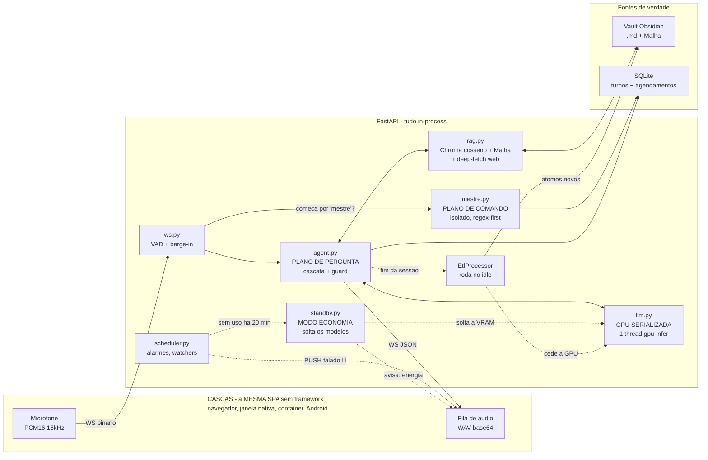

<div align="center">

# 🧠 Mente Digital

### Assistente Omni **100% local** — voz e texto, sem nuvem, sem API key, sem telemetria de terceiros.

*Um segundo cérebro que fala: conversa por voz, responde a partir das **suas** notas do Obsidian, recorre à web só quando precisa — **age** por comando falado (lembretes, listas, rotinas), **cuida** de coisas sozinho (alarmes, briefings, pomodoro) e, enquanto você não olha, destila o que aprendeu em novas notas atômicas.*

📐 **[Arquitetura completa / deep-dive técnico →](ARQUITETURA.md)**  ·  🇺🇸 [English overview](README.en.md)


**Alvo:** RTX 3080 (10 GB) · Ryzen 9 7950X3D · Windows

</div>

---

<div align="center">

**⏱ A camada de 30 segundos** — sete números, todos medidos neste repositório:

| | |
|---:|:---|
| **1663 testes** | a suíte inteira roda **sem GPU e sem rede**, em ~42 s — é literalmente o job de CI |
| **33% → 8%** | taxa de "não sei" com o contexto na mão, na troca `Qwen2.5-7B` → `Qwen3-8B` — decidida por **A/B próprio** |
| **~2×** | ranqueamento do RAG na troca de embedding (known-item MRR@10 0.20 → 0.375) |
| **0.55 → 0.16** | gate de relevância **recalibrado por dados** contra a base real |
| **TTFT ≈ 1,1 s** | medido ao vivo numa resposta do vault (decode ≈ 85 tok/s) |
| **8,9 / 10 GB** | o stack inteiro (Qwen3-8B + e5-base + KV `q8_0`) residente na VRAM da 3080, ~1,3 GB de folga |
| **61 MB** | o **vigia** que fica de plantão no logon — contra ~7,7 GB de RAM do assistente carregado. Sem uso, o PC volta a zero; o celular o levanta |

</div>

---

## 🎬 Demo — vendo funcionar

> **100% local, sem nuvem.** Nos dois vídeos, o **Gerenciador de Tarefas** (VRAM/GPU da RTX 3080) e o **terminal** ficam à mostra de propósito: dá pra ver a **rota** de cada resposta (`rota=ram` / `banco` / `web`), a **latência** real (`TTFT`/`TTFA`) e a placa trabalhando ao vivo. É a prova de que roda de verdade na máquina — não é um _wrapper_ de API.

<table>
<tr>
<td width="50%" align="center" valign="top">

**🎙️ Voz em tempo real**

[](https://github.com/user-attachments/assets/4ed48485-06b8-4fe9-907e-7395d9cd4f7c)

Fala → Whisper (STT) → LLM local → voz clonada (XTTS-v2), com _barge-in_.<br>No print: `rota=banco`, resposta vinda do vault.

</td>
<td width="50%" align="center" valign="top">

**💬 Modo texto**

[](https://github.com/user-attachments/assets/334cfa14-0896-4a83-a743-1c8c9fa684de)

Cascata memória → notas → web, com anti-alucinação.<br>No print: _"o que é RAG?"_ respondido do próprio banco.

</td>
</tr>
</table>

<sub>▶️ Clique num pôster para abrir o vídeo (player nativo do GitHub). Métricas por resposta ao vivo em `/api/metrics`; a suíte inteira roda **sem GPU e sem rede**.</sub>

---

## 🎯 O que é

**Mente Digital** é um assistente de voz e texto que roda inteiramente na sua máquina. Você fala; ele ouve, pensa e responde falando — em GPU local, com o primeiro áudio saindo enquanto o modelo ainda decodifica o resto da frase. Nada sai do computador, exceto uma busca web quando (e somente quando) o conhecimento local não basta.

Mas ele não só **responde**. Ele **age** (lembrete, lista, nota, rotina — por voz), **cuida** de coisas por conta própria (alarmes, watchers, briefing diário, pomodoro) e **lembra** (desfazer, corrigir, confirmar — a última ação sempre tem inverso). Três verbos, com uma **parede rígida** entre eles.

O que separa isto de um "chatbot com RAG" — seis teses que atravessam o código:

1. **A base é sua, e é um vault Obsidian.** Arquivos `.md` que você lê, edita e versiona; o ChromaDB é um índice **derivado e descartável**. Trocar o embedding é uma reindexação, não perda de dado.
2. **A métrica é a latência *percebida*, não a real.** O sistema persegue **TTFA** (tempo até o 1º *áudio*), não TTFT — token que ninguém ouviu não existe. Medido e exposto em `/api/metrics`.
3. **Anti-alucinação é controle de fluxo, não prompt.** O "não sei" é um **sinal interno**: o sistema segura o áudio, detecta o sentinela em streaming, descarta e escala para a web sem vazar uma sílaba.
4. **Comando ≠ conversa, e a fronteira é física.** Uma frase que começa por `"mestre, …"` entra num fluxo **isolado e determinístico** (regex antes de LLM) e **nunca vira conhecimento**.
5. **O sistema trabalha quando ninguém olha.** Um ETL idle destila conversas e pesquisas em notas atômicas; um scheduler persistente dispara os alarmes — ambos cedendo a GPU para a conversa ao vivo.
6. **Devolver a máquina faz parte do produto.** O app foi feito para ficar aberto o dia inteiro, então ele aprende a sair da frente: sem uso, solta os modelos sozinho (~5 GB de VRAM, ~7 GB de RAM) e **avisa** quem está conectado; sem uso por mais tempo, **se encerra**. Quem fica de plantão é um vigia de 61 MB que só levanta o assistente a pedido **autenticado** do celular.

> Pacote modularizado (**V2**) de um MVP monolítico, estendido por três "ondas" de agentes com **zero dependência nova**. Quase toda heurística carrega no comentário o bug real que ela conserta.

---

## 🧭 O que este projeto demonstra de Engenharia de Dados

> Por fora é um assistente de voz. Por dentro é o problema central de todo time de dados:
> **transformar dado bruto e disperso em um dataset confiável, pronto para uma camada de IA consumir.**

| Competência de Eng. de Dados | Onde vive neste repositório |
|---|---|
| **Pipeline de ETL incremental** (ingestão → transformação → carga) | `etl.py` — destila conversas e páginas web em unidades atômicas e as carrega em duas engines |
| **Modelagem em camadas** (bruto → limpo → pronto, no espírito *bronze/silver/gold*) | dado cru → limpo/conformado (extração, dedup, atomização com proveniência) → pronto (indexado e ranqueado) |
| **Ingestão incremental / CDC** | reindex por `mtime` do filesystem como *change-feed* — só reprocessa o que mudou (`rag.py`) |
| **Arquitetura relacional + não-relacional** | SQLite (fatos + estado, migrações idempotentes) e ChromaDB (vetorial, cosseno) convivendo |
| **Qualidade de dados / DataOps** | **1663 testes sem GPU nem rede** em CI, dedup por Jaccard, proveniência/linhagem em frontmatter |
| **Decisão orientada por métrica** | harnesses de A/B em `eval/` — ranqueamento **2×** (MRR@10 0,20→0,375), erro do modelo **33%→8%** |
| **Otimização de performance/custo** | orçamento de 10 GB de VRAM; profiling por estágio com **percentis p50/p95** (`/api/metrics`) |
| **Orquestração** | `scheduler.py` — loop persistente de trabalho agendado (recorrência, reentrega do que falhou) |

---

## 🔬 Arquitetura em um diagrama



A **primeira bifurcação** é a arquitetura inteira em uma imagem: **começou por "mestre"? é comando** (plano determinístico) — **senão, é pergunta** (plano de conhecimento). As setas cheias são o caminho crítico; as pontilhadas, trabalho de fundo que nunca disputa a GPU com você.

**→ Detalhe módulo a módulo, os diagramas de cada fluxo, as *war stories* e cada decisão de design em [`ARQUITETURA.md`](ARQUITETURA.md).**

---

## ✨ Principais capacidades

- **Dois planos separados** — *pergunta* (RAG em cascata RAM→banco→web, com guard anti-alucinação) e *comando* (palavra-mestre, regex-first, isolado do conhecimento).
- **Voz de baixa latência** — streaming token→frase→áudio, chunking por frase, filler falado; Piper (CPU, default) ou XTTS-v2 (GPU, opt-in), com verbalização PT-BR de números.
- **Agentes que agem** — lembretes/alarmes, listas, rotinas compostas, captura rápida (GTD), SRS, hábitos, pomodoro — tudo por voz, reversível (desfazer/corrigir/confirmar).
- **Agentes que cuidam** — scheduler persistente (sobrevive a restart) com alarmes, *watchers* ("me avise quando X"), briefing diário e push falado.
- **Ciclo de vida do conhecimento** — notas nascem `#conhecimento_novo` e só "amadurecem" quando você de fato as reusa; a base cresce da sua curiosidade.
- **A Malha** — GraphRAG sobre o vault (aterramento por IDF, hubs, pontes por surpresa) **sem biblioteca de grafo**.
- **Figuras, e imagem da web sem furar o pilar local** — a resposta anexa a figura do seu vault que a ilustra e, quando não há, o **servidor** busca, valida (SSRF, teto de tamanho), reencoda em WebP e guarda no acervo com nota de proveniência; o navegador nunca fala com domínio externo. A busca de figura é **exata em memória** — 85× mais rápida que o índice aproximado, que errava a **1ª colocada em 30%** das perguntas.
- **Modo avançado, na mesma página** — de onde veio a última resposta (RAM/nota/web), navegador do vault com filtros de pasta, origem e data, o **grafo local da Malha** desenhado em ~90 linhas de JS puro (nenhuma CDN: `vis-network` viria do unpkg e quebraria o "100% local") e o waterfall de latência p50/p95 por estágio.

> Histórico completo de features (patch notes das três ondas) e o *porquê* de cada uma em [`ARQUITETURA.md`](ARQUITETURA.md#-patch-notes).

---

## 🖥️ O aplicativo — e a máquina de volta

`python app.py` abre a **mesma SPA** numa janela WebView2 sem moldura, com ícone na bandeja. Não há segunda interface para manter em sincronia: navegador, janela nativa, container e o app Android consomem o mesmo [`templates/index.html`](templates/index.html) e o mesmo WebSocket. O ícone é **desenhado em código** ([`marca.py`](mente_digital/marca.py)) e não um binário versionado — a cor do ícone *é* a cor da interface, por construção.

- **Tela de boot com progresso REAL.** O uvicorn roda no próprio processo, então a barra lê `ctx.llama.ready`/`ctx.stt.ready` direto da memória — inclusive nos ~12 s em que a porta ainda nem existe (o bind só acontece depois do lifespan). O percentual é contagem de **marcos alcançados**, nunca cronômetro disfarçado; sem marco algum, o anel gira sem número em vez de inventar um. E a tela só libera com o **trabalho de fundo** terminado também: medido, os serviços ficam prontos aos 11,6 s e ainda há ~24 s de malha/sync depois disso. A espera não some — sai de dentro da primeira resposta, onde é invisível e irritante, e vai para a barra, onde é esperada. Boot **35,7 s → 25,3 s** depois de descobrir que a malha era reconstruída **3×** por boot.
- **Modo economia automático.** Sem turno de conversa por `MENTE_IDLE_STANDBY_MINUTOS` (20), o servidor solta LLM, Whisper, voz e embeddings e **avisa** as sessões vivas (`{"tipo":"energia"}`) — um standby calado deixaria a próxima pergunta sair com o RAG cego, bem formada e sem contexto. ⚠ A régua é **atividade**, não sessão conectada: num app feito para ficar aberto o dia inteiro, `ctx.sessoes` nunca esvazia e o watcher jamais dispararia. Decode em voo e trabalho de fundo **vetam** o sono, com o motivo registrado no log; o botão manual (que hoje se aperta do celular, longe do PC) **espera** o turno terminar e, se não terminar, recusa com motivo em vez de degradar a resposta em silêncio.
- **O PC em zero, e o celular o levanta.** Descansar libera a VRAM, mas o processo Python segue com ~7,7 GB de RAM — "de plantão" não era barato o bastante. Então são **duas camadas**: depois de `MENTE_IDLE_ENCERRAR_MINUTOS` (45) o app **se encerra**, e quem fica no logon é o **vigia** ([`vigia.py`](mente_digital/vigia.py)) — stdlib pura, sem torch, sem FastAPI, **61 MB**, duas rotas: `GET /vigia/status` (sem gate, só booleanos) e `POST /vigia/acordar` (**com** token, porque é a única que faz algo). Medido do zero: pedido autenticado → tela de carregamento com progresso real → conversa em **96 s**; sem token ou com token errado, HTTP 401.
- **Ócio do DONO, não da janela.** Parado o teclado e o mouse por `MENTE_APP_OCIOSO_SEGUNDOS` (300; lido direto do ambiente, não pelo `Settings`), o app pergunta se pode consolidar e, sem resposta em 15 s, consolida. O relógio é o `GetLastInputInfo` do Windows — "há quanto tempo ninguém tocou em nada nesta máquina" —, não um detector em JavaScript: para este, jogar em tela cheia é idêntico a estar longe do teclado, e o idle roubaria a GPU no meio da partida. Quando você volta, o trabalho para e devolve o que ocupou — observado ao vivo: o `parar` chegou **0,27 s** depois do input e a VRAM ficou em 6.578 MiB, porque o contrato é *"libera o que o idle ocupou"*, não *"desliga tudo"*.
- **Sobe com o Windows.** `python app.py --instalar-inicio` escreve um `.vbs` de quatro linhas na pasta Inicializar **do usuário** (a de todos pediria administrador) que deixa o vigia de plantão. ⚠ Em **UTF-16**: o Windows Script Host lê `.vbs` como ANSI, e falha de script de logon não aparece em lugar nenhum visível.

> A janela precisa de `pywebview`, e a bandeja de `pystray` — **nenhum dos dois está no `requirements.txt`** hoje: `pip install pywebview pystray`. A bandeja é *fail-soft* (sessão sem bandeja, política de grupo ou headless deixam o app exatamente como antes); a janela, não. `python main.py` continua subindo só o servidor.

**📱 No celular:** um cliente magro em [`android/`](android/README.md) — **um clone do `app.py`**, não uma segunda interface: tela de boot nativa com os mesmos marcos e a mesma SPA num WebView. Quando não acha o servidor, ele levanta o PC pelo vigia; e o libera de volta pela folha de utilidades (o menu da bandeja, num telefone sem bandeja). Ver [`android/README.md`](android/README.md).

---

## 🧩 Stack

Nenhuma escolha é "a lib popular" — cada uma resolve a restrição do alvo: **10 GB de VRAM e um orçamento de TTFA**.

| Camada | Tecnologia | Papel |
|---|---|---|
| LLM | **llama-cpp-python** + **Qwen3-8B** `Q4_K_M` | GPU serializada por `ThreadPoolExecutor(max_workers=1)`; streaming com cancelamento |
| STT | **faster-whisper** (`large-v3-turbo`) | Na CPU por padrão — sai da GPU para o embedding entrar |
| TTS | **Piper** (ONNX, default) / **XTTS-v2** (GPU, opt-in) | Zero-VRAM na CPU; uma síntese por frase |
| Embeddings | **e5-base** (`sentence-transformers`) | Singleton, injetado no VectorStore **e** no deep-fetch web |
| Índice | **ChromaDB** (cosseno) + **A Malha** (código próprio) | Índice derivado; reindex incremental por `mtime` |
| Persistência | **SQLite** | Turnos, latências, agendamentos, estado dos agentes; migrações idempotentes |
| Servidor | **FastAPI** + **WebSocket** | Full-duplex (pré-condição de barge-in e do push proativo) |
| Casca | **pywebview** (WebView2) + **pystray** | Janela sem moldura e bandeja; a mesma SPA, zero interface nova |
| Celular | **Kotlin** + **WebView** (`android/`) | Clone do `app.py`: boot nativo, ponte de microfone, e a mesma SPA |

> ~22.900 linhas de Python em 60 módulos + **1663 testes** sem GPU nem rede. A justificativa de cada escolha (por que GGUF, por que cosseno, por que ONNX) está em [`ARQUITETURA.md`](ARQUITETURA.md#-por-que-cada-formato).

---

## 🚀 Quickstart

```bash
git clone https://github.com/danielpvp22/mente_digital.git
cd mente_digital

python -m venv .venv
.venv\Scripts\activate            # Windows  (Linux/macOS: source .venv/bin/activate)

:: llama-cpp-python PRECISA ser compilado com CUDA — sem isto o pip instala a
:: versão CPU em silêncio e o TTFT vai de ~1s para ~1min (exige VS Build Tools
:: + CUDA Toolkit; alternativa: wheel pré-compilada cu12x do repositório oficial).
set CMAKE_ARGS=-DGGML_CUDA=on -DCMAKE_CUDA_ARCHITECTURES=86
set FORCE_CMAKE=1
pip install -r requirements.txt   # reprodutível: pip install -c requirements.lock.txt -r requirements.txt

python scripts/baixar_modelos.py  # baixa o LLM (GGUF) e a voz Piper (--xtts p/ voz clonada)
copy .env.example .env            # e ajuste (vault, token da LAN, calibração)

python main.py                    # ou: uvicorn main:app --host 0.0.0.0 --port 8000
```

Abra `http://localhost:8000` e diga *"mestre, ajuda"* (ou `/ajuda`). O servidor sobe **antes** do LLM terminar de carregar.

Para a **casca de aplicativo** (janela nativa + bandeja, com a tela de boot de progresso real) em vez da aba do navegador:

```bash
pip install pywebview pystray     # ainda fora do requirements.txt
python app.py                     # sobe o servidor e abre a janela
python app.py --vigia             # plantão mínimo (61 MB, sem torch): espera o celular
python app.py --instalar-inicio   # deixa o vigia de plantão a cada logon do Windows
python app.py --remoto http://192.168.0.10:8000   # só a janela; servidor alheio (Docker)
```

**Modelos** (não vêm no repo, ficam em `dados/modelos/`): `scripts/baixar_modelos.py` baixa o LLM `Qwen3-8B-Q4_K_M.gguf` e a voz Piper `pt_BR-cadu-medium.onnx` (+ `.onnx.json`); Whisper e embeddings baixam sozinhos no 1º uso. Configuração 100% por `.env` (prefixo `MENTE_`, modelo comentado em [.env.example](.env.example)) — **calibrar nunca exige editar código**.

```bash
pip install -r requirements-dev.txt
pytest                            # 1663 testes, sem GPU e sem rede (~42 s)
```

⚠ O CI tem **quatro portões bloqueantes**, e o job que os roda chama-se `pytest` — uma reprovação "no pytest" pode não ter nada a ver com testes. Rode o mesmo que ele roda antes de empurrar:

```bash
ruff check . && pytest -q --cov=mente_digital --cov-fail-under=77
bandit -c pyproject.toml -r mente_digital main.py -q --severity-level medium && pip-audit
```

`requirements.txt` e `requirements-ci.txt` divergem **de propósito** (o do CI é mínimo, para o job durar ~1 minuto). Dependência usada por **teste** precisa entrar nos dois — senão passa na máquina de desenvolvimento e reprova lá.

**→ Setup detalhado (CUDA, Docker, `.env`, download dos modelos) em [`ARQUITETURA.md`](ARQUITETURA.md#-setup--instalação).**

---

## 📚 Documentação

| Documento | Conteúdo |
|---|---|
| **[ARQUITETURA.md](ARQUITETURA.md)** | O deep-dive: papel de cada módulo, fluxos, war stories, casos de uso, API, configuração |
| [android/README.md](android/README.md) | O app do celular: como abrir no Studio, o que a casca faz e o que continua sendo da SPA |
| [docs/CALIBRACAO.md](docs/CALIBRACAO.md) | Como calibrar o gate de relevância e os botões dos agentes |
| [docs/CONSULTORIA_TTFT.md](docs/CONSULTORIA_TTFT.md) | Rodada de latência TTFT/TTFA (banca, ranking, implementação) |
| [docs/PLANO_APP_ANDROID.md](docs/PLANO_APP_ANDROID.md) | O plano de 4 fases do app, e as três armadilhas que o quebrariam em silêncio |
| [docs/UPGRADE_BLACKWELL.md](docs/UPGRADE_BLACKWELL.md) | Roteiro para rodar numa GPU Blackwell (sm_120), com o gate que confere a toolchain |
| [docs/MALHA_TEXTO_2026-07-31.md](docs/MALHA_TEXTO_2026-07-31.md) | A passada de links nas 6.324 notas de texto — e as duas ideias que a medição derrubou |
| [docs/TESTE_MANUAL.md](docs/TESTE_MANUAL.md) | Roteiro de verificação (o que exige microfone) |

---

## 📄 Licença

[Apache-2.0](LICENSE) (com cláusula de patente) · ver [NOTICE](NOTICE).
