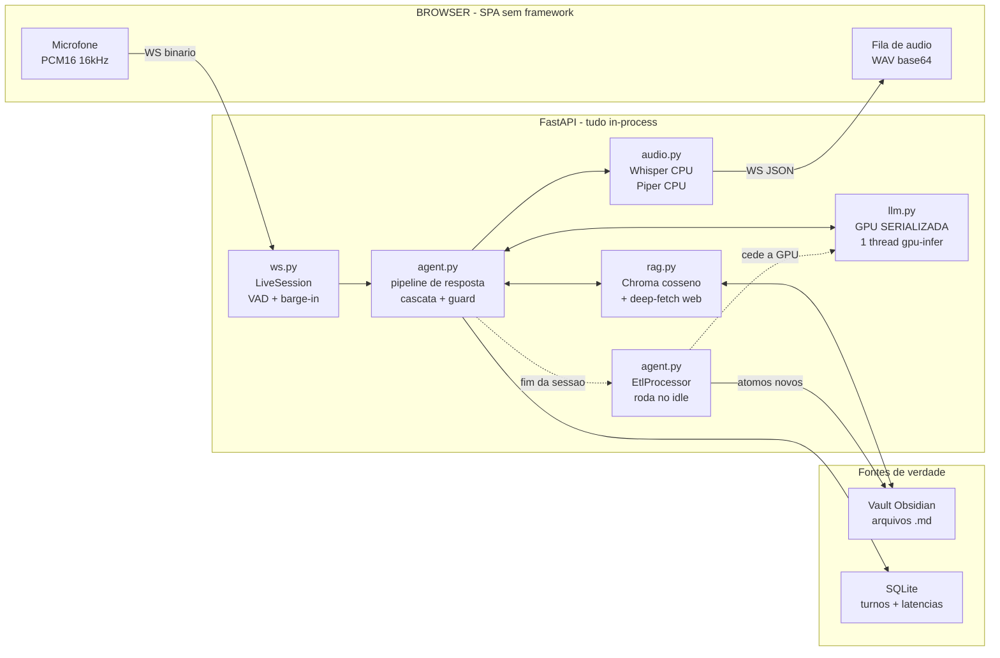
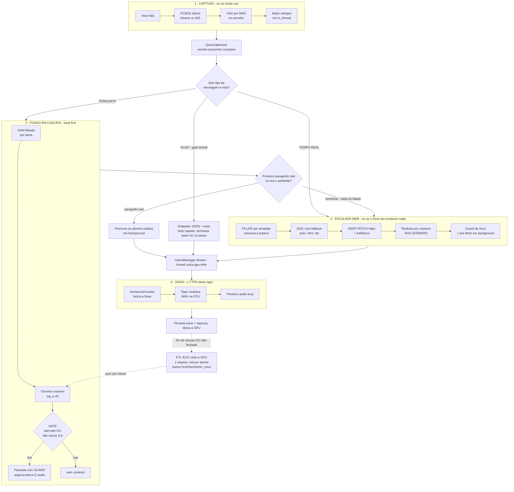
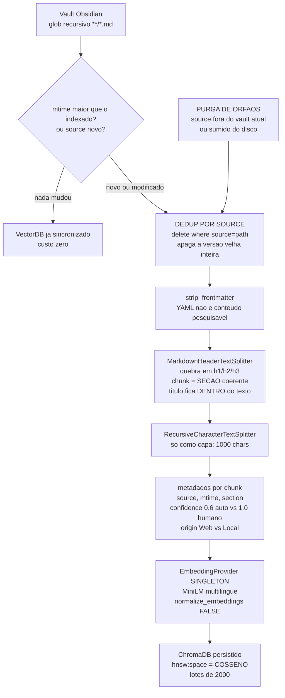
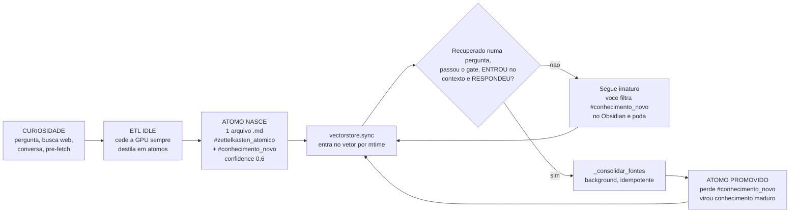
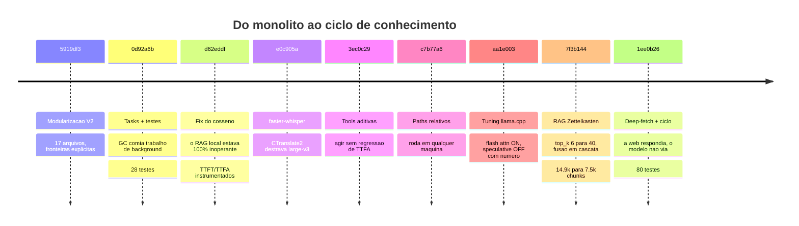

<div align="center">

# 🧠 Mente Digital

### Assistente Omni **100% local** — voz e texto, sem nuvem, sem API key, sem telemetria de terceiros.

*Um segundo cérebro que fala: conversa por voz, responde a partir das **suas** notas do Obsidian, recorre à web só quando precisa — e, enquanto você não está olhando, destila o que aprendeu em novas notas atômicas.*


**Alvo:** RTX 3080 (10 GB) · Ryzen 9 7950X3D · Windows

</div>

---

## Índice

| | | |
|---|---|---|
| [O que é](#-o-que-é) | [Passo a passo](#-passo-a-passo-o-que-acontece-quando-você-fala) | [Evolução](#-evolução-do-projeto) |
| [Anatomia em 30s](#-anatomia-em-30-segundos) | [O banco vetorial](#-o-banco-vetorial-como-ele-é-formado) | [War stories](#-war-stories-os-bugs-que-moldaram-a-arquitetura) |
| [Stack](#-stack-e-como-cada-peça-é-usada) | [Ciclo do conhecimento](#-o-ciclo-de-vida-do-conhecimento) | [Casos de uso](#-casos-de-uso) |
| [Papel de cada módulo](#-papel-de-cada-módulo) | [Por que cada formato](#-por-que-cada-formato) | [Outros contextos](#-além-do-assistente-pessoal) |
| [Setup](#-setup--instalação) | [Skills demonstradas](#-skills-de-engenharia-demonstradas) | [Em aberto](#-não-features-intencionais-e-pontos-em-aberto) |

---

## 🎯 O que é

**Mente Digital** é um assistente de voz e texto que roda inteiramente na sua máquina. Você fala; ele ouve, pensa e responde falando — em GPU local, com o primeiro áudio saindo enquanto o modelo ainda está decodificando o resto da frase. Nada sai do computador, exceto uma busca web quando (e somente quando) o conhecimento local não basta.

A diferença para um "chatbot com RAG" está em três teses que atravessam cada linha do código:

**1. A base de conhecimento é sua, e é um vault Obsidian.** Não um banco vetorial opaco — arquivos `.md` que você lê, edita e versiona. O ChromaDB é um índice **derivado e descartável**; a fonte de verdade é o filesystem. Trocar o modelo de embedding é uma reindexação, não uma perda de dados.

**2. O que importa não é a latência real, é a latência percebida.** A métrica que o sistema persegue não é TTFT (tempo até o primeiro *token*) e sim **TTFA — tempo até o primeiro *áudio***. Num assistente de voz, token que ninguém ouviu não existe. Streaming + chunking por frase + filler falado + guard prefixal existem todos para minimizar esse número — e ele é medido, gravado no SQLite e exposto em `/api/metrics`.

**3. Anti-alucinação é problema de controle de fluxo, não de prompt.** O assistente prefere dizer "não sei" a inventar. Mas "não sei" é um **sinal interno de controle** — o usuário nunca o ouve: o sistema segura o áudio, detecta o sentinela ainda em streaming, descarta a resposta e escala para a web sem que uma sílaba tenha vazado.

E há um quarto pilar, mais raro: **o sistema faz trabalho quando ninguém está olhando.** No fim da sessão, um ETL idle destila as pesquisas e a própria conversa em notas Zettelkasten atômicas — que nascem marcadas `#conhecimento_novo` e só "amadurecem" (perdem a tag) quando você de fato as reusa numa resposta futura. A base cresce da sua curiosidade e se cura pelo seu uso.

> Este é o pacote modularizado (**V2**) de um MVP monolítico anterior (`mvp_mente.py`). A herança importa: quase toda heurística deste repositório carrega no comentário o bug real que ela conserta. Elas não são estilo — são cicatrizes.

---

## 🔬 Anatomia em 30 segundos



**Como ler este diagrama:** as setas cheias são o caminho crítico (o que acontece enquanto você espera); as pontilhadas são trabalho de background que nunca compete com você pela GPU. Essa separação é a arquitetura inteira em uma imagem.

---

## 🧩 Stack e como cada peça é usada

Nenhuma escolha aqui é "a lib popular". Cada uma resolve uma restrição concreta do alvo: **10 GB de VRAM e um orçamento de TTFA**.

### Núcleo de IA

| Tecnologia | Papel | Como é usada **neste** projeto |
|---|---|---|
| **llama-cpp-python** | LLM local | Compilado com CUDA. Encapsulado em `LlamaManager` com **GPU serializada por um `ThreadPoolExecutor(max_workers=1)`** — dois decodes nunca coexistem, por construção. `flash_attn=True` invertendo o default da lib; `n_batch`/`n_ubatch`/`kv_cache_type` expostos como botões calibráveis. Streaming token-a-token com `stop_event` para barge-in de ~1 token de granularidade. |
| **Qwen2.5-Coder-7B** `Q4_K_M` | Modelo | GGUF de ~4.7 GB. A quantização não é sobre qualidade — é **orçamento de coabitação**: pesos + KV-cache de 8k + embeddings na GPU têm que caber juntos em 10 GB. |
| **faster-whisper** (CTranslate2) | STT | Mesmos pesos do Whisper, execução muito mais rápida. Roda na **CPU por padrão** — deliberadamente: sai da GPU para o embedding poder entrar. `MENTE_WHISPER_MODEL=large-v3` sobe a qualidade quando há VRAM. A API é lazy, então a iteração dos segmentos acontece **dentro** do `to_thread`. |
| **Piper TTS** (ONNX) | Voz PT-BR | `onnxruntime` puro: sem PyTorch, sem CUDA, **zero VRAM**. Chamado **uma vez por frase** (não por resposta) — é o que faz o primeiro áudio sair enquanto o LLM ainda decodifica. |
| **sentence-transformers** | Embeddings | `paraphrase-multilingual-MiniLM-L12-v2`, **singleton** criado uma vez e injetado em **dois** consumidores: o `VectorStore` (busca no vault) e o `WebSearcher` (ranking do deep-fetch). Um modelo, uma alocação de VRAM, dois usos. |

### RAG e dados

| Tecnologia | Papel | Como é usada **neste** projeto |
|---|---|---|
| **ChromaDB** | Índice vetorial | In-process, persistido em disco. **Métrica de cosseno explícita** (`hnsw:space=cosine`), não o L2 padrão — ver [war stories](#3-o-gate-que-rejeitava-tudo--l2-vs-cosseno). Metadata por chunk (`source`/`section`/`confidence`/`origin`) sustenta o reindex por arquivo, a purga de órfãos e a proveniência no prompt. |
| **LangChain** (só os splitters) | Chunking | Usado **cirurgicamente**: `MarkdownHeaderTextSplitter` para quebrar por cabeçalho e `RecursiveCharacterTextSplitter` só como capa de tamanho. Nenhuma chain, nenhum agent, nenhum abstração de orquestração — o pipeline é código próprio. |
| **Obsidian / Markdown** | **Fonte de verdade** | O vault é o dado; o vetor é derivado. `mtime` do filesystem é um change-feed grátis para o reindex incremental. |
| **SQLite** | Fatos episódicos | Turnos de chat com `conversa_id`, log de ETL, e **latências TTFT/TTFA por resposta**. Uma conexão por operação (`timeout=10`) porque conexões `sqlite3` não atravessam threads e as chamadas vêm de `asyncio.to_thread`. Migração idempotente via `PRAGMA table_info` + `ALTER TABLE`. |
| **ddgs** (DuckDuckGo) | Busca web | Com **fallback de backend** (`auto → html → lite`): backend que cai por rate-limit não derruba a busca. Cache LRU + speculative pre-fetch. |
| **httpx** + **trafilatura** | Deep-fetch | Abrem o **corpo** das top-N páginas em paralelo e extraem o texto principal (sem menu/rodapé/ads). Existem porque snippet não responde pergunta numérica — ver [war stories](#4-a-web-respondia-e-o-modelo-dizia-que-não-sabia). |

### Web e infra

| Tecnologia | Papel | Como é usada **neste** projeto |
|---|---|---|
| **FastAPI** | Servidor | `lifespan` constrói o `AppContext` e injeta tudo. O `main.py` tem 160 linhas e **zero lógica de domínio** — só wiring e rotas. |
| **WebSocket** | Transporte ao vivo | Full-duplex é **pré-condição do barge-in**: o microfone sobe enquanto o áudio desce. Sem isso, não há interrupção. |
| **Pydantic Settings** | Configuração | ~60 parâmetros com prefixo `MENTE_`, todos com default derivado de `BASE_DIR`. Calibrar o sistema **nunca** exige editar código. |
| **HTML/CSS/JS puro** | Frontend | SPA de arquivo único, sem framework e sem build. Mini-markdown próprio com `escapeHtml`. A fila de áudio tem 3 linhas — porque o wire é WAV base64. |
| **pytest** | Testes | **80 testes que rodam sem GPU e sem rede** (~7s), com fakes de LLM/TTS/store. Testabilidade aqui é restrição de design, não add-on. |

---

## 🗂 Papel de cada módulo

**~3.300 linhas de Python** em 12 módulos, mais ~900 de testes e 456 de frontend. Nenhum módulo de domínio conhece o WebSocket: o pipeline recebe um callback `send(dict) -> bool` e é só isso que ele sabe do mundo exterior.

```
mente_digital/
├── main.py         # wiring: lifespan monta o AppContext, expõe rotas + WS
├── config.py       # Settings (Pydantic) + dicionário fonético do TTS
├── prompts.py      # todos os prompts de sistema/tarefa + as tags Zettelkasten
├── state.py        # AppContext (DI) + SessionMemory + LruCache
├── llm.py          # LlamaManager: GPU serializada, streaming, cancelamento
├── audio.py        # SttService (Whisper) + TtsService (Piper) + SentenceChunker
├── rag.py          # EmbeddingProvider + VectorStore (Chroma) + WebSearcher
├── agent.py        # pipeline de resposta, tools, LatencyTracker, EtlProcessor
├── tools.py        # function calling aditivo: gate, roteador JSON, registry
├── textutils.py    # normalização, keywords, aterramento léxico (100% puro)
├── ws.py           # LiveSession: VAD, barge-in, conversas, fim de sessão
├── telemetry.py    # logs coloridos thread-safe + Database (SQLite)
├── templates/      # index.html — a SPA inteira
├── modelos/        # LLM .gguf + voz Piper + whisper/ (binários fora do git)
└── tests/          # 80 testes, sem GPU, sem rede
```

<details>
<summary><b>O que cada arquivo faz (clique para expandir)</b></summary>

### `main.py` — o wiring, e nada mais
Único arquivo executável. No `lifespan`: cria as pastas, sobe o SQLite, monta o `AppContext` e instancia todos os serviços. O `_boot` trata cada recurso conforme seu custo — **a GPU carrega em background** (`track_task`) para o servidor aceitar conexões enquanto o modelo sobe; Whisper/Piper/embeddings vão para `asyncio.to_thread`. Termina abrindo e sincronizando o `VectorStore`. Zero lógica de domínio, por decisão explícita.

### `config.py` — o painel de controle
Uma classe `Settings` (Pydantic) com todas as constantes do sistema. **Todos os caminhos derivam de `BASE_DIR = Path(__file__).parent`** — nenhum path absoluto de máquina no código, então o repositório roda de qualquer diretório após um clone. Cada campo é sobrescrevível por `MENTE_*` no `.env`. Também guarda o `DICIONARIO_FONETICO` (inglês→PT-BR) que impede o Piper de soletrar "software" com fonética portuguesa. `ensure_dirs()` é chamado no startup — **nunca no import**: importar config não pode ter efeito colateral no filesystem.

### `state.py` — estado compartilhado, sem lógica
`AppContext` é o container de DI que vive em `app.state.ctx`; os serviços são campos `None` preenchidos no lifespan, porque o contexto precisa existir **antes** dos modelos carregarem (o boot é parcial e assíncrono por design). Contém também `track_task` (referência forte para tasks de background — ver [war stories](#2-as-tasks-que-o-garbage-collector-comia)), o `interactive_idle` (prioridade de GPU), a `SessionMemory` (histórico, memória fresca, fila de ETL — todas `deque` com `maxlen`, sem creep de RAM) e um `LruCache`. Quebra o ciclo de import com `if TYPE_CHECKING:`.

### `llm.py` — a única porta para a GPU
`LlamaManager` encapsula o `llama-cpp-python`. A garantia central: **um `ThreadPoolExecutor(max_workers=1)` chamado `gpu-infer`** — como só existe uma thread, dois `create_chat_completion` nunca se sobrepõem. Isso é serialização **estrutural** (por construção), não cooperativa (por convenção). O cancelamento usa um `threading.Event` por requisição, e o `asyncio.Lock` só é liberado **depois** de `await asyncio.to_thread(future.result)` — ou seja, depois que a thread realmente terminou. `_build_llama_kwargs` centraliza flash attention, KV-cache quantizado e speculative decoding, cada um guardado para degradar ao default em vez de derrubar o load. Import lazy do `llama_cpp` **dentro** das funções — é o que permite `import llm` sem CUDA, e é a pré-condição da suíte rodar sem GPU.

### `audio.py` — tudo que é som, tudo na CPU
`SttService` (faster-whisper), `TtsService` (Piper) e o `SentenceChunker`. Roda inteiramente na CPU, sempre atrás de `asyncio.to_thread` — porque a GPU é o recurso serializado e **tudo que pode sair dela deve sair**. O `SentenceChunker` é um conversor de impedância entre dois regimes de latência: o LLM produz token-a-token, o Piper precisa de uma unidade prosodicamente fechada e tem overhead fixo por chamada. Três mecanismos, cada um cobrindo um modo de falha: piso (`min_len`) contra migalhas, fim-de-frase **real** (`Dr.`, `3.5` e `etc.` não cortam) e flush por tamanho **cortando no último espaço dentro da janela** — para que uma frase longa sem pontuação não trave o áudio indefinidamente.

### `rag.py` — as duas fontes de conhecimento
`EmbeddingProvider` (singleton), `VectorStore` (Chroma, cosseno, reindex por `mtime`, purga de órfãos, dedup por `source`) e `WebSearcher` (DDG com fallback de backend, cache LRU, pre-fetch especulativo, e o **deep-fetch + RAG efêmero**: baixa o corpo das páginas, extrai com trafilatura, atomiza, rankeia por cosseno contra a pergunta e **não indexa nada**). Detalhes tratados aqui: `strip_frontmatter` (metadado YAML envenenaria o embedding), `split_markdown` (chunk = seção, não corte cego), e `resolve_device` (pedir `cuda` sem GPU degrada para `cpu` em vez de crashar).

### `agent.py` — o cérebro (719 linhas, o maior)
`QueryOptimizer` (resolve pronomes cruzados via histórico), `Agent.pipeline_resposta` (a fusão em cascata RAM → banco → web com o guard anti-sentinela), `_pipeline_tools` (loop agêntico capado), `LatencyTracker` (TTFT/TTFA com clock injetável) e `EtlProcessor` (atomização no idle, sempre cedendo a GPU). É onde vivem as decisões mais sutis do projeto — e onde os comentários carregam mais cicatriz por linha.

### `tools.py` — function calling **aditivo**
"Aditivo" é a decisão arquitetural: pergunta de conhecimento **não paga nada** pela existência das ferramentas. O gate lexical `talvez_acao` (custo ~zero) filtra: só mensagem de **ação** chega ao roteador LLM. O roteador é por **JSON** (`parse_decisao`), não o tool-calling nativo do llama.cpp — validado 7/7 no Qwen local. `calcular_seguro` compila AST com whitelist de nós (nunca `eval`) e capa o expoente em 1000, porque a calculadora é síncrona e `9**9**9` não seria lentidão, seria **indisponibilidade do servidor**. Seis ferramentas; as terminais saem no 1º passo.

### `textutils.py` — 97 linhas puras que sustentam o anti-alucinação
Só `re` + `unicodedata`, zero imports do projeto — as heurísticas mais sensíveis vivem onde não precisam de fake nenhum. `normaliza`, `palavras_chave`, `contem_alguma` (aterramento léxico), `limpar_query`, `remover_tag`. A lista `STOP` é **curada adversarialmente**: inclui `'modelo'`, `'dados'`, `'informacao'` — que não são stopwords gramaticais, mas casariam com qualquer chunk do vault e tornariam o aterramento inútil. A stoplist é função do corpus, não da língua. A exceção espelhada: token curto **com dígito** (`3d`, `5g`, `gpt4`) é preservado — são os mais discriminantes.

### `ws.py` — a máquina de estados ao vivo
`LiveSession`: VAD por RMS no servidor, barge-in em dois níveis (implícito — nova fala já cancela a anterior; explícito — mensagem do cliente), e o controle de conversas (`set_conversa`/`nova_conversa`/`carregar_conversa`). `_finalizar_sessao` dispara o ETL idle uma vez, tanto no `end_session` explícito quanto **no disconnect** — rede de segurança: antes, fechar a aba sem encerrar perdia a atomização da conversa inteira.

### `telemetry.py` — observabilidade e persistência
Logs coloridos thread-safe e um wrapper fino de SQLite. Histórico agrupado **por conversa** (não turnos soltos), log de ETL, e `save_latency` por resposta com médias em `/api/metrics`. Regra do projeto codificada aqui: **nunca `except: pass`** — todo erro passa por `telemetry.error`.

### `prompts.py` — a camada de linguagem
Todos os prompts num só lugar. O detalhe que importa: `SYS_RESPOSTA` (local) e `SYS_RESPOSTA_WEB` compartilham o **sentinela literal idêntico**, porque o guard depende da string exata — mas têm níveis de ceticismo diferentes, porque o ceticismo é função da fonte. `TAG_ATOMO` (`#zettelkasten_atomico`) marca a natureza; `TAG_NOVO` (`#conhecimento_novo`) marca a maturidade.

</details>

---

## 🎬 Passo a passo: o que acontece quando você fala

O caminho completo, do ar até o ar. Os passos 3–6 são exclusivos da voz; **texto digitado converge no passo 7** e daí em diante é idêntico.



<details>
<summary><b>Os 12 momentos que valem detalhe (clique para expandir)</b></summary>

**1. Boot.** O LLM carrega em **background** — o servidor aceita conexões enquanto isso e avisa o cliente se ainda não estiver pronto. Um warm-up de 1 token garante que a primeira resposta real não pague cold-start.

**2. VAD no servidor.** `rms = sqrt(mean(pcm**2))` direto sobre `int16` — sem decoder no caminho crítico. Enquanto está gravando, **todos** os frames entram no buffer (inclusive os abaixo do limiar), para não cortar pausas curtas no meio da frase. O loop lê com `timeout=0.5s`: é esse timeout que garante detectar silêncio mesmo se o browser parar de mandar pacotes.

**3. Filtro anti-ruído.** Buffer com menos de `vad_min_frames` é descartado — tosse não vira pergunta. Transcrição com menos de 3 chars idem.

**4. QueryOptimizer.** Resolve pronomes cruzados usando os 2 últimos turnos. Atalho barato: `"sim"`, `"continue"`, `"pode falar"` reaproveitam a query anterior sem chamar o LLM. Duas redes de segurança: regex tira pontuação e `limpar_query` capa em ~6 palavras contra o modelo que "ecoa" a frase inteira.

**5. Pergunta enriquecida só para o gerador.** `_pergunta_com_contexto` prefixa 2 turnos + `[PERGUNTA ATUAL]` **apenas no prompt de resposta** — dump, memória e busca seguem com o texto original. Conserta um bug cirúrgico: a *recuperação* já resolvia o pronome, mas o *gerador* recebia o texto cru e ficava cego a "explique melhor" — respondia sentinela **com os átomos certos na mão**.

**6. A cascata é fusão, não escolha binária.** RAM → banco → web. Cada fonte relevante contribui com **um parágrafo em passada própria**, e a web só entra `if not paragrafos` — ou seja, quando **nenhuma** fonte local produziu texto real. A rota final é reportada no log como `ram+banco`, `web`, etc.

**7. O gate combina dois sinais ortogonais.** Aterramento **léxico** (o chunk menciona a entidade perguntada) **OU** confiança **semântica** (distância < `rag_score_confident`). A lição: *embedding não tem noção de entidade* — um chunk sobre "ML em geral" fica perto de "TensorRT no YOLO" no espaço vetorial e mesmo assim não contém a resposta. Léxico e denso cobrem as falhas um do outro. É o híbrido sparse+dense clássico, sem BM25, a custo zero.

**8. O corte real é orçamento de caracteres**, não contagem de chunks: com chunks de tamanho variável, contar chunks **não protege o `n_ctx`**. `rag_context_char_budget=12000` (~3k tokens dentro de 8192) é quem morde primeiro; `rag_max_chunks=30` é só o limite de contagem.

**9. O guard anti-sentinela** é um matcher de prefixo incremental sobre o stream. Enquanto o buffer normalizado for **prefixo** de `"nao tenho informacoes suficientes"`, tokens **e áudio** ficam retidos. Diverge → despeja o buffer e streama (custo: alguns tokens de TTFA). Confirma → descarta, retorna `None`, **nada foi falado**, escala. É a única forma de "cancelar depois de já ter começado a gerar" sem matar o streaming — a alternativa óbvia (coletar tudo antes de falar) destruiria o TTFA, que é a razão de existir da arquitetura.

**10. O filler é UX de tempo, não decoração.** Só existe **na escalada web** — o único caminho com espera real. É **template** (sem chamada extra ao LLM): mascarar latência não pode *custar* latência. E ele **diz o que está fazendo** ("vou buscar X na web"), o que converte espera em progresso percebido. Rotaciona 3 variantes para não virar tique.

**11. Barge-in de ponta a ponta.** Cancelamento da task → `CancelledError` re-propagado explicitamente (se o `except Exception` o engolisse, o decode continuaria) → `stop_event.set()` → o loop quebra no próximo token → **join** via `await asyncio.to_thread(future.result)` → só então o lock é liberado → a nova inferência entra sem overlap de VRAM. Os `safe_send` da stream morta devolvem `False` — falha **esperada**, não erro.

**12. Fim de sessão.** Dispara no `end_session` **e** no disconnect. A task do ETL é retida no `ctx`, **não na sessão** — sobrevive ao WebSocket morto. O `EtlProcessor` espera `interactive_idle` **antes de cada tarefa pesada**: se outra aba perguntar algo, o ETL cede a GPU no meio do trabalho.

</details>

---

## 🗄 O banco vetorial: como ele é formado

A regra que governa tudo: **o vault é a fonte de verdade; o Chroma é um índice derivado e descartável.** Apagar `banco_vetorial_cerebro/` não perde nada — o próximo boot reconstrói. É essa hierarquia que dá liberdade de trocar métrica, modelo de embedding ou estratégia de chunking sem que isso seja *perda de dados*.



### As sete etapas, e o porquê de cada uma

| # | Etapa | Por que assim |
|---|---|---|
| 1 | **Varredura** — `glob` recursivo por `**/*.md` | O filesystem é o índice primário de identidade. `source path` = id do átomo. |
| 2 | **Diff por `mtime`** | O filesystem já mantém o timestamp: change-feed **de graça**, sem CDC, sem watcher, sem tabela de versões. A heurística antiga (`len(ids) < len(arquivos)`) comparava **chunks com arquivos** — quebrava logo após o primeiro split. |
| 3 | **Purga de órfãos** | Quando o *caminho* do vault muda, o delete-by-source (match exato de string) não casa e **toda** nota duplica. Aconteceu de verdade: 14.9k chunks para 7.5k reais. |
| 4 | **Dedup por `source`** | Delete-then-insert por arquivo. Sem isso, editar uma nota **duplicaria** os chunks em vez de atualizá-los. |
| 5 | **`strip_frontmatter`** | Metadado YAML não é conteúdo pesquisável — e envenenaria o embedding. |
| 6 | **Split por cabeçalho, depois capa por tamanho** | Chunk = seção semanticamente coerente, não corte cego a cada N chars. `strip_headers=False`: o título fica **dentro** do texto (contexto para o LLM *e* para o TTS) e o caminho de títulos vai para `metadata['section']`. |
| 7 | **Embedding + Chroma cosseno** | Ver abaixo — é a decisão mais consequente do módulo. |

### Proveniência: o LLM sabe de onde veio cada pedaço

```python
is_auto = settings.subpasta_conhecimento_novo in path
base_meta = {
    "source": path,                          # id do átomo
    "mtime": mtime,                          # chave do reindex incremental
    "confidence": 0.6 if is_auto else 1.0,   # auto-colhido vale menos que escrito à mão
    "origin": "Web" if is_auto else "Local",
}
```

E isso **aparece literalmente no prompt** (`[Local - Confiança: 0.6] ...`): o modelo recebe o *grau de confiança da fonte*, não apenas o texto.

### Por que top_k=40 e não 4

Porque **a granularidade do corpus dita a configuração**. A base é Zettelkasten atômica — 1 nota = 1 ideia. Colher 4 chunks de um corpus assim rende contexto pobre demais: cada nota traz um fragmento mínimo, e o assistente "esquece" o que já foi anotado. Daí `rag_top_k=40` / `rag_max_chunks=30` (contra o default típico de 4) e a resposta por **fusão** — o LLM integra dezenas de átomos num parágrafo coerente em vez de listá-los.

### Coerência entre os dois caminhos

O RAG efêmero da web usa o **mesmo** `EmbeddingProvider` e normaliza os vetores **à mão** (`np.dot(q,v)/(qn*vn)`) exatamente porque `normalize_embeddings=False`. A mesma premissa, dois lugares, zero inconsistência: no caminho local quem faz o cosseno é o Chroma; no efêmero, o numpy.

> ⚠️ **`hnsw:space` é fixado na criação da coleção.** Trocar a métrica exige **apagar `banco_vetorial_cerebro/`** e reindexar. Passar `collection_metadata` diferente numa coleção existente não faz nada.

---

## 🔄 O ciclo de vida do conhecimento

Este é o mecanismo mais sofisticado do projeto: **um feedback loop de curadoria com sinal implícito.** A base cresce da sua curiosidade e amadurece pelo seu uso — sem você curar nada à mão.



### Nascimento: três fontes

| Fonte | Onde | Detalhe |
|---|---|---|
| **Pesquisas web da sessão** | `process_queue` | Cada escalada para a web é enfileirada e destilada no idle. |
| **A "curiosidade" do pre-fetch** | `_prefetch` | O mais sutil: o speculative pre-fetch baixa um contexto **amplo** para antecipar a próxima pergunta. Esse contexto *não precisava ser falado agora* — mas também vira átomo. O sistema colhe o que você **quase** perguntou. |
| **O histórico da conversa** | `summarize_dump` | A conversa inteira (voz + texto) é atomizada. Se o LLM responde `"NADA"` (small talk), não cria nota. |

### Promoção: três condições, todas necessárias

```python
if local.relevante:                                  # 1. passou o gate
    antes = len(paragrafos)
    await passada(self._montar_contexto(local, []), "banco")
    if len(paragrafos) > antes and local.fontes:     # 2. produziu parágrafo REAL (não sentinela)
        self.ctx.track_task(self._consolidar_fontes(local.fontes))   # 3. só as fontes que ENTRARAM
```

E as três decisões que sustentam isso são todas não-óbvias:

**1. O sinal é honesto.** `LocalResult.fontes` reporta apenas os chunks que **entraram no contexto** — não os que o `similarity_search` recuperou. Promover o que foi *recuperado* seria promover ruído; promover o que foi *usado* é o sinal real. E recuperar não basta: o átomo tem que ter de fato **respondido** (passada não-sentinela).

**2. A granularidade do storage foi dimensionada pela granularidade do sinal.** **Um arquivo por átomo** existe porque, com vários `##` num arquivo, promover um átomo **promoveria os vizinhos por acidente** — os que calharam de estar no mesmo documento. Isso é raro de ver: a resolução do armazenamento escolhida em função da resolução do feedback.

**3. A escrita é idempotente e barata.** `_consolidar_fontes` só reescreve **se a tag existir** — porque uma escrita inócua bumparia o `mtime`, e `mtime` é o gatilho do índice: cada promoção redundante dispararia uma reindexação inútil. Roda em background para não pesar no TTFA. O arquivo no vault muda na hora (é o que você vê no Obsidian); o Chroma só sabe na próxima `sync`.

### E nada se perde em silêncio

- `summarize_dump` **só limpa o dump se a síntese foi salva**. Falha transitória? A conversa fica para a próxima passada.
- LLM devolveu texto sem nenhum `##`? `_salvar_atomos` salva o texto inteiro como 1 átomo em vez de descartar o conhecimento calado.

---

## 🎛 Por que cada formato

Um resumo antes do detalhe: **três formatos, três naturezas de dado, nenhum forçado no papel do outro.** SQLite guarda fatos episódicos (turnos, latências); Markdown guarda conhecimento semântico curado; Chroma é índice derivado descartável. É esse casamento que faz o sistema parecer projetado em vez de acumulado.

<details>
<summary><b>GGUF Q4_K_M — uma decisão de orçamento de sistema, não de qualidade</b></summary>

**GGUF** é o formato do llama.cpp: tensores + metadata (tokenizer, chat template, arquitetura) num **arquivo único**, mmap-ável, com **offload por camadas** (`n_gpu_layers`). É o formato que *permite* a divisão GPU/CPU — a alternativa (safetensors + transformers) quer o modelo inteiro em VRAM ou uma camada de `accelerate` por cima.

**Q4_K_M** é k-quant "medium": **mistura de precisão por tensor** — mais bits nos tensores sensíveis (`attention.wv`, `feed_forward.w2`), 4 bits no resto. ~4.7 GB para um 7B (vs. ~15 GB em fp16), com perplexidade próxima do fp16.

**Mas a justificativa real não é sobre o LLM — é sobre coabitação.** A RTX 3080 tem 10 GB e o orçamento precisa acomodar: pesos + KV-cache de `n_ctx=8192` + embeddings na GPU (estão no caminho crítico de *toda* pergunta) + eventualmente Whisper. Q4_K_M é o que **deixa VRAM sobrando para o resto do sistema**. A mesma restrição explica, em cascata:

- `whisper_device="cpu"` — large-v3 comeria ~3 GB; o Whisper sai da GPU **para o embedding poder entrar**;
- `flash_attn=True` **invertendo o default da lib** — ganho duplo: prefill mais rápido (TTFT com prompt RAG de até 12k chars) **e** menos VRAM de KV;
- `kv_cache_type="f16"` com `q8_0` como escape hatch documentado ("~metade da VRAM de KV com perda ínfima → libera espaço para embeddings/Whisper"), incluindo o guard que exige `flash_attn=True` para o cache V quantizado, com fallback avisado em vez de erro obscuro em runtime.

</details>

<details>
<summary><b>ONNX (Piper) — porque a GPU é o recurso escasso</b></summary>

Piper é **VITS exportado para ONNX**, executado no `onnxruntime`: **sem PyTorch, sem CUDA, sem VRAM**. Roda em CPU em tempo real (o 7950X3D tem sobra ociosa).

**A razão arquitetural é a política de GPU:** a GPU é serializada (uma thread). **Tudo que consegue rodar na CPU deve rodar na CPU**, senão entra na fila do executor e come TTFA diretamente. O TTS na GPU competiria com o decode que está *produzindo o texto que ele precisa falar* — o assistente disputando consigo mesmo.

Dois detalhes práticos: **(a)** o Piper é chamado **uma vez por frase**, então o overhead fixo por chamada é multiplicado pelo número de frases — um runtime com JIT/warm-up variável destruiria o TTFA; **(b)** ONNX = grafo estático + pesos, com o **`.onnx.json` ao lado** carregando `phoneme_id_map` e `sample_rate`. Daí a instrução de baixar os dois arquivos, e o `setframerate(voice.config.sample_rate)` — a taxa vem do sidecar, não é hardcoded.

</details>

<details>
<summary><b>Markdown / Obsidian — seis justificativas independentes</b></summary>

1. **O banco vetorial é derivado; o vault é a fonte.** O Chroma pode ser apagado e reconstruído. Se o dado morasse no Chroma, trocar de embedding seria **perda de dados**. Essa hierarquia é o que dá liberdade de evoluir o RAG.
2. **`mtime` é um change-feed grátis.** Sem CDC, sem watcher, sem hash, sem tabela de versões — o filesystem já mantém o timestamp.
3. **Markdown tem estrutura semântica legível por máquina.** Os cabeçalhos permitem chunkar por **seção**. JSON, binário ou texto puro não dariam isso.
4. **As tags são texto no arquivo** — a promoção é um `re.sub`, e o **Obsidian já sabe filtrar por tag**. A UI de curadoria vem de graça: pesquise `#conhecimento_novo` e veja tudo que a IA colheu e você ainda não usou.
5. **Human-in-the-loop real.** Você abre o Obsidian e **vê** o átomo, edita, apaga, linka. É *por isso* que `remover_tag` consome o whitespace órfão — **um humano lê esse arquivo**; a promoção não pode sujá-lo.
6. **Formato aberto e durável.** O conhecimento sobrevive ao projeto. Coerente com "100% local": o dado não fica refém nem de um serviço nem *do próprio código*.

**Bônus:** um arquivo por átomo transforma o filesystem no **índice primário de identidade** (`source path` = id). É o que faz o delete-by-source, a purga de órfãos e a promoção por átomo funcionarem — todos operam sobre a mesma chave.

</details>

<details>
<summary><b>SQLite — e por que não Postgres, nem JSON</b></summary>

- **Zero servidor, um arquivo, embutido** — coerente com "sem infra". Postgres exigiria um daemon a mais numa app single-user.
- **O perfil de acesso cabe folgado:** escrita de baixa frequência (1 turno + 1 latência por resposta), leitura pontual. Nunca chega perto do limite de escritor único.
- **Suporta o que um formato serializado não suporta:** migração idempotente (`PRAGMA table_info` + `ALTER TABLE`) e **SQL real** — o `COALESCE(conversa_id, substr(data_hora,1,10))` que agrupa turnos legados **por dia** (senão cada turno antigo viraria uma "conversa" solta na UI), e as agregações de TTFT/TTFA médios. JSON/pickle não dariam nem migração nem agregação.
- **Métodos síncronos por decisão** ("chame via `asyncio.to_thread`"): o wrapper fica trivialmente testável e o offload é responsabilidade do chamador.

</details>

<details>
<summary><b>ChromaDB — escolhido por duas capacidades específicas</b></summary>

- **In-process com persistência em disco** — mesma lógica do SQLite. Qdrant/Weaviate/Milvus seriam um serviço a mais para um corpus de alguns milhares de átomos.
- **O índice não é o gargalo** — o gargalo é o prefill do LLM com 12k chars. Escolher um vector DB "que escala" aqui seria otimizar o componente errado.
- **As duas capacidades que ditaram a escolha:** métrica **configurável por collection** (foi o que permitiu a correção do gate) e **metadata arbitrária por chunk** com filtro/delete por `where` (é o que faz o reindex por `source`, a purga de órfãos e a proveniência funcionarem).
- **`similarity_search_with_score` devolve a distância crua**, não um ranking. O gate precisa do **número** para comparar com `rag_score_confident`. Uma API que só devolvesse ordem tornaria o gate **inconstruível**.
- **A interface é pequena o bastante para o `FakeStore` imitar em 5 linhas.** Sim, isso conta como critério de escolha de dependência.

</details>

<details>
<summary><b>JSON para roteamento de tools — em vez do tool-calling nativo</b></summary>

- **Razão empírica:** o parser de tool-calling do llama.cpp é instável (depende do chat template/grammar de cada modelo); a abordagem prompt+JSON foi **validada 7/7 no Qwen local**. Escolha por medição.
- **Portabilidade do modelo:** trocar o `.gguf` não quebra o roteador. Num assistente que se define como "100% local", **o modelo é peça substituível** — acoplar o roteamento ao chat template seria acoplar a arquitetura ao artefato mais volátil do sistema.
- **Controle do parse como superfície de confiança:** `_objetos_json` trata a saída do LLM como **texto não-confiável** — varredura O(n) de objetos com chaves **balanceadas** e **ciente de strings** (permite `{"expressao":"a}b"}`), devolvendo o primeiro objeto com `'tool'` válido. Tolera prosa em volta, chave solta na frase (`{sorriso}`) e dois objetos. No caminho nativo, grammar que falha devolve erro opaco; aqui a falha é **observável e degrada para "responder"**.
- **O contrato tem um no-op explícito:** `{"tool":"responder","args":{}}`. "Isto é só uma pergunta normal" **tem representação no protocolo** — então não existe caminho de "parse vazio" ambíguo.

</details>

<details>
<summary><b>WebSocket — em vez de SSE/HTTP streaming</b></summary>

- **Full-duplex é a razão decisiva e insubstituível.** O áudio do microfone **sobe** enquanto tokens e áudio **descem**. SSE é unidirecional. **Sem duplex não existe barge-in** — a interrupção depende de o servidor *receber som durante a fala da IA*.
- **Frames binários nativos:** o PCM chega como `msg["bytes"]`, sem base64 nem multipart.
- **A conexão tem estado, e o estado mapeia 1:1 nela:** buffer do VAD, `last_audio_time`, conversa ativa, task do pipeline em voo. Sobre HTTP exigiria session id + estado server-side por request — reinventar o WebSocket, pior.
- **Canal de controle multiplexado e ordenado:** `set_conversa`/`nova_conversa`/`carregar_conversa`/`end_session` viajam no **mesmo canal** do áudio, com ordem garantida. Se fosse REST, existiria a corrida clássica: "o POST troca a conversa **enquanto** o stream ainda responde à anterior". Aqui é impossível por construção.
- **O disconnect é um sinal entregue** — é o que dispara a rede de segurança do ETL quando você simplesmente fecha a aba. Um POST não avisa que o usuário foi embora.
- **O custo foi assumido:** reconexão vira problema seu → backoff exponencial + indicador de conexão no cliente, e `set_conversa` para reassociar o id **sem** mexer no contexto (por isso ele **não** cancela o pipeline: é a mesma conversa; interromper seria destrutivo — já `nova_conversa`/`carregar_conversa` cancelam, porque o contexto mudou).

</details>

<details>
<summary><b>PCM na subida, WAV base64 na descida — a assimetria é proposital</b></summary>

**Sobe: PCM int16, 16 kHz, mono, cru.**
- **É o que o VAD precisa.** RMS é média quadrática de **amostras**. Com Opus/MP3/WebM seria preciso **decodificar cada pacote antes de medir energia** — decoder + latência **dentro do caminho crítico da detecção de fala**, que é o caminho do barge-in. Com PCM, custa microssegundos.
- **É o que o Whisper quer:** `np.ndarray` float32 mono 16 kHz. A conversão é uma divisão por 32768. **Zero resample, zero decoder** entre o mic e o modelo. E 16 kHz é a taxa **nativa** do Whisper — o resample acontece no browser (`new AudioContext({sampleRate:16000})`), otimizado e de graça.
- **Custo: ~32 KB/s.** Irrelevante em localhost, que é o cenário-alvo declarado. **O trade-off banda × latência foi resolvido a favor da latência porque a banda é grátis.**

**Desce: WAV base64 em `data:audio/wav`.**
- Montar o header WAV custa **~44 bytes e zero encoding**. Opus/MP3 custariam **uma passada de encoder por frase** — e como o chunker emite frase a frase, esse custo entra **direto no TTFA**.
- **WAV é o formato que todo browser toca sem codec, sem MSE, sem lib:** `new Audio("data:audio/wav;base64," + fila.shift())`. A fila de áudio tem 3 linhas.
- **Base64 (+33%) é banda trocada por simplicidade de protocolo:** o áudio viaja no **mesmo canal JSON dos tokens**, então há **um único protocolo de mensagem** — sem multiplexar binário e texto na descida, sem correlacionar dois canais.

**Cada direção otimizou o que importa nela:** subida = latência do VAD/barge-in; descida = simplicidade de reprodução e sincronia com o stream de tokens. Um formato único nos dois sentidos seria pior nos dois.

</details>

---

## 🛠 Skills de engenharia demonstradas

Não são buzzwords — cada item abaixo aponta para código específico e para o bug real que o motivou.

### Concorrência sobre recurso escasso e não-preemptível

**A lição central: um `asyncio.Lock` não serializa trabalho que já vazou para uma thread.** O bug do monólito é o caso canônico de *lock protegendo o token errado* — ele protegia a **entrada no gerador async**, não a **posse da VRAM**. No barge-in, cancelar o gerador liberava o lock imediatamente enquanto a daemon thread continuava decodificando: a próxima inferência pegava o lock e começava por cima. **O lock produzia exatamente a race que existia para impedir.**

A correção troca serialização *cooperativa* (funciona se todo mundo respeitar) por **estrutural** (`ThreadPoolExecutor(max_workers=1)` — o próximo job só começa quando o anterior *retorna*). Nenhuma disciplina de código pode violar. Três detalhes que só aparecem em quem já debugou isso:

- **A ordem do `finally` é o fix inteiro:** `stop_event.set()` → **join** → *só então* solta o lock. Cancelamento cooperativo **com join** é obrigatório quando o trabalho não é preemptível — não dá para "matar" um decode CUDA no meio.
- **Granularidade de ~1 token:** o barge-in custa uma iteração de decode, não `max_tokens`.
- **Manter o `asyncio.Lock` "redundante"** é a decisão mais sutil: são **dois invariantes distintos** — *uma stream lógica por vez* (contrato de protocolo) e *um decode físico por vez* (posse de recurso). Reconhecer que a redundância aparente são dois contratos, e documentar isso, é o oposto de "limpar código".

**Prioridade de dois níveis sem scheduler.** `interactive_idle` é um `asyncio.Event` com semântica invertida — **SET = livre**. O consumidor de baixa prioridade (ETL) espera antes de *cada* tarefa pesada; o de alta (`pipeline_resposta`) faz `clear()` ao entrar e `set()` no `finally`. Prioridade + yield cooperativo sem fila de prioridade, sem preempção, sem nice level. A granularidade (antes de *cada* tarefa, não uma vez no início) é o que faz um ETL longo ceder a GPU no meio.

### Latência percebida ≠ latência real

**Cada decisão é cotada em TTFA** — é uma moeda de decisão consistente, não uma preocupação difusa:

| Decisão | Efeito no TTFA |
|---|---|
| Gate lexical antes do roteador LLM | Pergunta comum **não paga** a chamada extra |
| HyDE custa ~300-900ms no caminho crítico | Vira **botão** (`MENTE_RAG_HYDE`), não default |
| Filler é template, não LLM | Mascarar latência não pode *custar* latência |
| Warm-up de 1 token no boot | A 1ª resposta real não paga cold-start |
| LLM carrega em background | O servidor aceita conexões enquanto o modelo sobe |
| Promoção e pre-fetch em `track_task` | Saem do caminho crítico |
| `sync()` do vault em background | O POST de nota retorna sem esperar o reindex |

### Anti-alucinação como controle de fluxo

O sentinela é um **sinal de controle *in-band*** num canal de linguagem natural — logo, exige um demultiplexador. Isso é raro de ver bem feito. Detalhes: o guard compara sobre **texto normalizado** (robusto a acento/caixa que o modelo varie); o `"\n\n"` de separação só é emitido na 1ª emissão **real, dentro do guard** — nem a quebra de linha vaza quando a passada acaba em sentinela.

**Ceticismo calibrado por proveniência.** `SYS_RESPOSTA` (local) é conservador para não alucinar sobre suas notas. Mas o mesmo prompt na web produzia **falso negativo** — rejeitava o preço do bitcoin *que estava cravado no snippet*. Daí `SYS_RESPOSTA_WEB`: **o nível de ceticismo tem que ser função da fonte**, não uma constante do assistente.

**Análise de custo de erro por classe.** A lista de gatilhos time-sensitive é curta por raciocínio explícito de assimetria: falso **negativo** custa ~1s (cai na cascata); falso **positivo** custa uma **resposta pior** (pula o vault numa pergunta que ele responderia). Escolha de operating point pela matriz de custo — não "tuning".

### Design de sistema

- **Ports & adapters de verdade — e o port tem semântica.** `send(dict) -> bool`: o **valor de retorno importa** (`False` = backpressure/desistência), e o domínio para sem jamais saber o que é um WebSocket. `safe_send` engolir a exceção e devolver `False` é justificado: *falha esperada durante barge-in/disconnect*. **Distinguir erro de condição normal do caminho feliz** é o que evita tanto o log poluído quanto o `except: pass`.
- **Degradação graciosa é uma matriz, não um try/except.** LLM falha → servidor sobe e avisa; STT/TTS falham → texto funciona; vault vazio → web; deep-fetch falha/off/sem embeddings → snippets; snippets falham → resposta graciosa; backend do DDG cai → próximo; `ddgs` antigo sem o param `backend` → refaz a chamada sem ele. **Cada camada tem um degrau abaixo.**
- **A regra mais sutil do fallback web:** só propaga erro se **nenhum** backend respondeu — e backend que respondeu **vazio-com-sucesso é "nada encontrado", não falha**. Distinguir *ausência de resultado* de *falha de canal*.
- **PEP8 violada conscientemente e documentada:** `KMP_DUPLICATE_LIB_OK` e `TOKENIZERS_PARALLELISM` são setados **antes** dos imports de ML, com `# noqa: E402`, porque as libs leem essas variáveis **no import time**. Obedecer a convenção aqui quebraria o programa. Saber *quando* violar e deixar a marca do porquê é melhor que os dois extremos.
- **Migração de dados sem destruição:** o schema se adapta ao dado do usuário, nunca o contrário.
- **Injeção de clock:** `LatencyTracker(clock=time.perf_counter)` — teste determinístico de tempo sem monkeypatch global, e monotônico em vez de `time.time()`.

### Segurança de entrada gerada por LLM

`calcular_seguro` compila **AST com whitelist de nós** — nunca `eval` numa expressão vinda do LLM. Mas o detalhe caro é o **teto de expoente**: como a calculadora roda **síncrona no event loop**, `9**9**9` não é "um cálculo lento", é **indisponibilidade global do servidor**. E o trade-off é medido: não jogar toda conta em `to_thread` (pagaria o hop *sempre*), e sim capar o expoente (1000 cobre qualquer uso real e mantém o cálculo instantâneo).

### Testabilidade sem GPU

80 testes, ~7s, sem GPU e sem rede. O ponto de mérito é que isso **só é possível por causa da arquitetura** — dá para apontar onde a testabilidade foi requisito de design: o port `send` no lugar do WS; import lazy do `llama_cpp`; `textutils` **puro** (as heurísticas mais sensíveis vivem onde não precisam de fake nenhum); clock injetado; o RAG efêmero degradando sem embeddings.

E a **cobertura foi escolhida por risco, não por percentual**: gate de relevância, buffer anti-sentinela, chunker, latência, parse de tools, fallback web, ciclo do conhecimento — exatamente as heurísticas que já quebraram na vida real.

> **Meta-skill:** cada heurística carrega no comentário **o bug que ela conserta**. É convenção obrigatória no `CLAUDE.md`. O efeito prático: nenhuma dessas defesas pode ser removida por engano num refactor futuro — a razão está no arquivo.

---

## 📈 Evolução do projeto

Cada marco resolveu um problema **observado**, não um problema hipotético.



<details>
<summary><b>O que cada marco resolveu, em detalhe (clique para expandir)</b></summary>

### `5919df3` — Modularização do MVP monolítico (V2)
**Problema:** o assistente inteiro num arquivo (`mvp_mente.py`), sem separação entre wiring, domínio e transporte. Impossível testar uma peça isolada; impossível mexer no RAG sem tocar no WebSocket.
**Solução:** 17 arquivos com fronteiras explícitas, DI via `AppContext`, e o contrato que sustenta todo o resto — **nenhum módulo de domínio conhece o WebSocket**.
**Impacto:** 2.253 linhas. Todos os marcos seguintes alteram **um módulo por vez** sem efeito colateral.

### `0d92a6b` — Tasks perdidas pelo GC + primeira suíte
**Problema:** bug real e silencioso. O event loop mantém apenas **referência fraca** às tasks: sem guardar referência forte, o GC podia coletar a task no meio e a corrotina morria **sem exceção e sem log**. Afetava pre-fetch, ETL idle e syncs do VectorDB. Pior: o ETL estava retido na `LiveSession`, então desconectar matava a atomização em curso.
**Solução:** `AppContext.track_task` (set + done-callback) e o ETL retido no **`ctx`**, sobrevivendo ao WebSocket. Mais 28 testes com fakes de LLM/TTS/store.
**Impacto:** elimina uma classe de falha **invisível** e cria a rede de segurança que permitiu as refatorações agressivas seguintes.

### `d62eddf` — Fix do cosseno, chunking semântico, embeddings na GPU, TTFA
**Problema:** quatro, sendo um crítico. O Chroma usava **L2** (default) sobre embeddings **não normalizados** → distâncias ~15 contra thresholds de escala cosseno (0.8/1.5) → **o gate rejeitava tudo e o RAG local estava 100% inoperante**. Além disso: chunking cego por caracteres, embeddings na CPU e **nenhuma medição** de TTFT/TTFA numa arquitetura justificada por latência.
**Solução:** `hnsw:space=cosine` (bom match ≈ 0.3), `split_markdown` por cabeçalho, `resolve_device` para GPU, e `LatencyTracker` + `save_latency`.
**Impacto:** destrava o RAG local. Verificado ponta-a-ponta na GPU: `relevante=True, dist=0.26`. Exige recriar o banco vetorial.

### `e0c905a` — faster-whisper (CTranslate2)
**Problema:** o `openai-whisper` de referência era lento demais no hardware local para permitir subir o modelo — o STT ficava preso em modelos pequenos, limitando a porta de entrada de todo o modo voz.
**Solução:** mesmos pesos, execução muito mais rápida; `compute_type` automático (float16 na GPU, int8 na CPU).
**Impacto:** habilita `large-v3` no mesmo hardware. Verificado por round-trip real (Piper → resample → faster-whisper).

### `3ec0c29` — Function calling aditivo + fallback de backend
**Problema:** o assistente não conseguia **agir**. Mas adotar function calling de forma ingênua custaria uma chamada de roteador em **toda** pergunta, destruindo o TTFA afinado — e o tool-calling nativo do llama.cpp tem parser instável. Em paralelo, a busca web dependia de um único backend: ponto único de falha.
**Solução:** gate lexical + roteador JSON + AST segura + `buscar_com_fallback`.
**Impacto:** capacidade de ação **sem regressão de latência** nas perguntas comuns. Verificado no modelo real: *"quanto é 15% de 240"* → `calcular` → "36".

### `c7b77a6` — Paths relativos
**Problema:** caminhos absolutos hardcoded amarravam o projeto a uma máquina; o Whisper baixava pesos no cache global do HF, fora do projeto.
**Solução:** tudo ancorado em `BASE_DIR`, `modelos/` versionada só na estrutura, `download_root` local.
**Impacto:** projeto portátil. O `.env` vira **opcional**.

### `aa1e003` — Tuning llama.cpp
**Problema:** `flash_attn=False` por default na lib — o projeto pagava latência e VRAM à toa. E o speculative decoding era hipótese não medida.
**Solução:** flash attention ligado; `n_batch`/`n_ubatch`/`kv_cache_type` expostos como botões; speculative implementado e **desligado com número**.
**Impacto medido na RTX 3080:** **+6-10% tok/s** e **-22% de TTFT no RAG (563 → 441 ms)**. Decisões negativas documentadas: speculative **93 vs 121 tok/s** e crash de shape em contexto longo — justo no caso de uso principal; ExLlamaV3 validado em env isolado e descartado (**~67 tok/s vs ~120** do llama.cpp tunado no Ampere).

### `7f3b144` — RAG Zettelkasten + fusão em cascata
**Problema:** sintomas do uso real — *"não reconhece o que já anotei"*, *"se perde ao mudar poucas palavras"*, banco duplicado, sentinela vazando. Causas: base atômica (7k+ notas de 1 ideia) colhendo só 4 chunks; embedding usando a query de 5 palavras (que não casa com a forma das notas); `sync()` sem purga de órfãos (**14.9k chunks para 7.5k reais**); ETL gerando documentões que poluíam a base atômica.
**Solução:** `top_k` 6→40, `max_chunks` 4→30 + orçamento de chars; embedding da **pergunta inteira** + HyDE opcional; fusão em cascata com atalho time-sensitive; purga de órfãos; guard anti-sentinela **também** no caminho web + `SYS_RESPOSTA_WEB`.
**Impacto:** alinha o RAG à realidade da base. Banco real: **14.9k → 7.5k chunks**.

### `1ee0b26` — Deep-fetch, RAG efêmero e o ciclo do conhecimento
**Problema:** o `ddgs.text()` só devolve snippets. Para perguntas numéricas, o dado está **dentro** do artigo — o LLM respondia "não tenho informações" **mesmo com a web respondendo**. E não havia noção de maturidade: tudo que o ETL colhia entrava com o mesmo peso.
**Solução:** deep-fetch (`httpx` + `trafilatura`) + ranking efêmero com o embedding singleton; ciclo `#conhecimento_novo` com promoção por uso; um arquivo por átomo; `summarize_dump` atomizando.
**Impacto:** fecha o buraco entre "a web respondeu" e "o LLM viu a resposta". **80 testes.**

### 🚧 Em andamento — Histórico por conversa
**Problema:** o histórico era uma lista de **turnos soltos**, sem vínculo com a conversa. Não havia como listar conversas nem reabrir uma e continuar de onde parou.
**Solução:** `conversa_id` com **migração idempotente**; `COALESCE(conversa_id, dia)` para agrupar turnos legados **por dia** em vez de virar uma lista infinita de fragmentos; três mensagens novas no WS; sidebar deslizante.
**Impacto:** o histórico vira conversas navegáveis e **retomáveis** — reabrir recarrega o contexto no backend, então o modelo continua com a memória certa.

</details>

---

## 🔥 War stories: os bugs que moldaram a arquitetura

### 1. O "Cache Hit falso" — o gate que confundia *ter contexto* com *ter contexto relevante*

**Sintoma:** o agente respondia *"Não tenho informações suficientes"* em loop, mesmo com a web disponível.

**Causa raiz:** o gate tratava *"tem algum contexto"* como Cache Hit — quando deveria ser *"tem contexto **relevante**"*. Com um vault grande, quase toda pergunta achava algo vagamente parecido (ou herdava uma entrada velha da RAM), então **a web nunca era consultada** e o guard anti-alucinação disparava sobre contexto errado.

**A correção, em quatro camadas:**

| Camada | Onde | O que faz |
|---|---|---|
| **Aterramento léxico** | `rag.py` | Um chunk só conta se menciona uma keyword da pergunta **OU** é semanticamente muito próximo (`rag_score_confident`) |
| **RAM filtrada por tema** | `agent.py` | Só injeta memória da sessão cujo tema casa com a pergunta — nada de herdar o assunto anterior. Antes, as 2 últimas entradas entravam **sempre**: uma busca velha sobre "TensorFlow" contaminava toda pergunta seguinte |
| **Extrator enxuto** | `textutils.limpar_query` | Tira saudação/filler e capa a query: *"Olá gostaria de entender… TensorFlow RT"* vira *"TensorFlow RT"* |
| **Rede de segurança** | `agent._responder_contexto` | Se o contexto não bastar, escala para a web **sem "falar" o sentinela** — segura o áudio até descartá-lo. TTFA preservado para respostas reais |

**Botão de calibração:** cada pergunta loga `[LOCAL] melhor_dist=... relevante=...`. Rode algumas, veja a distância dos bons matches locais e ajuste `MENTE_RAG_SCORE_CONFIDENT` (default `0.8`) — **menor = mais rígido (mais web), maior = mais confiança no local**. Ligue `MENTE_RAG_DEBUG=true` para ver cada chunk recuperado com distância, fonte e trecho.

### 2. As tasks que o garbage collector comia

O event loop guarda apenas **weakref** das tasks — footgun documentado do asyncio. Sem referência forte, o GC coletava a task no meio e a corrotina morria **em silêncio**: sem exceção, sem log. Afetava o pre-fetch, o ETL e as syncs.

O insight não está no `track_task` em si — está no **escopo**: o set vive no `AppContext`, **não na `LiveSession`**. Pre-fetch e ETL disparados durante a conversa precisam sobreviver ao fim do WebSocket. *Amarrar a task ao ciclo de vida errado é o mesmo bug com outra roupa.*

### 3. O gate que rejeitava tudo — L2 vs cosseno

O sintoma era "o gate não funciona". A tentação seria mexer nos thresholds. A causa raiz estava **na métrica do índice**:

```
encode_kwargs={"normalize_embeddings": False}   →  vetores com norma ~4-5
    ↓
L2 (default do Chroma) mede distância ABSOLUTA, sensível à magnitude
    ↓
bom match dá distância ~15
    ↓
thresholds do gate (0.8 / 1.5) são de escala COSSENO
    ↓
score < 1.5 é FALSO para 100% dos chunks → relevante sempre False → tudo vira web
```

Com `hnsw:space=cosine`, um bom match fica ≈ 0.3 e os números voltam a fazer sentido. **A consequência operacional — trocar a métrica exige recriar o banco, porque o grafo HNSW é construído *com* ela — é o tipo de nota que só existe depois de ter sido mordido.**

### 4. "A web respondia" e o modelo dizia que não sabia

**Sintoma:** perguntas numéricas (*"quanto o TensorRT acelera o YOLOv8?"*) recebiam o sentinela mesmo com a busca web funcionando.

A tentação óbvia: mexer no prompt, ou trocar o modelo. **A causa raiz era que o contexto genuinamente não continha a resposta** — `ddgs.text()` devolve título + 1-2 frases, e o número está **dentro** do artigo, nunca no snippet. **O LLM estava certo.**

A correção foi na **fonte de dados**, não no prompt: abrir o corpo das páginas (`httpx` async), extrair o texto principal (`trafilatura`), atomizar, rankear contra a pergunta com o mesmo embedding e passar só os melhores — **RAG efêmero, nada indexado**.

> *Resistir a "consertar no prompt" e consertar nos dados é a lição mais transferível deste repositório.*

### 5. O gerador cego aos follow-ups

*"Explique melhor"* virava sentinela **com os átomos certos recuperados**. A *recuperação* já resolvia o pronome (via `QueryOptimizer`), mas o **gerador** recebia o texto cru e ficava cego ao antecedente. Diagnosticar que o problema estava no **consumidor** e não no **recuperador** — e injetar contexto em só um dos dois — é precisão de bisturi.

---

## 🚀 Setup / Instalação

### Pré-requisitos

- **Python 3.10.20** — use exatamente essa versão para evitar incompatibilidades de wheels de ML.
- **GPU NVIDIA + CUDA Toolkit.** O `llama-cpp-python` precisa ser **compilado com suporte CUDA** — não basta o `pip install` padrão. No Windows isso exige também o *Visual Studio Build Tools* com C++. Sem GPU NVIDIA dá para rodar em CPU, porém lento.

### 1. Clonar e criar a venv

```bash
git clone https://github.com/danielpvp22/mente_digital.git
cd mente_digital

python -m venv .venv
.venv\Scripts\activate          # Windows
# source .venv/bin/activate     # Linux/macOS

pip install -r requirements.txt
```

### 2. Baixar os modelos (não vêm no repositório)

A pasta `modelos/` já existe — só os binários não são versionados. Ver [`modelos/README.md`](modelos/README.md):

```
modelos/
├── Qwen2.5-Coder-7B-Instruct-Uncensored.Q4_K_M.gguf   # LLM (~4.7 GB)
├── pt_BR-cadu-medium.onnx                              # voz TTS (Piper)
├── pt_BR-cadu-medium.onnx.json                         # config da voz (fica junto do .onnx)
└── whisper/                                            # cache do STT (baixa sozinho)
```

- **Voz Piper** (`pt_BR-cadu`, medium): [rhasspy/piper-voices](https://huggingface.co/rhasspy/piper-voices) em `pt/pt_BR/cadu/medium/`. ⚠️ Baixe o `.onnx` **e** o `.onnx.json` — o sidecar carrega o `phoneme_id_map` e o `sample_rate`.
- **Whisper** baixa sozinho na 1ª execução para `modelos/whisper/`; os **embeddings** também baixam sozinhos.
- O **banco vetorial** e a **pasta do vault** são criados automaticamente no startup — **o vault pode começar vazio** (cai no fallback web até você adicionar notas `.md`).

### 3. (Opcional) `.env`

Por padrão tudo funciona com caminhos relativos, sem `.env`. Crie um na raiz apenas se os modelos/vault já moram em outro lugar (está no `.gitignore`):

```ini
MENTE_CAMINHO_MODELO_LLAMA=D:\outro\caminho\modelo.gguf
MENTE_CAMINHO_VOZ_PIPER=D:\outro\caminho\voz.onnx
MENTE_CAMINHO_OBSIDIAN=D:\meu\vault\Cerebro_Digital
# qualquer outro parâmetro, ex.:
MENTE_N_CTX=8192
MENTE_RAG_SCORE_CONFIDENT=0.7
```

### 4. Rodar

```bash
python main.py            # ou: uvicorn main:app --host 0.0.0.0 --port 8000
```

Abra `http://localhost:8000`. O servidor sobe **antes** do LLM terminar de carregar e avisa o cliente se ainda não estiver pronto.

> 🎤 O microfone exige **contexto seguro**: funciona em `localhost`/`127.0.0.1`; de outra máquina, precisa de HTTPS.

### Testes

```bash
pip install -r requirements-dev.txt
pytest                    # 80 testes, ~7s, sem GPU e sem rede
```

> **Ambiente:** o projeto roda na env conda `llama-omni`. O `python` no PATH do Windows costuma ser o atalho falso da Microsoft Store — use o caminho absoluto:
> `C:\ProgramData\miniconda3\envs\llama-omni\python.exe -m pytest`

---

## 🔧 Configuração

Todos os parâmetros vivem em [`config.py`](config.py) e são sobrescrevíveis por `.env` com prefixo `MENTE_`. **Calibrar o sistema nunca exige editar código.** Os mais úteis:

| Variável | Default | Efeito |
|---|---|---|
| `MENTE_RAG_SCORE_CONFIDENT` | `0.8` | **O principal botão.** Distância abaixo da qual um match vale como Cache Hit mesmo sem casar keyword. Menor = mais rígido = mais web |
| `MENTE_RAG_DEBUG` | `false` | Loga cada chunk recuperado (distância/fonte/trecho) — para **ver** o que a busca pega |
| `MENTE_RAG_TOP_K` | `40` | Candidatos do vetor. Largo de propósito: base atômica precisa de dezenas de átomos |
| `MENTE_RAG_CONTEXT_CHAR_BUDGET` | `12000` | O corte que **de fato** morde. Protege o `n_ctx` (~3k tokens dentro de 8192) |
| `MENTE_RAG_HYDE` | `false` | Gera uma nota atômica hipotética como sonda de embedding. +recall, custa ~300-900ms |
| `MENTE_WEB_FETCH_ENABLED` | `true` | Deep-fetch. `false` volta ao comportamento de só snippets |
| `MENTE_N_CTX` | `8192` | Janela do LLM. É o teto que os orçamentos de chars protegem |
| `MENTE_KV_CACHE_TYPE` | `f16` | `q8_0` corta ~metade da VRAM de KV com perda ínfima. **Exige `flash_attn=True`** |
| `MENTE_WHISPER_MODEL` | `small` | `large-v3` para máxima qualidade de transcrição |
| `MENTE_WHISPER_DEVICE` | `cpu` | `cuda` custa ~3 GB de VRAM com large-v3 |
| `MENTE_SPECULATIVE_ENABLED` | `false` | **Desligado com número** — ver [evolução](#-evolução-do-projeto) |

---

## 🌐 API e protocolo

### HTTP

| Rota | Método | O que faz |
|---|---|---|
| `/` | GET | A SPA inteira (Jinja2) |
| `/api/conversas` | GET | Histórico agrupado **em conversas** — id, título (1ª pergunta), fim, nº de turnos |
| `/api/conversa/{cid}` | GET | Todos os turnos de uma conversa, para reabrir |
| `/api/historico` | GET | Os 200 turnos mais recentes (flat) |
| `/api/metrics` | GET | ETL por status, **médias de TTFT/TTFA**, e prontidão de cada serviço (`llm_pronto`, `stt_pronto`, …) |
| `/api/nota/texto` | POST | Grava uma nota rápida no vault e reindexa em background |
| `/ws/chat_live` | WS | O chat ao vivo |

### WebSocket `/ws/chat_live`

**Cliente → servidor**

| Mensagem | Formato | Efeito |
|---|---|---|
| *(áudio)* | **binário** — PCM16 LE mono 16 kHz, blocos de 1024 | VAD por RMS no servidor |
| `texto` | `{tipo, payload}` | Mesmo caminho da voz, a partir da transcrição |
| `barge_in` | `{tipo}` | Cancela o pipeline em andamento |
| `end_session` | `{tipo}` | Dispara o ETL idle (idempotente; rearma a cada nova interação) |
| `set_conversa` | `{tipo, id}` | Reassocia o id na reconexão — **não** cancela o pipeline (é a mesma conversa) |
| `nova_conversa` | `{tipo, id}` | Id novo + contexto limpo (cancela o pipeline) |
| `carregar_conversa` | `{tipo, id}` | Recarrega os turnos do SQLite na RAM para continuar (cancela o pipeline) |

**Servidor → cliente** — apenas quatro tipos: `status` (aviso), `transcricao` (eco), `token` (streaming) e `audio` (WAV base64, um por frase).

---

## 💡 Casos de uso

Seis exemplos, cada um exercitando um **caminho diferente** do pipeline.

### 1. Cache Hit local puro — o caminho feliz e o mais rápido
> *"O que eu anotei sobre flash attention?"* — com o átomo no vault.

Extração de termos → embedding da **pergunta natural inteira** → Chroma cosseno, top_k 40 → o gate encontra **aterramento léxico** → o corte real vem do orçamento de 12k chars → o guard vê o 1º token **divergir** do sentinela e libera o buffer → chunker fecha a frase → Piper → **TTFA**.

**Sem filler** (não há espera a mascarar), **sem web**, **sem ETL**. Depois, em background: os átomos que entraram no contexto perdem `#conhecimento_novo`.

### 2. Escalada silenciosa para a web — o *showcase*
> *"Quanto o TensorRT acelera o YOLOv8?"* — o vault fala de TensorRT, mas genericamente.

O gate **passa** por aterramento léxico → Cache Hit **aparente** → o LLM, fiel ao prompt conservador, começa a emitir *"Não tenho informa…"* → **o guard segura tudo: nada foi falado** → confirma o sentinela → descarta e **escala** → filler por template ("procurando TensorRT YOLOv8 na web") → `auto → html → lite` → **deep-fetch** abre o corpo das páginas → trafilatura extrai → rankeia contra a pergunta crua → `SYS_RESPOSTA_WEB` (ceticismo calibrado para a fonte) → **o mesmo guard de novo** → resposta com o número → enfileira no ETL.

Este caso amarra o sistema inteiro. É também a demonstração viva do diagnóstico: *o modelo dizia "não sei" porque o snippet genuinamente não tinha o número — o bug estava nos dados, não no prompt.*

### 3. Barge-in — o caminho de concorrência
> A IA está falando um parágrafo longo e você corta: *"não, sobre o outro"*.

O microfone **nunca parou de subir** (full-duplex) → RMS direto sobre `int16`, sem decoder no caminho crítico → cancelamento → `CancelledError` re-propagado explicitamente → `stop_event` → o decode quebra no próximo token → **join** → só então o lock é liberado → a nova inferência entra **sem overlap de VRAM**.

*Ilustra por que WebSocket, por que PCM cru, por que executor single-thread com join, e o `send -> bool` como sinal de backpressure.*

### 4. Ação — function calling aditivo
> *"Calcula 1520 * 0.87 e salva isso como nota."*

Gate lexical dispara → roteador JSON (60 tokens) → parse defensivo acha o objeto mesmo com prosa em volta → AST com whitelist → `terminal=True` → **sai no 1º passo** → fala.

**O contraponto é o que define a arquitetura:** *"explique o que é Zettelkasten"* **não** aciona o gate e vai direto ao pipeline afinado — **o TTFA de uma pergunta comum nunca paga a chamada do roteador**. É por isso que se chama *aditivo*.

### 5. Tempo real — o caminho que **pula** o RAG de propósito
> *"Quanto está o bitcoin agora?"*

Gatilho time-sensitive → **pula RAM e banco**, vai direto à web. O vault é inútil e desatualizado aqui; rodar a cascata local seria pagar uma passada morta antes de fazer o certo. Foi este caso que originou o `SYS_RESPOSTA_WEB`: com o system prompt local, o modelo **via o preço cravado no snippet** e ainda assim respondia o sentinela — o anti-alucinação, calibrado para as notas, sabotava a web.

### 6. Fim de sessão — o loop se fechando
> Você conversa 20 minutos sobre quantização e **fecha a aba sem clicar em encerrar**.

`WebSocketDisconnect` → rede de segurança dispara o ETL → a task vive no `ctx`, **sobrevive ao WebSocket morto** → o ETL espera o idle **antes de cada tarefa** (se outra aba perguntar, ele cede a GPU no meio) → a conversa é destilada em blocos `##` → **1 arquivo por ideia** → cada um nasce `#conhecimento_novo` → o dump **só é limpo se algo foi salvo**.

**Amanhã, a pergunta do caso 1 recupera esse átomo, ele entra no contexto, e a promoção remove a tag.** Curiosidade → colheita → uso → maturidade. O ciclo fecha.

---

## 🔭 Além do assistente pessoal

Especulação fundamentada: onde esta arquitetura se aplicaria, e **por quê tecnicamente** — ancorado no que o código já permite.

<details>
<summary><b>1. Conformidade / jurídico / clínico on-premise</b></summary>

O único contexto em que "100% local" deixa de ser preferência e vira **requisito regulatório** (LGPD/HIPAA, segredo de justiça, dado de paciente). O que já existe e normalmente é o mais caro de construir:

- a **única** saída de rede é o `WebSearcher`, com kill switch real (`MENTE_WEB_FETCH_ENABLED=false`) — todo o resto é in-process;
- **proveniência já existe** (`origin`/`confidence` + `LocalResult.fontes`) — vira citação obrigatória por parágrafo com uma linha;
- o **gate de aterramento + sentinela** é literalmente a exigência "não afirme nada que não esteja no documento", implementada como **controle de fluxo** e não como pedido no prompt — que é o que auditor não aceita;
- **trilha de auditoria pronta:** SQLite com `conversa_id`, turnos, latências, log de ETL.

*Adaptação real:* trocar o vault, os prompts e a lista `STOP` (que é específica do domínio).
</details>

<details>
<summary><b>2. Assistente hands-free de campo (manutenção, enfermagem, oficina)</b></summary>

Voz não é conveniência — é **a única interface viável** com as mãos ocupadas ou enluvadas.

- **barge-in é o requisito nº1** de hands-free, e já está resolvido no nível difícil (full-duplex + VAD no servidor + cancelamento com join);
- **TTFA como métrica de produto** é o que separa um assistente de campo utilizável de um brinquedo;
- **offline é o caso normal** (subsolo, galpão, área rural) — o sistema roda sem internet, degradando em vez de quebrar;
- o vault vira o corpus de manuais e o ciclo `#conhecimento_novo` **captura o que o técnico descobre em campo** — o conhecimento tácito que hoje se perde.
</details>

<details>
<summary><b>3. Runbook / on-call assistant — encaixe quase suspeito de bom</b></summary>

- **o corpus já É Markdown versionável** — mora no git ao lado do código, revisado por PR;
- **o reindex por `mtime` casa exatamente com um `git pull`** — o change-feed já existe;
- **o chunking por cabeçalho casa com a estrutura de um runbook** (`## Sintoma` / `## Diagnóstico` / `## Correção`) — cada seção vira um chunk recuperável isolado, que é precisamente o que se quer às 3h da manhã;
- o **`ToolRegistry`** é o ponto de extensão para ferramentas de leitura (`kubectl get`, query de log, status de deploy), e `terminal` + `max_tool_steps` já dão o **cap de latência** que impede um loop agêntico de derreter durante um incidente;
- e o ciclo de vida vira **exatamente a semântica que um runbook precisa**: procedimento novo nasce "não validado" e é promovido quando alguém **realmente o usou** num incidente. Curadoria por evidência de uso — o problema não resolvido de todo wiki de engenharia.
</details>

<details>
<summary><b>4. Tutor / ferramenta de estudo — o Zettelkasten canônico, invertido</b></summary>

Um Anki que se escreve sozinho a partir da sua curiosidade:
- a base já é **atômica** (1 nota = 1 ideia = 1 card);
- o ETL já **destila a conversa em átomos** — estudar conversando gera o material;
- o pre-fetch já enfileira a **curiosidade** — o sistema colhe o que você *quase* perguntou;
- e `#conhecimento_novo` **já é um sinal de spaced repetition implícito**: marca o que foi colhido e **nunca reusado**. Um scheduler de revisão apenas *leria* essa tag. A infraestrutura de decisão já está lá; falta o gatilho.
</details>

<details>
<summary><b>5. Suporte / atendimento com base própria + fallback em docs públicas</b></summary>

A cascata RAM → banco → web é literalmente o fluxo mental de um atendente: *o que eu já sei desta conversa* → *o que a base diz* → *o que está na documentação pública*. E as peças que normalmente faltam já existem:
- **ceticismo por proveniência** — a base interna é autoridade; a web, pista a verificar;
- o **filler** é o "só um instante" **com o motivo** — a diferença entre espera e abandono;
- o **deep-fetch + RAG efêmero** permite responder sobre a doc de um fornecedor **sem indexar a internet** e sem poluir a base própria com conteúdo de consulta pontual.
</details>

<details>
<summary><b>6. Kiosk, embarcado e acessibilidade</b></summary>

- **sem nuvem = sem latência de rede, sem custo por request, sem SLA de terceiro** — num dispositivo assistivo, dependência de rede é falha de segurança, não de UX;
- **a matriz de degradação graciosa é o requisito central de embarcado:** o dispositivo tem que subir e fazer *alguma coisa* mesmo com um modelo faltando;
- **`maxlen` nas deques + LRU limitado** é o que permite rodar por dias sem creep de RAM — a diferença entre uma demo e um aparelho;
- e **toda a config é `.env`**: o *mesmo* código atende hardwares diferentes (`MENTE_KV_CACHE_TYPE=q8_0` num card menor, `MENTE_N_CTX` menor num SBC). O `BASE_DIR` relativo fecha o argumento de "empacota e vai".
</details>

<details>
<summary><b>7. Qualquer sistema single-GPU multi-workload — a lição mais transferível</b></summary>

**E não tem nada a ver com LLM.** O `LlamaManager` é, na essência, um **scheduler de recurso não-preemptível com cancelamento e prioridade de dois níveis**: executor single-thread (serialização estrutural) + `stop_event` (cancelamento fino) + join antes do release (sem overlap) + `interactive_idle` (yield para a alta prioridade).

Aplica-se igual a: pipeline de visão (câmera + detecção + OCR na mesma GPU); transcrição em lote concorrendo com resumo interativo; geração de imagem com fila e cancelamento pelo usuário.

*Prova interna:* se Whisper e embedding fossem para a GPU sob carga, entrariam no **mesmo executor** — o padrão já é genérico, só não foi extraído.
</details>

<details>
<summary><b>8. Agente de coleta / data steward</b></summary>

O `EtlProcessor` **já é um worker de background completo**, e a UI está acoplada quase por acidente:
- **já é desacoplado da sessão** — sobrevive ao WebSocket morto e roda quando ninguém está olhando;
- **já cede a GPU** antes de *cada* tarefa;
- o **pipeline de ingestão já existe**: httpx + trafilatura → ranking por relevância → síntese → normalização de saída → 1 arquivo por ideia com tag de maturidade.

Trocar o gatilho de "fim de sessão" por cron/RSS/webhook é ~uma linha. É um agente de monitoramento de fontes com curadoria por uso, **disfarçado de assistente de voz**.
</details>

> **Nota que reforça a fronteira do port:** migrar de LLM local para API (ou vLLM/ExLlamaV3) toca **apenas** o `LlamaManager`. O resto do sistema só conhece `stream()` e `collect()` — e a prova está no `conftest.py`: o `FakeLlama` tem exatamente **dois métodos**. Se o `agent.py` precisasse de mais, o fake seria maior. **A suíte de testes é a evidência empírica de que a abstração vaza pouco.**

---

## 🚧 Não-features intencionais e pontos em aberto

### STT parcial (transcrição em tempo real) — adiado **de propósito**

Transcrição parcial estável exige um ASR de streaming (ex.: `faster-whisper` com janelas deslizantes) e mexeria no contrato do VAD atual — risco desproporcional para uma rodada que priorizou estabilidade. O ponto de entrada natural é `SttService`; dá para evoluir sem tocar no resto do pipeline.

### Speculative decoding — implementado e **desligado com número**

`93 vs 121 tok/s` em prompt curto (overhead de lookup sem aceitação) e **crash de shape em contexto longo** — justo no caso de uso principal (RAG). Fica como flag experimental, religável após subir o `llama-cpp-python` para uma versão que corrija o bug de shape no draft. *Ligar porque "é otimização" é cargo cult.*

### O que ainda incomoda, honestamente

| Ponto | Situação |
|---|---|
| **Números de TTFT/TTFA publicados** | O instrumento existe (`metricas_latencia` + `/api/metrics`) mas o README ainda não publica médias por rota. É a lacuna mais visível num projeto cuja tese é latência percebida |
| **Escolha do modelo** | `Qwen2.5-Coder-7B-Instruct-Uncensored` é herdado do MVP e nunca foi comparado com um `Qwen2.5-7B-Instruct` base num benchmark de PT-BR. É o único ponto que parece herdado em vez de decidido |
| **CI** | 80 testes que rodam sem GPU nem rede — literalmente o cenário de GitHub Actions gratuito. Um badge verde converteria "é testável" em fato verificável |
| **Licença** | Ainda não definida |

---

<div align="center">

**Mente Digital** — porque o seu segundo cérebro não deveria morar no servidor de outra pessoa.

</div>
