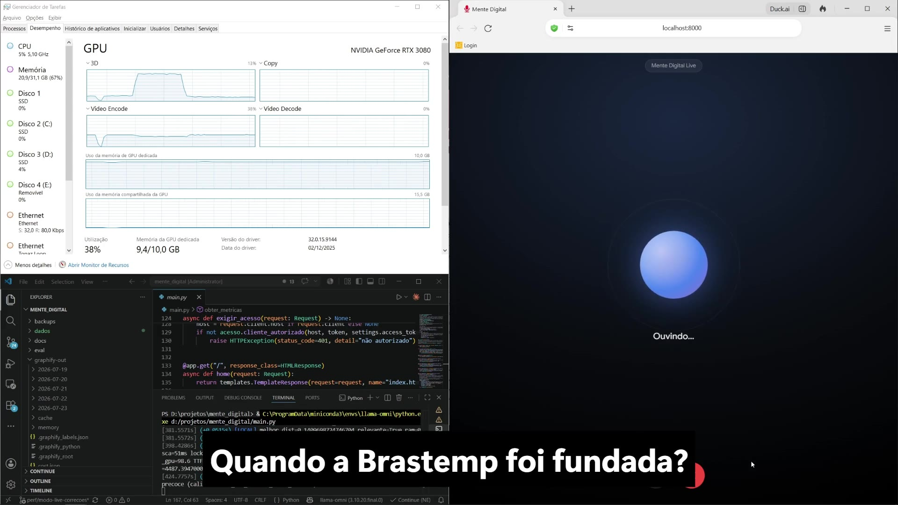
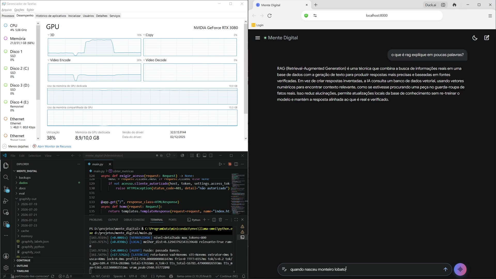
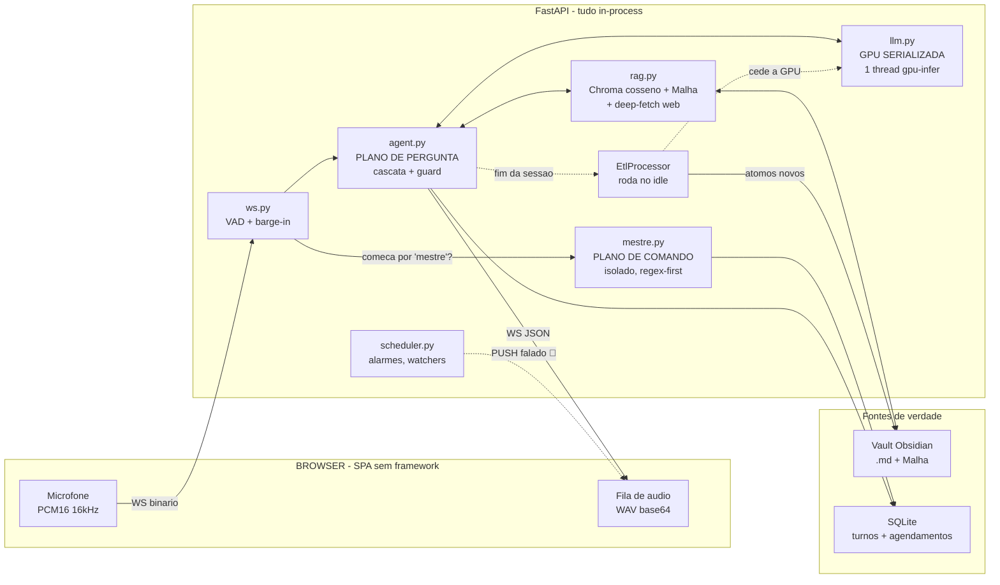

<div align="center">

# 🧠 Mente Digital

### Assistente Omni **100% local** — voz e texto, sem nuvem, sem API key, sem telemetria de terceiros.

*Um segundo cérebro que fala: conversa por voz, responde a partir das **suas** notas do Obsidian, recorre à web só quando precisa — **age** por comando falado (lembretes, listas, rotinas), **cuida** de coisas sozinho (alarmes, briefings, pomodoro) e, enquanto você não olha, destila o que aprendeu em novas notas atômicas.*

📐 **[Arquitetura completa / deep-dive técnico →](ARQUITETURA.md)**  ·  🇺🇸 [English overview](README.en.md)


**Alvo:** RTX 3080 (10 GB) · Ryzen 9 7950X3D · Windows

</div>

---

<div align="center">

**⏱ A camada de 30 segundos** — seis números, todos medidos neste repositório:

| | |
|---:|:---|
| **824 testes** | a suíte inteira roda **sem GPU e sem rede**, em ~10 s — é literalmente o job de CI |
| **33% → 8%** | taxa de "não sei" com o contexto na mão, na troca `Qwen2.5-7B` → `Qwen3-8B` — decidida por **A/B próprio** |
| **~2×** | ranqueamento do RAG na troca de embedding (known-item MRR@10 0.20 → 0.375) |
| **0.55 → 0.16** | gate de relevância **recalibrado por dados** contra a base real |
| **TTFT ≈ 1,1 s** | medido ao vivo numa resposta do vault (decode ≈ 85 tok/s) |
| **8,9 / 10 GB** | o stack inteiro (Qwen3-8B + e5-base + KV `q8_0`) residente na VRAM da 3080, ~1,3 GB de folga |

</div>

---

## 🎬 Demo — vendo funcionar

> **100% local, sem nuvem.** Nos dois vídeos, o **Gerenciador de Tarefas** (VRAM/GPU da RTX 3080) e o **terminal** ficam à mostra de propósito: dá pra ver a **rota** de cada resposta (`rota=ram` / `banco` / `web`), a **latência** real (`TTFT`/`TTFA`) e a placa trabalhando ao vivo. É a prova de que roda de verdade na máquina — não é um _wrapper_ de API.

<table>
<tr>
<td width="50%" align="center" valign="top">

**🎙️ Voz em tempo real**

[](https://github.com/user-attachments/assets/4ed48485-06b8-4fe9-907e-7395d9cd4f7c)

Fala → Whisper (STT) → LLM local → voz clonada (XTTS-v2), com _barge-in_.<br>No print: `rota=banco`, resposta vinda do vault.

</td>
<td width="50%" align="center" valign="top">

**💬 Modo texto**

[](https://github.com/user-attachments/assets/334cfa14-0896-4a83-a743-1c8c9fa684de)

Cascata memória → notas → web, com anti-alucinação.<br>No print: _"o que é RAG?"_ respondido do próprio banco.

</td>
</tr>
</table>

<sub>▶️ Clique num pôster para abrir o vídeo (player nativo do GitHub). Métricas por resposta ao vivo em `/api/metrics`; a suíte inteira roda **sem GPU e sem rede**.</sub>

---

## 🎯 O que é

**Mente Digital** é um assistente de voz e texto que roda inteiramente na sua máquina. Você fala; ele ouve, pensa e responde falando — em GPU local, com o primeiro áudio saindo enquanto o modelo ainda decodifica o resto da frase. Nada sai do computador, exceto uma busca web quando (e somente quando) o conhecimento local não basta.

Mas ele não só **responde**. Ele **age** (lembrete, lista, nota, rotina — por voz), **cuida** de coisas por conta própria (alarmes, watchers, briefing diário, pomodoro) e **lembra** (desfazer, corrigir, confirmar — a última ação sempre tem inverso). Três verbos, com uma **parede rígida** entre eles.

O que separa isto de um "chatbot com RAG" — cinco teses que atravessam o código:

1. **A base é sua, e é um vault Obsidian.** Arquivos `.md` que você lê, edita e versiona; o ChromaDB é um índice **derivado e descartável**. Trocar o embedding é uma reindexação, não perda de dado.
2. **A métrica é a latência *percebida*, não a real.** O sistema persegue **TTFA** (tempo até o 1º *áudio*), não TTFT — token que ninguém ouviu não existe. Medido e exposto em `/api/metrics`.
3. **Anti-alucinação é controle de fluxo, não prompt.** O "não sei" é um **sinal interno**: o sistema segura o áudio, detecta o sentinela em streaming, descarta e escala para a web sem vazar uma sílaba.
4. **Comando ≠ conversa, e a fronteira é física.** Uma frase que começa por `"mestre, …"` entra num fluxo **isolado e determinístico** (regex antes de LLM) e **nunca vira conhecimento**.
5. **O sistema trabalha quando ninguém olha.** Um ETL idle destila conversas e pesquisas em notas atômicas; um scheduler persistente dispara os alarmes — ambos cedendo a GPU para a conversa ao vivo.

> Pacote modularizado (**V2**) de um MVP monolítico, estendido por três "ondas" de agentes com **zero dependência nova**. Quase toda heurística carrega no comentário o bug real que ela conserta.

---

## 🧭 O que este projeto demonstra de Engenharia de Dados

> Por fora é um assistente de voz. Por dentro é o problema central de todo time de dados:
> **transformar dado bruto e disperso em um dataset confiável, pronto para uma camada de IA consumir.**

| Competência de Eng. de Dados | Onde vive neste repositório |
|---|---|
| **Pipeline de ETL incremental** (ingestão → transformação → carga) | `etl.py` — destila conversas e páginas web em unidades atômicas e as carrega em duas engines |
| **Modelagem em camadas** (bruto → limpo → pronto, no espírito *bronze/silver/gold*) | dado cru → limpo/conformado (extração, dedup, atomização com proveniência) → pronto (indexado e ranqueado) |
| **Ingestão incremental / CDC** | reindex por `mtime` do filesystem como *change-feed* — só reprocessa o que mudou (`rag.py`) |
| **Arquitetura relacional + não-relacional** | SQLite (fatos + estado, migrações idempotentes) e ChromaDB (vetorial, cosseno) convivendo |
| **Qualidade de dados / DataOps** | **824 testes sem GPU nem rede** em CI, dedup por Jaccard, proveniência/linhagem em frontmatter |
| **Decisão orientada por métrica** | harnesses de A/B em `eval/` — ranqueamento **2×** (MRR@10 0,20→0,375), erro do modelo **33%→8%** |
| **Otimização de performance/custo** | orçamento de 10 GB de VRAM; profiling por estágio com **percentis p50/p95** (`/api/metrics`) |
| **Orquestração** | `scheduler.py` — loop persistente de trabalho agendado (recorrência, reentrega do que falhou) |

---

## 🔬 Arquitetura em um diagrama



A **primeira bifurcação** é a arquitetura inteira em uma imagem: **começou por "mestre"? é comando** (plano determinístico) — **senão, é pergunta** (plano de conhecimento). As setas cheias são o caminho crítico; as pontilhadas, trabalho de fundo que nunca disputa a GPU com você.

**→ Detalhe módulo a módulo, os diagramas de cada fluxo, as *war stories* e cada decisão de design em [`ARQUITETURA.md`](ARQUITETURA.md).**

---

## ✨ Principais capacidades

- **Dois planos separados** — *pergunta* (RAG em cascata RAM→banco→web, com guard anti-alucinação) e *comando* (palavra-mestre, regex-first, isolado do conhecimento).
- **Voz de baixa latência** — streaming token→frase→áudio, chunking por frase, filler falado; Piper (CPU, default) ou XTTS-v2 (GPU, opt-in), com verbalização PT-BR de números.
- **Agentes que agem** — lembretes/alarmes, listas, rotinas compostas, captura rápida (GTD), SRS, hábitos, pomodoro — tudo por voz, reversível (desfazer/corrigir/confirmar).
- **Agentes que cuidam** — scheduler persistente (sobrevive a restart) com alarmes, *watchers* ("me avise quando X"), briefing diário e push falado.
- **Ciclo de vida do conhecimento** — notas nascem `#conhecimento_novo` e só "amadurecem" quando você de fato as reusa; a base cresce da sua curiosidade.
- **A Malha** — GraphRAG sobre o vault (aterramento por IDF, hubs, pontes por surpresa) **sem biblioteca de grafo**.

> Histórico completo de features (patch notes das três ondas) e o *porquê* de cada uma em [`ARQUITETURA.md`](ARQUITETURA.md#-patch-notes).

---

## 🧩 Stack

Nenhuma escolha é "a lib popular" — cada uma resolve a restrição do alvo: **10 GB de VRAM e um orçamento de TTFA**.

| Camada | Tecnologia | Papel |
|---|---|---|
| LLM | **llama-cpp-python** + **Qwen3-8B** `Q4_K_M` | GPU serializada por `ThreadPoolExecutor(max_workers=1)`; streaming com cancelamento |
| STT | **faster-whisper** (`large-v3-turbo`) | Na CPU por padrão — sai da GPU para o embedding entrar |
| TTS | **Piper** (ONNX, default) / **XTTS-v2** (GPU, opt-in) | Zero-VRAM na CPU; uma síntese por frase |
| Embeddings | **e5-base** (`sentence-transformers`) | Singleton, injetado no VectorStore **e** no deep-fetch web |
| Índice | **ChromaDB** (cosseno) + **A Malha** (código próprio) | Índice derivado; reindex incremental por `mtime` |
| Persistência | **SQLite** | Turnos, latências, agendamentos, estado dos agentes; migrações idempotentes |
| Servidor | **FastAPI** + **WebSocket** | Full-duplex (pré-condição de barge-in e do push proativo) |

> ~12.900 linhas de Python em 34 módulos + **824 testes** sem GPU nem rede. A justificativa de cada escolha (por que GGUF, por que cosseno, por que ONNX) está em [`ARQUITETURA.md`](ARQUITETURA.md#-por-que-cada-formato).

---

## 🚀 Quickstart

```bash
git clone https://github.com/danielpvp22/mente_digital.git
cd mente_digital

python -m venv .venv
.venv\Scripts\activate            # Windows  (Linux/macOS: source .venv/bin/activate)

:: llama-cpp-python PRECISA ser compilado com CUDA — sem isto o pip instala a
:: versão CPU em silêncio e o TTFT vai de ~1s para ~1min (exige VS Build Tools
:: + CUDA Toolkit; alternativa: wheel pré-compilada cu12x do repositório oficial).
set CMAKE_ARGS=-DGGML_CUDA=on -DCMAKE_CUDA_ARCHITECTURES=86
set FORCE_CMAKE=1
pip install -r requirements.txt   # reprodutível: pip install -c requirements.lock.txt -r requirements.txt

python scripts/baixar_modelos.py  # baixa o LLM (GGUF) e a voz Piper (--xtts p/ voz clonada)
copy .env.example .env            # e ajuste (vault, token da LAN, calibração)

python main.py                    # ou: uvicorn main:app --host 0.0.0.0 --port 8000
```

Abra `http://localhost:8000` e diga *"mestre, ajuda"* (ou `/ajuda`). O servidor sobe **antes** do LLM terminar de carregar.

**Modelos** (não vêm no repo, ficam em `dados/modelos/`): `scripts/baixar_modelos.py` baixa o LLM `Qwen3-8B-Q4_K_M.gguf` e a voz Piper `pt_BR-cadu-medium.onnx` (+ `.onnx.json`); Whisper e embeddings baixam sozinhos no 1º uso. Configuração 100% por `.env` (prefixo `MENTE_`, modelo comentado em [.env.example](.env.example)) — **calibrar nunca exige editar código**.

```bash
pip install -r requirements-dev.txt
pytest                            # 824 testes, sem GPU e sem rede (~10 s)
```

**→ Setup detalhado (CUDA, Docker, `.env`, download dos modelos) em [`ARQUITETURA.md`](ARQUITETURA.md#-setup--instalação).**

---

## 📚 Documentação

| Documento | Conteúdo |
|---|---|
| **[ARQUITETURA.md](ARQUITETURA.md)** | O deep-dive: papel de cada módulo, fluxos, war stories, casos de uso, API, configuração |
| [docs/CALIBRACAO.md](docs/CALIBRACAO.md) | Como calibrar o gate de relevância e os botões dos agentes |
| [docs/CONSULTORIA_TTFT.md](docs/CONSULTORIA_TTFT.md) | Rodada de latência TTFT/TTFA (banca, ranking, implementação) |
| [docs/TESTE_MANUAL.md](docs/TESTE_MANUAL.md) | Roteiro de verificação (o que exige microfone) |

---

## 📄 Licença

[Apache-2.0](LICENSE) (com cláusula de patente) · ver [NOTICE](NOTICE).
